# 充电站领域模型分析与 UML 类图

## 1. 建模目标

围绕"让车辆完成充电服务的总时间最短（排队等待 + 实际充电）"这一核心目标，领域模型需要同时覆盖：

- 充电请求从创建到完成的生命周期管理
- 多级队列与充电桩分配调度
- 分时电价 + 服务费的动态计费
- 充电桩故障与再调度
- 管理员对运营状态与配置的控制

## 2. 领域对象识别

### 2.1 实体（Entity）

- `ChargingStation充电站`：充电站聚合根，持有排队区、等待区与充电区
- `User用户`、`Vehicle车辆`：用户与车辆
- `ChargingRequest充电请求`：一次充电请求，贯穿排队/等待/充电状态
- `ChargingPile充电桩`：充电桩（快充/慢充）
- `PileQueue桩队列`：每个充电桩对应的排队结构（容量约束）
- `ChargingSession充电会话`：一次实际充电会话
- `BillingRecord账单记录`、`PaymentOrder支付订单`：账单与支付
- `FaultEvent故障事件`：故障事件
- `OperationReport运营报表`：运营报表

### 2.2 值对象（Value Object）

- 计费策略值对象：`TimeOfUseTariffPolicy分时电价策略`、`ServiceFeePolicy服务费策略`
- 枚举类型：`ChargeMode充电模式`、`PileStatus充电桩状态`、`RequestStatus请求状态`、`ProtocolType协议类型`、`ZoneType区域类型`、`PaymentStatus支付状态`

### 2.3 领域服务（Domain Service）

- `DispatchService调度服务`：按"完成时间最短"进行分配与再调度
- `QueueService队列服务`：车辆在排队区/等待区/充电区的流转控制
- `BillingService计费服务`：统一费用计算与账单生成

## 3. UML 类图（Mermaid）

```mermaid
classDiagram
direction LR

class ChargingStation充电站 {
  +stationId: String (站点编号)
  +name: String (名称)
  +address: String (地址)
  +maxQueueCapacity: Integer (排队区最大容量)
  +totalWaitCapacity: Integer (等待区总容量)
  +receiveRequest(request: ChargingRequest充电请求) (接收请求)
  +executeDispatch() (执行调度)
}

class QueueArea排队区 {
  +capacity: Integer (容量)
  +enqueue(request: ChargingRequest充电请求) (入队)
  +dequeueByMode(mode: ChargeMode充电模式): ChargingRequest充电请求 (按模式出队)
  +changeQueue(requestId: String, targetMode: ChargeMode充电模式) (换队)
}

class WaitingArea等待区 {
  +capacity: Integer (容量)
  +enterWaiting(request: ChargingRequest充电请求, pile: ChargingPile充电桩) (进入等待)
  +dequeueToCharging(pile: ChargingPile充电桩): ChargingRequest充电请求 (出队到充电)
}

class ChargingArea充电区 {
  +parkingSpotsPerPile: Integer (每桩停车位数量)
  +findAvailablePiles(mode: ChargeMode充电模式): ChargingPile充电桩[] (查找可用充电桩)
}

class User用户 {
  +userId: String (用户编号)
  +licensePlate: String (车牌号)
  +membershipLevel: Integer (会员等级)
  +createRequest(vehicle: Vehicle车辆, mode: ChargeMode充电模式, targetPower: Double): ChargingRequest充电请求 (创建请求)
  +cancelRequest(requestId: String) (取消请求)
}

class Vehicle车辆 {
  +vehicleId: String (车辆编号)
  +licensePlate: String (车牌号)
  +batteryCapacityKWh: Double (电池容量kWh)
  +currentBatteryPercentage: Double (当前电量百分比)
  +chargingProtocol: ProtocolType协议类型 (充电协议)
}

class ChargingRequest充电请求 {
  +requestId: String (请求编号)
  +requestTime: DateTime (请求时间)
  +chargingMode: ChargeMode充电模式 (充电模式)
  +targetPowerKWh: Double (目标电量kWh)
  +requestStatus: RequestStatus请求状态 (请求状态)
  +estimatedWaitMinutes: Integer (预计等待分钟)
  +updateRequest(mode: ChargeMode充电模式, targetPower: Double) (更新请求)
  +confirmEnterWaitingArea() (确认进入等待区)
  +cancel() (取消)
}

class ChargingPile充电桩 {
  +pileId: String (充电桩编号)
  +type: ChargeMode充电模式 (类型)
  +maxPowerKW: Double (最大功率kW)
  +status: PileStatus充电桩状态 (状态)
  +supportedProtocols: ProtocolType协议类型[] (支持协议列表)
  +estimateCompletionTime(request: ChargingRequest充电请求): DateTime (估算完成时间)
  +startCharging(session: ChargingSession充电会话) (开始充电)
  +stopCharging(sessionId: String) (停止充电)
}

class PileQueue桩队列 {
  +queueId: String (队列编号)
  +capacity: Integer (容量)
  +enqueue(request: ChargingRequest充电请求) (入队)
  +dequeue(): ChargingRequest充电请求 (出队)
  +remove(requestId: String) (移除)
}

class ChargingSession充电会话 {
  +sessionId: String (会话编号)
  +startTime: DateTime (开始时间)
  +endTime: DateTime (结束时间)
  +chargedPowerKWh: Double (已充电量kWh)
  +currentPowerKW: Double (当前功率kW)
  +modifyTargetPower(targetPowerKWh: Double) (修改目标电量)
  +end() (结束)
}

class BillingRecord账单记录 {
  +billingId: String (账单编号)
  +electricityFee: Double (电费)
  +serviceFee: Double (服务费)
  +totalFee: Double (总费用)
  +generationTime: DateTime (生成时间)
  +generateBill(session: ChargingSession充电会话) (生成账单)
}

class PaymentOrder支付订单 {
  +orderId: String (订单编号)
  +paymentStatus: PaymentStatus支付状态 (支付状态)
  +paymentTime: DateTime (支付时间)
  +pay(amount: Double) (支付)
  +refund(amount: Double) (退款)
}

class TimeOfUseTariffPolicy分时电价策略 {
  +peakPrice: Double (峰时电价)
  +normalPrice: Double (平时电价)
  +valleyPrice: Double (谷时电价)
  +queryTimeSlotPrice(time: DateTime): Double (查询时段电价)
}

class ServiceFeePolicy服务费策略 {
  +baseServiceFee: Double (基础服务费)
  +timeCoefficient: Double (时长系数)
  +overtimePenalty: Double (超时罚金)
  +calculateServiceFee(durationMinutes: Integer, isOvertime: Boolean): Double (计算服务费)
}

class DispatchService调度服务 {
  +assignChargingPile(request: ChargingRequest充电请求): ChargingPile充电桩 (分配充电桩)
  +estimateTotalCompletionTime(request: ChargingRequest充电请求, pile: ChargingPile充电桩): Integer (估算总完成时长)
  +rescheduleByFault(pileId: String) (按故障重调度)
}

class QueueService队列服务 {
  +moveToQueueArea(request: ChargingRequest充电请求) (移动到排队区)
  +moveToWaitingArea(request: ChargingRequest充电请求, pile: ChargingPile充电桩) (移动到等待区)
  +moveToPileQueue(request: ChargingRequest充电请求, pile: ChargingPile充电桩) (移动到桩队列)
  +promoteToCharging(pile: ChargingPile充电桩) (提升到充电中)
}

class BillingService计费服务 {
  +calculateBill(session: ChargingSession充电会话, tariffPolicy: TimeOfUseTariffPolicy分时电价策略, serviceFeePolicy: ServiceFeePolicy服务费策略): BillingRecord账单记录 (计算账单)
}

class FaultEvent故障事件 {
  +eventId: String (事件编号)
  +occurrenceTime: DateTime (发生时间)
  +pileId: String (充电桩编号)
  +severityLevel: Integer (严重级别)
  +markRecovery() (标记恢复)
}

class Administrator管理员 {
  +adminId: String (管理员编号)
  +setPileAvailability(pileId: String, status: PileStatus充电桩状态) (设置充电桩可用性)
  +moveVehicle(requestId: String, targetZone: ZoneType区域类型, position: Integer) (移动车辆)
  +updatePileConfiguration(pileId: String, maxPowerKW: Double) (更新充电桩配置)
  +exportReport() (导出报表)
}

class OperationReport运营报表 {
  +reportId: String (报表编号)
  +startTime: DateTime (开始时间)
  +endTime: DateTime (结束时间)
  +totalChargedPowerKWh: Double (总充电量kWh)
  +totalRevenue: Double (总收入)
  +utilizationRate: Double (利用率)
  +generate() (生成)
}

class ChargeMode充电模式 {
  <<enumeration>>
  FAST_CHARGE (快充)
  SLOW_CHARGE (慢充)
}

class PileStatus充电桩状态 {
  <<enumeration>>
  AVAILABLE (可用)
  QUEUEING (排队中)
  CHARGING (充电中)
  CLOSED (关闭)
  FAULT (故障)
}

class RequestStatus请求状态 {
  <<enumeration>>
  QUEUED (已排队)
  WAITING (等待区中)
  CHARGING (充电中)
  COMPLETED (已完成)
  CANCELLED (已取消)
}

class ProtocolType协议类型 {
  <<enumeration>>
  GB_STANDARD (国标)
  CCS (CCS)
  CHADEMO (CHAdeMO)
}

class ZoneType区域类型 {
  <<enumeration>>
  QUEUE_AREA (排队区)
  WAITING_AREA (等待区)
  CHARGING_AREA (充电区)
}

class PaymentStatus支付状态 {
  <<enumeration>>
  UNPAID (未支付)
  PAID (已支付)
  REFUNDED (已退款)
}

ChargingStation充电站 *-- QueueArea排队区
ChargingStation充电站 *-- WaitingArea等待区
ChargingStation充电站 *-- ChargingArea充电区
ChargingArea充电区 *-- "1..*" ChargingPile充电桩
ChargingPile充电桩 *-- "1" PileQueue桩队列

User用户 "1" -- "1..*" Vehicle车辆 : owns (拥有)
Vehicle车辆 "1" -- "0..*" ChargingRequest充电请求 : initiates (发起)
ChargingRequest充电请求 "0..1" --> ChargingPile充电桩 : assigned to (分配到)
ChargingRequest充电请求 "0..1" --> ChargingSession充电会话 : opens (开启)

ChargingSession充电会话 "1" --> "1" BillingRecord账单记录 : generates (生成)
BillingRecord账单记录 "1" --> "1" PaymentOrder支付订单 : settles (结算)
BillingRecord账单记录 --> TimeOfUseTariffPolicy分时电价策略 : uses (使用)
BillingRecord账单记录 --> ServiceFeePolicy服务费策略 : uses (使用)

DispatchService调度服务 ..> QueueArea排队区
DispatchService调度服务 ..> WaitingArea等待区
DispatchService调度服务 ..> ChargingPile充电桩
DispatchService调度服务 ..> ChargingRequest充电请求
QueueService队列服务 ..> QueueArea排队区
QueueService队列服务 ..> WaitingArea等待区
QueueService队列服务 ..> PileQueue桩队列
BillingService计费服务 ..> ChargingSession充电会话
BillingService计费服务 ..> TimeOfUseTariffPolicy分时电价策略
BillingService计费服务 ..> ServiceFeePolicy服务费策略

ChargingPile充电桩 --> PileStatus充电桩状态
ChargingRequest充电请求 --> RequestStatus请求状态
ChargingRequest充电请求 --> ChargeMode充电模式
Vehicle车辆 --> ProtocolType协议类型
Administrator管理员 ..> ChargingPile充电桩 : manages (管理)
Administrator管理员 ..> DispatchService调度服务 : triggers rescheduling (触发重调度)
Administrator管理员 ..> OperationReport运营报表
ChargingPile充电桩 "1" --> "0..*" FaultEvent故障事件
PaymentOrder支付订单 --> PaymentStatus支付状态
```

## 4. 关键约束与业务规则映射

- 快充/慢充分流：`ChargingRequest充电请求.chargingMode` + `DispatchService调度服务.assignChargingPile`
- 三级队列：QueueArea排队区（按模式排队）+ WaitingArea等待区（进入充电前缓冲）+ 每桩队列（`PileQueue桩队列`）
- 桩队列容量：`PileQueue桩队列.capacity`（默认可设为 4）
- 最短完成时间目标：`DispatchService调度服务.estimateTotalCompletionTime`
- 请求变更与取消：`ChargingRequest充电请求.updateRequest/cancel`
- 故障再调度：`FaultEvent故障事件` + `DispatchService调度服务.rescheduleByFault`
- 分时电价：`TimeOfUseTariffPolicy分时电价策略.queryTimeSlotPrice`
- 服务费（基础费 + 时长/超时）：`ServiceFeePolicy服务费策略.calculateServiceFee`

## 5. 聚合建议（实现时可采用）

- 充电站聚合：`ChargingStation充电站`、`QueueArea排队区`、`WaitingArea等待区`、`ChargingArea充电区`、`ChargingPile充电桩`、`PileQueue桩队列`
- 请求聚合：`ChargingRequest充电请求`、`ChargingSession充电会话`
- 计费聚合：`BillingRecord账单记录`、`PaymentOrder支付订单`、`TimeOfUseTariffPolicy分时电价策略`、`ServiceFeePolicy服务费策略`

以上模型可直接作为后续用例图、系统顺序图（SSD）和操作契约建模的领域基础。
