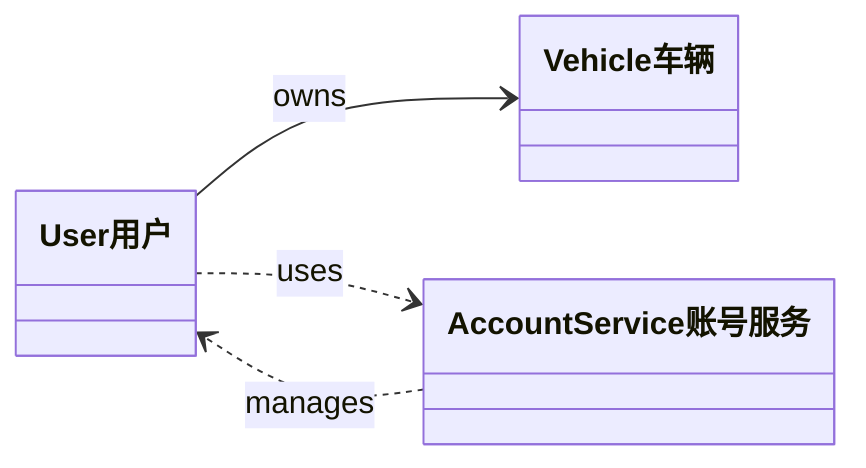
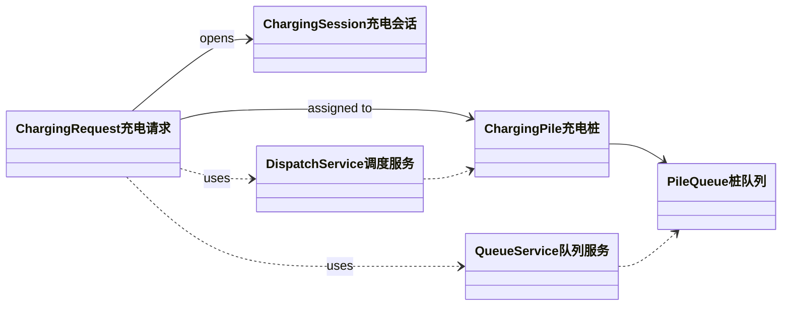
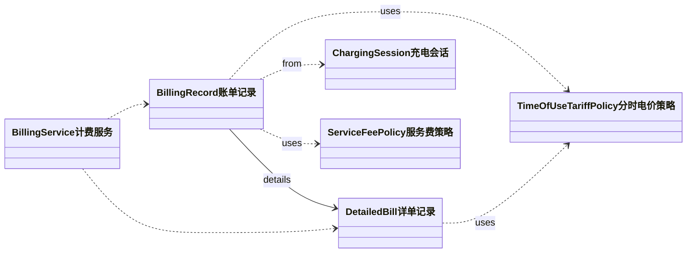
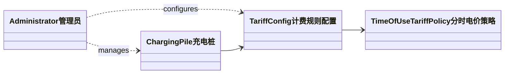
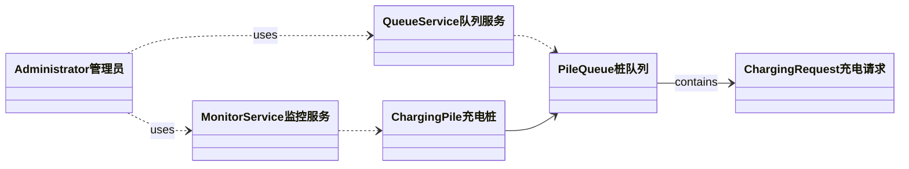
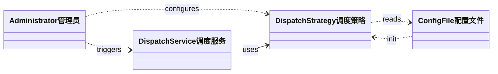
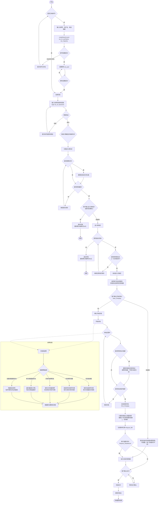

# 充电站领域模型分析与 UML 类图

## 1. 建模目标

围绕"让车辆完成充电服务的总时间最短（排队等待 + 实际充电）"这一核心目标，领域模型需要同时覆盖：

- 充电请求从创建到完成的生命周期管理
- 多级队列与充电桩分配调度
- 分时电价 + 服务费的动态计费
- 充电桩故障与再调度
- 管理员对运营状态与配置的控制

## 2. 领域对象识别

### 2.1 实体（Entity）

- `ChargingStation充电站`：充电站聚合根，持有充电区（含多个充电桩），每个充电桩各自管理其排队区与等待区
- `User用户`、`Vehicle车辆`：用户与车辆
- `ChargingRequest充电请求`：一次充电请求，贯穿排队/等待/充电状态
- `ChargingPile充电桩`：充电桩（快充/慢充）
- `PileQueue桩队列`：每个充电桩对应的排队结构（容量约束）
- `ChargingSession充电会话`：一次实际充电会话
- `BillingRecord账单记录`、`DetailedBill详单记录`、`PaymentOrder支付订单`：账单与支付
- `FaultEvent故障事件`：故障事件
- `OperationReport运营报表`：运营报表

### 2.2 值对象（Value Object）

- 计费策略值对象：`TimeOfUseTariffPolicy分时电价策略`、`ServiceFeePolicy服务费策略`、`TariffConfig计费规则配置`
- 枚举类型：`ChargeMode充电模式`、`PileStatus充电桩状态`、`RequestStatus请求状态`、`ProtocolType协议类型`、`ZoneType区域类型`、`PaymentStatus支付状态`

### 2.3 领域服务（Domain Service）

- `DispatchService调度服务`：按当前激活策略进行分配与再调度
- `QueueService队列服务`：车辆在排队区/等待区/充电区的流转控制
- `BillingService计费服务`：统一费用计算与账单生成
- `MonitorService监控服务`：充电桩状态定时采集与推送
- `DispatchStrategy调度策略`：封装策略选择与切换逻辑

## 3. UML 类图（领域模型）

> **说明**：本类图仅使用**定向关联**(`-->`)、**依赖**(`..>`)和**继承**(`<|--`)三种关系，按第二次作业要求调整。

```mermaid
classDiagram
direction LR

class ChargingStation充电站 {
  +stationId: String (站点编号)
  +name: String (名称)
  +address: String (地址)
  +receiveRequest(request: ChargingRequest充电请求) (接收请求)
  +executeDispatch() (执行调度)
}

class QueueArea排队区 {
  +capacity: Integer (容量)
  +enqueue(request: ChargingRequest充电请求) (入队)
  +dequeueByMode(mode: ChargeMode充电模式): ChargingRequest充电请求 (按模式出队)
  +changeQueue(requestId: String, targetMode: ChargeMode充电模式) (换队)
}

class WaitingArea等待区 {
  +capacity: Integer (容量)
  +enterWaiting(request: ChargingRequest充电请求, pile: ChargingPile充电桩) (进入等待)
  +dequeueToCharging(pile: ChargingPile充电桩): ChargingRequest充电请求 (出队到充电)
}

class ChargingArea充电区 {
  +parkingSpotsPerPile: Integer (每桩停车位数量)
  +findAvailablePiles(mode: ChargeMode充电模式): ChargingPile充电桩[] (查找可用充电桩)
}

class User用户 {
  +userId: String (用户编号)
  +userName: String (用户名)
  +licensePlate: String (车牌号)
  +password: String (密码)
  +membershipLevel: Integer (会员等级)
  +accountStatus: String (账号状态)
  +createRequest(vehicle: Vehicle车辆, mode: ChargeMode充电模式, targetPower: Double): ChargingRequest充电请求 (创建请求)
  +cancelRequest(requestId: String) (取消请求)
}

class Vehicle车辆 {
  +vehicleId: String (车辆编号)
  +licensePlate: String (车牌号)
  +batteryCapacityKWh: Double (电池容量kWh)
  +currentBatteryPercentage: Double (当前电量百分比)
  +chargingProtocol: ProtocolType协议类型 (充电协议)
}

class ChargingRequest充电请求 {
  +requestId: String (请求编号)
  +car_Id: String (车牌号)
  +requestTime: DateTime (请求时间)
  +chargingMode: ChargeMode充电模式 (充电模式)
  +Request_Amount: Double (请求电量kWh)
  +requestStatus: RequestStatus请求状态 (请求状态)
  +queue_Num: Integer (队列编号)
  +car_Number_before_position: Integer (前面排队数)
  +updateRequest(mode: ChargeMode充电模式, targetPower: Double) (更新请求)
  +confirmEnterWaitingArea() (确认进入等待区)
  +cancel() (取消)
}

class ChargingPile充电桩 {
  +pileId: String (充电桩编号)
  +type: ChargeMode充电模式 (类型)
  +maxPowerKW: Double (最大功率kW)
  +status: PileStatus充电桩状态 (状态)
  +supportedProtocols: ProtocolType协议类型[] (支持协议列表)
  +TotalChargeNum: Integer (累计充电次数)
  +TotalChargeTime: Double (累计充电时长)
  +TotalCapacity: Double (累计充电容量)
  +estimateCompletionTime(request: ChargingRequest充电请求): DateTime (估算完成时间)
  +startCharging(session: ChargingSession充电会话) (开始充电)
  +stopCharging(sessionId: String) (停止充电)
}

class PileQueue桩队列 {
  +queueId: String (队列编号)
  +capacity: Integer (容量，默认4)
  +queueArea: QueueArea排队区 (排队区)
  +waitingArea: WaitingArea等待区 (等待区)
  +enqueue(request: ChargingRequest充电请求) (入队)
  +dequeue(): ChargingRequest充电请求 (出队)
  +remove(requestId: String) (移除)
}

class ChargingSession充电会话 {
  +sessionId: String (会话编号)
  +startTime: DateTime (开始时间)
  +endTime: DateTime (结束时间)
  +chargedPowerKWh: Double (已充电量kWh)
  +currentPowerKW: Double (当前功率kW)
  +faultInterrupted: Boolean (故障中断标记)
  +interruptedPowerKWh: Double (中断时已充电量)
  +modifyTargetPower(targetPowerKWh: Double) (修改目标电量)
  +end() (结束)
  +pause() (暂停)
  +resume(targetPileId: String, resumeFromPower: Double) (恢复)
}

class BillingRecord账单记录 {
  +billingId: String (账单编号)
  +Bill_Id: String (账单编号)
  +carId: String (车牌号)
  +date: Date (日期)
  +ChargePileNum: String (充电桩编号)
  +ChargeAmount: Double (充电量)
  +ChargeDuration: Double (充电时长)
  +StartTime: DateTime (开始时间)
  +EndTime: DateTime (结束时间)
  +TotalChargeFee: Double (总电费)
  +TotalServiceFee: Double (总服务费)
  +TotalFee: Double (总费用)
  +generateBill(session: ChargingSession充电会话) (生成账单)
}

class DetailedBill详单记录 {
  +Bill_Id: String (账单编号)
  +carId: String (车牌号)
  +date: Date (日期)
  +ChargePileNum: String (充电桩编号)
  +ChargeAmount: Double (充电量)
  +ChargeDuration: Double (充电时长)
  +StartTime: DateTime (开始时间)
  +EndTime: DateTime (结束时间)
  +periodChargeFees: Double[] (各时段电费)
  +periodServiceFees: Double[] (各时段服务费)
  +periodSubtotalFees: Double[] (各时段小计)
  +splitByPeriods(tariff: TimeOfUseTariffPolicy分时电价策略) (按时段拆分)
}

class PaymentOrder支付订单 {
  +orderId: String (订单编号)
  +paymentStatus: PaymentStatus支付状态 (支付状态)
  +paymentTime: DateTime (支付时间)
  +pay(amount: Double) (支付)
  +refund(amount: Double) (退款)
}

class TimeOfUseTariffPolicy分时电价策略 {
  +peakPrice: Double (峰时电价)
  +normalPrice: Double (平时电价)
  +valleyPrice: Double (谷时电价)
  +queryTimeSlotPrice(time: DateTime): Double (查询时段电价)
}

class ServiceFeePolicy服务费策略 {
  +baseServiceFee: Double (基础服务费)
  +timeCoefficient: Double (时长系数)
  +overtimePenalty: Double (超时罚金)
  +calculateServiceFee(durationMinutes: Integer, isOvertime: Boolean): Double (计算服务费)
}

class TariffConfig计费规则配置 {
  +pileId: String (充电桩编号)
  +tariffRule: String (计费规则说明)
  +peakPrice: Double (峰时电价)
  +normalPrice: Double (平时电价)
  +valleyPrice: Double (谷时电价)
  +updateTariff(pileId: String, peak: Double, normal: Double, valley: Double) (更新电价)
}

class DispatchService调度服务 {
  +assignChargingPile(request: ChargingRequest充电请求): ChargingPile充电桩 (分配充电桩)
  +estimateTotalCompletionTime(request: ChargingRequest充电请求, pile: ChargingPile充电桩): Integer (估算总完成时长)
  +rescheduleByPriority(vehicles: List) (按优先级重调度)
  +rescheduleByTimeOrder(vehicles: List) (按时间顺序重调度)
  +recoverChargingFault(pileId: String) (充电中故障恢复)
  +rescheduleByShortestTotalTime(vehicles: List) (单次调度最短时长)
  +batchAssignByShortestTotalTime(vehicles: List, piles: List) (批量调度最短时长)
  +initDispatchStrategy(algorithm: String, faultStrategy: String) (初始化策略)
  +switchDispatchStrategy(strategyType: String) (切换分配策略)
  +switchFaultStrategy(faultType: String) (切换故障策略)
  +getActiveFaultStrategy(): String (获取当前故障策略)
}

class DispatchStrategy调度策略 {
  +algorithm: String (当前分配算法标识)
  +faultStrategy: String (当前故障策略标识)
  +availableAlgorithms: String[] (可用分配算法列表)
  +availableFaultStrategies: String[] (可用故障策略列表)
  +init(configFile: String) (从配置文件初始化)
  +switchAlgorithm(algorithm: String) (切换算法)
  +switchFault(faultType: String) (切换故障策略)
  +getCurrentAlgorithm(): String (获取当前算法)
  +getCurrentFaultStrategy(): String (获取当前故障策略)
}

class QueueService队列服务 {
  +moveToQueueArea(request: ChargingRequest充电请求, pile: ChargingPile充电桩) (移动到指定桩的排队区)
  +moveToWaitingArea(request: ChargingRequest充电请求, pile: ChargingPile充电桩) (移动到指定桩的等待区)
  +moveToPileQueue(request: ChargingRequest充电请求, pile: ChargingPile充电桩) (移动到桩队列)
  +promoteToCharging(pile: ChargingPile充电桩) (提升到充电中)
  +getCarState(car_id: String): CarState (查询车辆状态)
  +getQueueDetail(queuelist: List): QueueDetail[] (查询队列详情)
  +changeQueue(vehicleId: String, fromPile: ChargingPile充电桩, toPile: ChargingPile充电桩) (跨桩换队)
}

class BillingService计费服务 {
  +calculateBill(session: ChargingSession充电会话, tariffPolicy: TimeOfUseTariffPolicy分时电价策略, serviceFeePolicy: ServiceFeePolicy服务费策略): BillingRecord账单记录 (计算账单)
  +queryBillByDate(carId: String, date: Date): BillingRecord[] (按日期查询账单)
  +getDetailedBill(Bill_Id: String): DetailedBill详单记录 (获取详单)
}

class MonitorService监控服务 {
  +getPileStats(pile_Id: String): PileStats (获取充电桩统计)
  +batchCollectStats(): PileStats[] (批量采集统计)
  +startPeriodicRefresh(intervalSeconds: Integer) (启动定时刷新)
}

class FaultEvent故障事件 {
  +eventId: String (事件编号)
  +occurrenceTime: DateTime (发生时间)
  +pileId: String (充电桩编号)
  +severityLevel: Integer (严重级别)
  +faultType: String (故障类型)
  +markRecovery() (标记恢复)
}

class Administrator管理员 {
  +adminId: String (管理员编号)
  +setPileAvailability(pileId: String, status: PileStatus充电桩状态) (设置充电桩可用性)
  +powerOn(pileId: String) (开机)
  +powerOff(pileId: String) (关机)
  +moveVehicle(requestId: String, targetZone: ZoneType区域类型, position: Integer) (移动车辆)
  +updatePileConfiguration(pileId: String, maxPowerKW: Double) (更新充电桩配置)
  +setParameters(pileId: String, tariffConfig: TariffConfig) (设置参数)
  +startChargingPile(pileId: String) (运行充电桩)
  +exportReport() (导出报表)
}

class OperationReport运营报表 {
  +reportId: String (报表编号)
  +startTime: DateTime (开始时间)
  +endTime: DateTime (结束时间)
  +totalChargedPowerKWh: Double (总充电量kWh)
  +totalRevenue: Double (总收入)
  +utilizationRate: Double (利用率)
  +generate() (生成)
}

class ChargeMode充电模式 {
  <<enumeration>>
  FAST_CHARGE (快充)
  SLOW_CHARGE (慢充)
}

class PileStatus充电桩状态 {
  <<enumeration>>
  AVAILABLE (可用)
  QUEUEING (排队中)
  CHARGING (充电中)
  RUNNING (运行中)
  CLOSED (关闭)
  FAULT (故障)
}

class RequestStatus请求状态 {
  <<enumeration>>
  QUEUED (已排队)
  WAITING (等待区中)
  CHARGING (充电中)
  COMPLETED (已完成)
  CANCELLED (已取消)
}

class ProtocolType协议类型 {
  <<enumeration>>
  GB_STANDARD (国标)
  CCS (CCS)
  CHADEMO (CHAdeMO)
}

class ZoneType区域类型 {
  <<enumeration>>
  QUEUE_AREA (排队区)
  WAITING_AREA (等待区)
  CHARGING_AREA (充电区)
}

class PaymentStatus支付状态 {
  <<enumeration>>
  UNPAID (未支付)
  PAID (已支付)
  REFUNDED (已退款)
}

ChargingStation充电站 --> ChargingArea充电区
ChargingArea充电区 --> ChargingPile充电桩
ChargingPile充电桩 --> PileQueue桩队列
PileQueue桩队列 --> QueueArea排队区
PileQueue桩队列 --> WaitingArea等待区

User用户 --> Vehicle车辆 : owns
Vehicle车辆 --> ChargingRequest充电请求 : initiates
ChargingRequest充电请求 --> ChargingPile充电桩 : assigned to
ChargingRequest充电请求 --> ChargingSession充电会话 : opens

ChargingSession充电会话 --> BillingRecord账单记录 : generates
BillingRecord账单记录 --> DetailedBill详单记录 : details
BillingRecord账单记录 --> PaymentOrder支付订单 : settles
BillingRecord账单记录 ..> TimeOfUseTariffPolicy分时电价策略 : uses
BillingRecord账单记录 ..> ServiceFeePolicy服务费策略 : uses
DetailedBill详单记录 ..> TimeOfUseTariffPolicy分时电价策略 : uses

DispatchService调度服务 ..> PileQueue桩队列
DispatchService调度服务 ..> ChargingPile充电桩
DispatchService调度服务 ..> ChargingRequest充电请求
QueueService队列服务 ..> PileQueue桩队列
BillingService计费服务 ..> ChargingSession充电会话
BillingService计费服务 ..> TimeOfUseTariffPolicy分时电价策略
BillingService计费服务 ..> ServiceFeePolicy服务费策略
MonitorService监控服务 ..> ChargingPile充电桩

ChargingPile充电桩 --> PileStatus充电桩状态
ChargingRequest充电请求 --> RequestStatus请求状态
ChargingRequest充电请求 --> ChargeMode充电模式
Vehicle车辆 --> ProtocolType协议类型
Administrator管理员 ..> ChargingPile充电桩 : manages
Administrator管理员 ..> DispatchService调度服务 : triggers
Administrator管理员 ..> DispatchStrategy调度策略 : configures
Administrator管理员 ..> OperationReport运营报表
Administrator管理员 ..> TariffConfig计费规则配置 : configures
ChargingPile充电桩 --> FaultEvent故障事件
PaymentOrder支付订单 --> PaymentStatus支付状态
TariffConfig计费规则配置 --> TimeOfUseTariffPolicy分时电价策略
ChargingPile充电桩 --> TariffConfig计费规则配置
DispatchService调度服务 --> DispatchStrategy调度策略 : uses
```

## 4. 关键约束与业务规则映射

- 快充/慢充分流：`ChargingRequest充电请求.chargingMode` + `DispatchService调度服务.assignChargingPile`
- 三区队列（每桩独立）：每个充电桩的 `PileQueue桩队列` 管理自己的 `QueueArea排队区` + `WaitingArea等待区`，`ChargingArea充电区` 包含所有充电桩
- 桩队列容量：`PileQueue桩队列.capacity`（默认可设为 4）
- 最短完成时间目标：`DispatchService调度服务.estimateTotalCompletionTime`
- 请求变更与取消：`ChargingRequest充电请求.updateRequest/cancel`
- 故障再调度（五种策略）：`FaultEvent故障事件` + `DispatchService调度服务.rescheduleByPriority/rescheduleByTimeOrder/recoverChargingFault/rescheduleByShortestTotalTime/batchAssignByShortestTotalTime`
- 调度策略可切换：`DispatchStrategy调度策略` — 系统启动参数决定默认值，管理员运行时可切换
- 分时电价：`TimeOfUseTariffPolicy分时电价策略.queryTimeSlotPrice`
- 服务费（基础费 + 时长/超时）：`ServiceFeePolicy服务费策略.calculateServiceFee`
- 计费规则配置：`TariffConfig计费规则配置` 存储充电桩级别的计费规则和三个时段电价
- 定时状态刷新：`MonitorService监控服务.startPeriodicRefresh`

## 5. 聚合建议（实现时可采用）

- 充电站聚合：`ChargingStation充电站`、`ChargingArea充电区`、`ChargingPile充电桩`、`PileQueue桩队列`（含 `QueueArea排队区` + `WaitingArea等待区`）、`TariffConfig计费规则配置`
- 请求聚合：`ChargingRequest充电请求`、`ChargingSession充电会话`
- 调度策略聚合：`DispatchStrategy调度策略`、`DispatchService调度服务`
- 计费聚合：`BillingRecord账单记录`、`DetailedBill详单记录`、`PaymentOrder支付订单`、`TimeOfUseTariffPolicy分时电价策略`、`ServiceFeePolicy服务费策略`
- 监控聚合：`MonitorService监控服务`、`FaultEvent故障事件`

---

## 6. 用例级别静态结构类图

按第二次作业要求，使用**依赖、定向关联、继承**三种关系，围绕用例绘制静态结构类图。
以下类图中仅展示类名和关键关系，属性和方法在后附表格中说明。

### 6.1 注册与登录用例类图

**表 6.1 注册与登录用例类说明**

| 类名 | 属性 | 方法 |
|------|------|------|
| User用户 | userId, userName, licensePlate, password, membershipLevel, accountStatus | createNewAccount(car_Id, userName, car_Capacity), set_pwd(password), login(car_Id, password) |
| Vehicle车辆 | vehicleId, licensePlate, batteryCapacityKWh, currentBatteryPercentage, chargingProtocol | — |
| AccountService账号服务 | — | validateAccount(car_Id), createAccount(user), setPassword(userId, password), authenticate(car_Id, password) |

### 6.2 充电申请用例类图

**表 6.2 充电申请用例类说明**

| 类名 | 属性 | 方法 |
|------|------|------|
| ChargingRequest充电请求 | requestId, car_Id, requestTime, chargingMode, Request_Amount, requestStatus, queue_Num, car_Number_before_position | updateRequest(mode, targetPower), cancel() |
| ChargingPile充电桩 | pileId, type, maxPowerKW, status, supportedProtocols, TotalChargeNum, TotalChargeTime, TotalCapacity | estimateCompletionTime(request), startCharging(session), stopCharging(sessionId) |
| ChargingSession充电会话 | sessionId, startTime, endTime, chargedPowerKWh, currentPowerKW, faultInterrupted, interruptedPowerKWh | modifyTargetPower(targetPowerKWh), end(), pause(), resume(targetPileId, resumeFromPower) |
| DispatchService调度服务 | — | assignChargingPile(request), estimateTotalCompletionTime(request, pile) |
| QueueService队列服务 | — | enqueue(request, pileId), getCarState(car_id), dequeue(pileId) |
| PileQueue桩队列 | queueId, capacity | enqueue(request), dequeue(), remove(requestId) |

### 6.3 查看账单与详单用例类图

**表 6.3 查看账单与详单用例类说明**

| 类名 | 属性 | 方法 |
|------|------|------|
| BillingRecord账单记录 | billingId, Bill_Id, carId, date, ChargePileNum, ChargeAmount, ChargeDuration, StartTime, EndTime, TotalChargeFee, TotalServiceFee, TotalFee | generateBill(session) |
| DetailedBill详单记录 | Bill_Id, carId, date, ChargePileNum, ChargeAmount, ChargeDuration, StartTime, EndTime, periodChargeFees[], periodServiceFees[], periodSubtotalFees[] | splitByPeriods(tariff) |
| BillingService计费服务 | — | calculateBill(session), queryBillByDate(carId, date), getDetailedBill(Bill_Id) |
| TimeOfUseTariffPolicy分时电价策略 | peakPrice, normalPrice, valleyPrice | queryTimeSlotPrice(time) |
| ServiceFeePolicy服务费策略 | baseServiceFee, timeCoefficient, overtimePenalty | calculateServiceFee(durationMinutes, isOvertime) |

### 6.4 运行充电桩用例类图

**表 6.4 运行充电桩用例类说明**

| 类名 | 属性 | 方法 |
|------|------|------|
| Administrator管理员 | adminId | powerOn(pile_Id), powerOff(pile_Id), setParameters(pile_Id, tariffConfig, peakPrice, normalPrice, valleyPrice), Start_ChargingPile(pile_Id) |
| ChargingPile充电桩 | pileId, type, maxPowerKW, status, supportedProtocols | — |
| TariffConfig计费规则配置 | pileId, tariffRule, peakPrice, normalPrice, valleyPrice | updateTariff(pileId, peak, normal, valley) |
| TimeOfUseTariffPolicy分时电价策略 | peakPrice, normalPrice, valleyPrice | queryTimeSlotPrice(time) |

### 6.5 查看充电桩状态与队列状态用例类图

**表 6.5 查看充电桩状态与队列状态用例类说明**

| 类名 | 属性 | 方法 |
|------|------|------|
| MonitorService监控服务 | refreshInterval | getPileStats(pile_Id), batchCollectStats(), startPeriodicRefresh(intervalSeconds) |
| QueueService队列服务 | — | getQueueDetail(queuelist) |
| ChargingPile充电桩 | pileId, type, status, TotalChargeNum, TotalChargeTime, TotalCapacity | — |
| PileQueue桩队列 | queueId, capacity | getVehicles(), calculateWaitTime(vehicle) |
| ChargingRequest充电请求 | car_Id, requestTime, Request_Amount | — |
| Administrator管理员 | adminId | Query_PileState(pile_Id), Query_QueueState(queuelist) |

### 6.6 管理调度策略用例类图

**表 6.6 管理调度策略用例类说明**

| 类名 | 属性 | 方法 |
|------|------|------|
| DispatchStrategy调度策略 | algorithm (当前分配算法标识), faultStrategy (当前故障策略标识), availableAlgorithms[], availableFaultStrategies[] | init(configFile), switchAlgorithm(algorithm), switchFault(faultType), getCurrentAlgorithm(), getCurrentFaultStrategy() |
| DispatchService调度服务 | — | assignChargingPile(request), rescheduleByPriority(vehicles), rescheduleByTimeOrder(vehicles), recoverChargingFault(pileId), rescheduleByShortestTotalTime(vehicles), batchAssignByShortestTotalTime(vehicles, piles), initDispatchStrategy(algorithm, faultStrategy), switchDispatchStrategy(strategyType), switchFaultStrategy(faultType) |
| ConfigFile配置文件 | algorithm (启动参数), faultStrategy (故障策略参数) | — |
| Administrator管理员 | adminId | setDispatchStrategy(strategyType), setFaultStrategy(faultType) |

---

## 7. UML活动图（客户充电服务业务流程）

### 7.1 业务流程概述

客户使用充电服务的完整业务流程从注册/登录开始，到结束一次充电服务，涵盖以下主要阶段：

1. **注册/登录**：新用户注册账号并设置密码，已有用户直接登录
2. **登录与队列分配**：用户登录后，系统基于当前选定的调度策略（默认为"完成充电所需时间最短"）计算最佳充电桩队列。策略由系统启动参数决定，管理员运行期间可切换。
3. **排队区阶段**：车辆在排队区等待，可自由更换到其他充电桩队列
4. **等待区阶段**：排队区排到最前时进入等待区，不可更换队列，仅可退出充电
5. **充电区阶段**：进入充电区后确认充电协议和电量，开始充电
6. **充电中阶段**：充电过程中可修改协议和电量
7. **充电完成与计费**：到达指定电量后自动结束充电，计算阶梯电价和服务费
8. **支付结算**：用户完成支付，驶离充电站

### 7.2 UML活动图（Mermaid）

### 7.3 活动图说明

#### 7.3.1 主要活动节点

1. **注册/登录**（新增）：
   - 新用户：createNewAccount(car_Id, userName, car_Capacity) → set_pwd(******)
   - 已有用户：login(car_Id, password)

2. **登录与队列分配**：
   - 系统基于"完成充电所需时间最短"策略计算最佳充电桩队列
   - 车辆被分配进入对应充电桩的排队区

3. **排队区活动**：
   - 车辆在排队区等待，可自由更换到其他充电桩队列（更换后排至目标队列队尾）
   - 排队区排到最前时，用户需确认是否进入等待区（操作超时自动确认）

4. **等待区活动**：
   - 等待区不可更换队列，仅可退出充电（退出时服务费与电费均为0元）
   - 等待区排至首位且上一位充电完毕后，车辆自动进入充电区

5. **充电区活动**：
   - 进入充电区后，系统请求用户核对和更改受支持的充电协议以及修改充电电量
   - 用户通过 Start_Charging(car_id, ChargePileNum) 确认开始充电
   - 若操作超时则取消充电并扣除基本服务费x

6. **充电完成与计费**：
   - 到达指定电量后通过 End_Charging(car_id, ChargingPileNum) 结束充电
   - 系统计算阶梯电价和服务费
   - Request_Bill 生成账单概览，Request_DetailedList 查看分段详单

7. **支付结算**：
   - 用户确认支付后完成结算
   - 车辆驶离充电站，充电服务结束

#### 7.3.2 故障处理流程（新增五种策略）

- **优先级调度**：按车辆优先级（充电中>等待区>排队区；同区域按会员等级+等待时间）排序，依次分配最优充电桩
- **时间顺序调度**：按请求到达时间先后排序，依次分配可用充电桩至目标队列队尾
- **充电中故障恢复**：保存已充电量快照，优先为充电中车辆分配同类型可用桩，从已充电量继续充电
- **单次调度最短时长（加分）**：对每台受影响的车辆独立计算总完成时间 Tⱼ = wⱼ + cⱼ，选择 min(Tⱼ) 对应的充电桩（贪心策略）
- **批量调度最短时长（加分）**：将所有受影响车辆构建 N×M 成本矩阵，使用匈牙利算法求全局最优分配（全局最优策略）
- **策略切换机制**：系统启动时通过配置文件设定默认策略，管理员运行期间可通过管理客户端动态切换

### 7.4 流程特点总结

1. **注册/登录分离**：新用户需完成注册流程（创建账号+设置密码），已有用户直接登录
2. **用户为中心**：流程设计以用户体验为核心，提供充分的自主选择权
3. **调度策略可配置**：支持五种故障处理策略（优先级/时间顺序/充电中恢复/单次最短/批量最短），系统启动参数决定默认值，管理员可运行时切换
4. **灵活性强**：支持中途队列更换、协议修改、电量调整等灵活操作
5. **容错性好**：五种独立的故障处理策略，保障不同场景下的服务连续性
6. **计费透明**：账单概览+分段详单两级查询，费用明细可追溯

---

该活动图完整描述了客户从注册/登录到结束充电服务的完整业务流程，已按第二次作业要求体现注册与登录的分离、五种独立故障调度策略（含可切换机制）以及两级账单查询机制。
