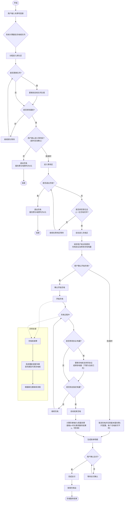

# 充电站领域模型分析与 UML 类图

## 1. 建模目标

围绕"让车辆完成充电服务的总时间最短（排队等待 + 实际充电）"这一核心目标，领域模型需要同时覆盖：

- 充电请求从创建到完成的生命周期管理
- 多级队列与充电桩分配调度
- 分时电价 + 服务费的动态计费
- 充电桩故障与再调度
- 管理员对运营状态与配置的控制

## 2. 领域对象识别

### 2.1 实体（Entity）

- `ChargingStation充电站`：充电站聚合根，持有排队区、等待区与充电区
- `User用户`、`Vehicle车辆`：用户与车辆
- `ChargingRequest充电请求`：一次充电请求，贯穿排队/等待/充电状态
- `ChargingPile充电桩`：充电桩（快充/慢充）
- `PileQueue桩队列`：每个充电桩对应的排队结构（容量约束）
- `ChargingSession充电会话`：一次实际充电会话
- `BillingRecord账单记录`、`PaymentOrder支付订单`：账单与支付
- `FaultEvent故障事件`：故障事件
- `OperationReport运营报表`：运营报表

### 2.2 值对象（Value Object）

- 计费策略值对象：`TimeOfUseTariffPolicy分时电价策略`、`ServiceFeePolicy服务费策略`
- 枚举类型：`ChargeMode充电模式`、`PileStatus充电桩状态`、`RequestStatus请求状态`、`ProtocolType协议类型`、`ZoneType区域类型`、`PaymentStatus支付状态`

### 2.3 领域服务（Domain Service）

- `DispatchService调度服务`：按"完成时间最短"进行分配与再调度
- `QueueService队列服务`：车辆在排队区/等待区/充电区的流转控制
- `BillingService计费服务`：统一费用计算与账单生成

## 3. UML 类图（Mermaid）

```mermaid
classDiagram
direction LR

class ChargingStation充电站 {
  +stationId: String (站点编号)
  +name: String (名称)
  +address: String (地址)
  +maxQueueCapacity: Integer (排队区最大容量)
  +totalWaitCapacity: Integer (等待区总容量)
  +receiveRequest(request: ChargingRequest充电请求) (接收请求)
  +executeDispatch() (执行调度)
}

class QueueArea排队区 {
  +capacity: Integer (容量)
  +enqueue(request: ChargingRequest充电请求) (入队)
  +dequeueByMode(mode: ChargeMode充电模式): ChargingRequest充电请求 (按模式出队)
  +changeQueue(requestId: String, targetMode: ChargeMode充电模式) (换队)
}

class WaitingArea等待区 {
  +capacity: Integer (容量)
  +enterWaiting(request: ChargingRequest充电请求, pile: ChargingPile充电桩) (进入等待)
  +dequeueToCharging(pile: ChargingPile充电桩): ChargingRequest充电请求 (出队到充电)
}

class ChargingArea充电区 {
  +parkingSpotsPerPile: Integer (每桩停车位数量)
  +findAvailablePiles(mode: ChargeMode充电模式): ChargingPile充电桩[] (查找可用充电桩)
}

class User用户 {
  +userId: String (用户编号)
  +licensePlate: String (车牌号)
  +membershipLevel: Integer (会员等级)
  +createRequest(vehicle: Vehicle车辆, mode: ChargeMode充电模式, targetPower: Double): ChargingRequest充电请求 (创建请求)
  +cancelRequest(requestId: String) (取消请求)
}

class Vehicle车辆 {
  +vehicleId: String (车辆编号)
  +licensePlate: String (车牌号)
  +batteryCapacityKWh: Double (电池容量kWh)
  +currentBatteryPercentage: Double (当前电量百分比)
  +chargingProtocol: ProtocolType协议类型 (充电协议)
}

class ChargingRequest充电请求 {
  +requestId: String (请求编号)
  +requestTime: DateTime (请求时间)
  +chargingMode: ChargeMode充电模式 (充电模式)
  +targetPowerKWh: Double (目标电量kWh)
  +requestStatus: RequestStatus请求状态 (请求状态)
  +estimatedWaitMinutes: Integer (预计等待分钟)
  +updateRequest(mode: ChargeMode充电模式, targetPower: Double) (更新请求)
  +confirmEnterWaitingArea() (确认进入等待区)
  +cancel() (取消)
}

class ChargingPile充电桩 {
  +pileId: String (充电桩编号)
  +type: ChargeMode充电模式 (类型)
  +maxPowerKW: Double (最大功率kW)
  +status: PileStatus充电桩状态 (状态)
  +supportedProtocols: ProtocolType协议类型[] (支持协议列表)
  +estimateCompletionTime(request: ChargingRequest充电请求): DateTime (估算完成时间)
  +startCharging(session: ChargingSession充电会话) (开始充电)
  +stopCharging(sessionId: String) (停止充电)
}

class PileQueue桩队列 {
  +queueId: String (队列编号)
  +capacity: Integer (容量)
  +enqueue(request: ChargingRequest充电请求) (入队)
  +dequeue(): ChargingRequest充电请求 (出队)
  +remove(requestId: String) (移除)
}

class ChargingSession充电会话 {
  +sessionId: String (会话编号)
  +startTime: DateTime (开始时间)
  +endTime: DateTime (结束时间)
  +chargedPowerKWh: Double (已充电量kWh)
  +currentPowerKW: Double (当前功率kW)
  +modifyTargetPower(targetPowerKWh: Double) (修改目标电量)
  +end() (结束)
}

class BillingRecord账单记录 {
  +billingId: String (账单编号)
  +electricityFee: Double (电费)
  +serviceFee: Double (服务费)
  +totalFee: Double (总费用)
  +generationTime: DateTime (生成时间)
  +generateBill(session: ChargingSession充电会话) (生成账单)
}

class PaymentOrder支付订单 {
  +orderId: String (订单编号)
  +paymentStatus: PaymentStatus支付状态 (支付状态)
  +paymentTime: DateTime (支付时间)
  +pay(amount: Double) (支付)
  +refund(amount: Double) (退款)
}

class TimeOfUseTariffPolicy分时电价策略 {
  +peakPrice: Double (峰时电价)
  +normalPrice: Double (平时电价)
  +valleyPrice: Double (谷时电价)
  +queryTimeSlotPrice(time: DateTime): Double (查询时段电价)
}

class ServiceFeePolicy服务费策略 {
  +baseServiceFee: Double (基础服务费)
  +timeCoefficient: Double (时长系数)
  +overtimePenalty: Double (超时罚金)
  +calculateServiceFee(durationMinutes: Integer, isOvertime: Boolean): Double (计算服务费)
}

class DispatchService调度服务 {
  +assignChargingPile(request: ChargingRequest充电请求): ChargingPile充电桩 (分配充电桩)
  +estimateTotalCompletionTime(request: ChargingRequest充电请求, pile: ChargingPile充电桩): Integer (估算总完成时长)
  +rescheduleByFault(pileId: String) (按故障重调度)
}

class QueueService队列服务 {
  +moveToQueueArea(request: ChargingRequest充电请求) (移动到排队区)
  +moveToWaitingArea(request: ChargingRequest充电请求, pile: ChargingPile充电桩) (移动到等待区)
  +moveToPileQueue(request: ChargingRequest充电请求, pile: ChargingPile充电桩) (移动到桩队列)
  +promoteToCharging(pile: ChargingPile充电桩) (提升到充电中)
}

class BillingService计费服务 {
  +calculateBill(session: ChargingSession充电会话, tariffPolicy: TimeOfUseTariffPolicy分时电价策略, serviceFeePolicy: ServiceFeePolicy服务费策略): BillingRecord账单记录 (计算账单)
}

class FaultEvent故障事件 {
  +eventId: String (事件编号)
  +occurrenceTime: DateTime (发生时间)
  +pileId: String (充电桩编号)
  +severityLevel: Integer (严重级别)
  +markRecovery() (标记恢复)
}

class Administrator管理员 {
  +adminId: String (管理员编号)
  +setPileAvailability(pileId: String, status: PileStatus充电桩状态) (设置充电桩可用性)
  +moveVehicle(requestId: String, targetZone: ZoneType区域类型, position: Integer) (移动车辆)
  +updatePileConfiguration(pileId: String, maxPowerKW: Double) (更新充电桩配置)
  +exportReport() (导出报表)
}

class OperationReport运营报表 {
  +reportId: String (报表编号)
  +startTime: DateTime (开始时间)
  +endTime: DateTime (结束时间)
  +totalChargedPowerKWh: Double (总充电量kWh)
  +totalRevenue: Double (总收入)
  +utilizationRate: Double (利用率)
  +generate() (生成)
}

class ChargeMode充电模式 {
  <<enumeration>>
  FAST_CHARGE (快充)
  SLOW_CHARGE (慢充)
}

class PileStatus充电桩状态 {
  <<enumeration>>
  AVAILABLE (可用)
  QUEUEING (排队中)
  CHARGING (充电中)
  CLOSED (关闭)
  FAULT (故障)
}

class RequestStatus请求状态 {
  <<enumeration>>
  QUEUED (已排队)
  WAITING (等待区中)
  CHARGING (充电中)
  COMPLETED (已完成)
  CANCELLED (已取消)
}

class ProtocolType协议类型 {
  <<enumeration>>
  GB_STANDARD (国标)
  CCS (CCS)
  CHADEMO (CHAdeMO)
}

class ZoneType区域类型 {
  <<enumeration>>
  QUEUE_AREA (排队区)
  WAITING_AREA (等待区)
  CHARGING_AREA (充电区)
}

class PaymentStatus支付状态 {
  <<enumeration>>
  UNPAID (未支付)
  PAID (已支付)
  REFUNDED (已退款)
}

ChargingStation充电站 *-- QueueArea排队区
ChargingStation充电站 *-- WaitingArea等待区
ChargingStation充电站 *-- ChargingArea充电区
ChargingArea充电区 *-- "1..*" ChargingPile充电桩
ChargingPile充电桩 *-- "1" PileQueue桩队列

User用户 "1" -- "1..*" Vehicle车辆 : owns (拥有)
Vehicle车辆 "1" -- "0..*" ChargingRequest充电请求 : initiates (发起)
ChargingRequest充电请求 "0..1" --> ChargingPile充电桩 : assigned to (分配到)
ChargingRequest充电请求 "0..1" --> ChargingSession充电会话 : opens (开启)

ChargingSession充电会话 "1" --> "1" BillingRecord账单记录 : generates (生成)
BillingRecord账单记录 "1" --> "1" PaymentOrder支付订单 : settles (结算)
BillingRecord账单记录 --> TimeOfUseTariffPolicy分时电价策略 : uses (使用)
BillingRecord账单记录 --> ServiceFeePolicy服务费策略 : uses (使用)

DispatchService调度服务 ..> QueueArea排队区
DispatchService调度服务 ..> WaitingArea等待区
DispatchService调度服务 ..> ChargingPile充电桩
DispatchService调度服务 ..> ChargingRequest充电请求
QueueService队列服务 ..> QueueArea排队区
QueueService队列服务 ..> WaitingArea等待区
QueueService队列服务 ..> PileQueue桩队列
BillingService计费服务 ..> ChargingSession充电会话
BillingService计费服务 ..> TimeOfUseTariffPolicy分时电价策略
BillingService计费服务 ..> ServiceFeePolicy服务费策略

ChargingPile充电桩 --> PileStatus充电桩状态
ChargingRequest充电请求 --> RequestStatus请求状态
ChargingRequest充电请求 --> ChargeMode充电模式
Vehicle车辆 --> ProtocolType协议类型
Administrator管理员 ..> ChargingPile充电桩 : manages (管理)
Administrator管理员 ..> DispatchService调度服务 : triggers rescheduling (触发重调度)
Administrator管理员 ..> OperationReport运营报表
ChargingPile充电桩 "1" --> "0..*" FaultEvent故障事件
PaymentOrder支付订单 --> PaymentStatus支付状态
```

## 4. 关键约束与业务规则映射

- 快充/慢充分流：`ChargingRequest充电请求.chargingMode` + `DispatchService调度服务.assignChargingPile`
- 三级队列：QueueArea排队区（按模式排队）+ WaitingArea等待区（进入充电前缓冲）+ 每桩队列（`PileQueue桩队列`）
- 桩队列容量：`PileQueue桩队列.capacity`（默认可设为 4）
- 最短完成时间目标：`DispatchService调度服务.estimateTotalCompletionTime`
- 请求变更与取消：`ChargingRequest充电请求.updateRequest/cancel`
- 故障再调度：`FaultEvent故障事件` + `DispatchService调度服务.rescheduleByFault`
- 分时电价：`TimeOfUseTariffPolicy分时电价策略.queryTimeSlotPrice`
- 服务费（基础费 + 时长/超时）：`ServiceFeePolicy服务费策略.calculateServiceFee`

## 5. 聚合建议（实现时可采用）

- 充电站聚合：`ChargingStation充电站`、`QueueArea排队区`、`WaitingArea等待区`、`ChargingArea充电区`、`ChargingPile充电桩`、`PileQueue桩队列`
- 请求聚合：`ChargingRequest充电请求`、`ChargingSession充电会话`
- 计费聚合：`BillingRecord账单记录`、`PaymentOrder支付订单`、`TimeOfUseTariffPolicy分时电价策略`、`ServiceFeePolicy服务费策略`

以上模型可直接作为后续用例图、系统顺序图（SSD）和操作契约建模的领域基础。

## 6. UML活动图（客户充电服务业务流程）

### 6.1 业务流程概述

客户使用充电服务的完整业务流程从申请服务开始，到结束一次充电服务，涵盖以下主要阶段：

1. **登录与队列分配**：用户输入车牌号，系统基于"完成充电所需时间最短"策略计算最佳充电桩队列
2. **排队区阶段**：车辆在排队区等待，可自由更换到其他充电桩队列
3. **等待区阶段**：排队区排到最前时进入等待区，不可更换队列，仅可退出充电
4. **充电区阶段**：进入充电区后确认充电协议和电量，开始充电
5. **充电中阶段**：充电过程中可修改协议和电量
6. **充电完成与计费**：到达指定电量后自动结束充电，计算阶梯电价和服务费
7. **支付结算**：用户完成支付，驶离充电站

### 6.2 UML活动图（Mermaid）

### 6.3 活动图说明

#### 6.3.1 主要活动节点

1. **登录与队列分配**：
   - 用户输入车牌号登录系统
   - 系统基于"完成充电所需时间最短"策略计算最佳充电桩队列
   - 车辆被分配进入对应充电桩的排队区

2. **排队区活动**：
   - 车辆在排队区等待，可自由更换到其他充电桩队列（更换后排至目标队列队尾）
   - 排队区排到最前时，用户需确认是否进入等待区（操作超时自动确认）

3. **等待区活动**：
   - 等待区不可更换队列，仅可退出充电（退出时服务费与电费均为0元）
   - 等待区排至首位且上一位充电完毕后，车辆自动进入充电区

4. **充电区活动**：
   - 进入充电区后，系统请求用户核对和更改受支持的充电协议以及修改充电电量
    - 用户确认后开始充电，若操作超时则取消充电并扣除基本服务费x（可配置，每个充电桩可不同）
   - 开始充电后，用户仍可更换此充电桩支持的协议和修改电量（下限为当前已充的电量）

5. **充电完成与计费**：
   - 到达指定电量后自动结束充电
   - 系统计算阶梯电价z和服务费（基础x+时长乘系数的结果y，可阶梯）
   - 生成详细账单明细供用户确认

6. **支付结算**：
   - 用户确认支付后完成结算
   - 车辆驶离充电站，充电服务结束

#### 6.3.2 决策节点与分支

- **队列更换决策**：用户在排队区可自由决定是否更换到其他充电桩队列
- **进入等待区确认**：排队区排到最前时，用户需确认进入等待区（超时自动确认）
- **等待区退出决策**：用户在等待区可随时退出充电（0费用）
- **充电开始确认**：充电区操作超时未确认则取消充电并扣除基本服务费
- **充电中修改决策**：充电过程中用户可修改协议和电量
- **支付确认**：用户需确认支付账单

#### 6.3.3 异常处理流程

- **充电桩故障**：充电过程中若充电桩故障，系统将该桩所有区域车辆重新调度至同类型可用充电桩，车辆根据新位置继续相应流程
- **操作超时**：关键操作节点设置超时机制，防止流程阻塞
- **中途退出**：排队区和等待区退出充电均不收取费用，保障用户权益

#### 6.3.4 关键业务规则体现

1. **三区队列模型**：清晰展示排队区、等待区、充电区三个逻辑区域的流转
2. **用户自主权**：排队区可更换队列，充电区可修改协议和电量
3. **超时处理机制**：关键操作节点设置超时自动处理
4. **阶梯计费**：体现阶梯电价和复合服务费计算
5. **故障容错**：充电桩故障时的重新调度机制

### 6.4 流程特点总结

1. **用户为中心**：流程设计以用户体验为核心，提供充分的自主选择权
2. **效率优先**：基于"完成时间最短"的调度策略，优化整体服务效率
3. **灵活性强**：支持中途队列更换、协议修改、电量调整等灵活操作
4. **容错性好**：完善的异常处理机制，保障服务连续性
5. **计费透明**：清晰的阶梯电价和服务费计算，费用明细可追溯

该活动图完整描述了客户从申请充电服务到结束充电的完整业务流程，为后续系统设计和实现提供了清晰的流程指导。
