# 第二次作业 — 系统架构选择及分工说明

## 一、系统架构选择及说明

### 1.1 架构风格选择

本系统采用**分层架构（Layered Architecture）**风格，结合**事件驱动**模式进行设计。选择理由如下：

#### 1.1.1 分层架构说明

系统从逻辑上划分为以下四层：

| 层级 | 名称 | 职责 | 对应组件 |
|------|------|------|----------|
| L1 | 表示层（Presentation） | 用户交互界面展示，接收用户输入，展示系统响应 | 用户客户端（Web/小程序）、管理员客户端（管理后台Web） |
| L2 | 应用层（Application） | 接收 REST 请求并路由分发给领域服务、编排定时任务 | Router（事件路由分发）、ScheduledTaskService（定时任务服务） |
| L3 | 领域层（Domain） | 核心业务逻辑：调度算法、计费规则、队列管理、故障处理策略、账号管理 | DispatchService、DispatchStrategy、BillingService、QueueService、MonitorService、AccountService |
| L4 | 基础设施层（Infrastructure） | 数据持久化、配置加载、日志记录 | 数据库（SQLite）、配置文件、Logger 日志服务 |

#### 1.1.2 选择分层架构的理由

1. **职责分离清晰**：表示层只负责界面逻辑，领域层封装核心业务规则，适合团队分工协作
2. **业务逻辑可测试**：领域层可独立于UI和数据层进行单元测试，核心调度和计费算法可充分验证
3. **易于扩展**：计费规则变更、调度策略增加（如可选的最短时长策略）只需修改领域层，不影响其他层
4. **符合课程要求**：分层架构是UML建模中最常用的架构风格，便于绘制系统顺序图和类图

#### 1.1.3 通信协议选择：RESTful API

客户端与服务器端之间采用 **RESTful API** 风格进行通信，理由如下：

1. **语义清晰**：每个系统事件（指令）直接映射为一个 REST 接口，URL 体现资源，HTTP 方法体现操作
2. **无状态通信**：每个请求独立，服务器不需维护客户端会话状态，便于水平扩展
3. **广泛支持**：各类客户端（小程序/APP/Web）均可通过 HTTP 调用，开发调试方便
4. **与分层架构匹配**：表示层通过 HTTP 调用应用层接口，应用层再将请求转发至领域层处理

**指令与 REST 接口映射表**：

| 系统指令 | HTTP方法 | REST路径（实际API） | 说明 |
|----------|----------|---------------------|------|
| 注册账号 | POST | /api/v1/auth/register | 一次性创建账号（含用户名、电池容量、密码、支持协议） |
| 登录 | POST | /api/v1/auth/login | 登录认证，返回 JWT Token |
| 获取用户信息 | GET | /api/v1/users/me | 获取当前用户信息及活动会话 |
| 发起充电请求 | POST | /api/v1/sessions | 提交充电申请，系统自动分配最佳充电桩 |
| 查看会话详情 | GET | /api/v1/sessions/:id | 查询会话状态、排队位置、实时费用 |
| 修改目标电量 | PUT | /api/v1/sessions/:id/energy | 修改充电量（充电态需 > 已充电量） |
| 修改充电协议 | PUT | /api/v1/sessions/:id/protocol | 修改支持的充电协议列表 |
| 获取候选协议 | GET | /api/v1/sessions/:id/protocol-options | 获取可切换的候选协议 |
| 换队（获取候选桩） | GET | /api/v1/sessions/:id/switch-options | 获取可换入充电桩列表 |
| 换队 | POST | /api/v1/sessions/:id/switch-station | 更换到目标充电桩排队区队尾 |
| 取消充电 | POST | /api/v1/sessions/:id/cancel | 取消充电（排队区免费，等待区收基础服务费） |
| 确认开始充电 | POST | /api/v1/sessions/:id/confirm-charging | 选择协议和电量后确认开始 |
| 结束充电 | POST | /api/v1/sessions/:id/stop-charging | 手动停止充电，生成账单 |
| 查看账单列表 | GET | /api/v1/bills | 查看当前用户的历史账单 |
| 查看账单详情 | GET | /api/v1/bills/:id | 查看单张账单完整信息（含分段详单） |
| 支付账单 | POST | /api/v1/bills/:id/pay | 模拟支付 |
| 创建充电桩 | POST | /api/v1/admin/stations | 管理员创建充电桩 |
| 修改充电桩 | PUT | /api/v1/admin/stations/:id | 管理员修改充电桩配置 |
| 删除充电桩 | DELETE | /api/v1/admin/stations/:id | 删除（需三区无车） |
| 启动充电桩 | POST | /api/v1/admin/stations/:id/start | 启动充电桩 |
| 正常停止 | POST | /api/v1/admin/stations/:id/stop | 正常停止（队列清空后自动关机） |
| 紧急停止 | POST | /api/v1/admin/stations/:id/emergency-stop | 异常停止 + 重新调度车辆 |
| 查看充电桩列表 | GET | /api/v1/stations | 查看所有充电桩状态 |
| 查看充电桩详情 | GET | /api/v1/stations/:id | 查看充电桩三区队列详情 |
| 查看所有队列 | GET | /api/v1/admin/queues | 管理员查看所有队列 |
| 拖拽修改位置 | PUT | /api/v1/admin/queues/reorder | 管理员拖拽修改队列位置 |
| 移动到其他桩 | PUT | /api/v1/admin/queues/move | 管理员移动车辆到其他桩 |
| 获取全局配置 | GET | /api/v1/admin/config | 获取电价、服务费、算法配置 |
| 更新全局配置 | PUT | /api/v1/admin/config | 统一更新所有运行时配置 |
| 查看会话管理 | GET | /api/v1/admin/sessions | 管理员查看所有用户会话 |
| 查看账单管理 | GET | /api/v1/admin/bills | 管理员查看所有账单 |
| 充电量报表 | GET | /api/v1/admin/reports/charging-volume | 充电量统计报表 |
| 收入报表 | GET | /api/v1/admin/reports/revenue | 收入统计报表 |
| 利用率报表 | GET | /api/v1/admin/reports/utilization | 充电桩利用率报表 |

#### 1.1.4 实时状态更新机制：客户端定时轮询

充电桩状态的更新采用**客户端定时轮询（Polling）**机制，理由如下：

1. **符合作业要求**：作业明确要求"定时刷新所有充电桩的状态并在客户端显示"，轮询是最直接的实现方式
2. **实现简单可靠**：客户端定时调用 `GET /api/piles/{pile_Id}/state` 拉取最新状态，无需维护长连接
3. **与 REST 风格一致**：复用已有的 REST 接口，不需引入 WebSocket 等额外协议

轮询流程：
- 管理员客户端启动后，设置轮询间隔（默认 N 秒）
- 每隔 N 秒，客户端向服务端发送 `Query_PileState(pile_Id)` 请求
- 服务端 MonitorService 实时读取充电桩状态数据，返回 `(workingState, TotalChargeNum, TotalChargeTime, TotalCapacity)`
- 客户端对比新旧数据，仅更新变更部分，减少界面重绘开销

#### 1.1.5 服务器端事件驱动补充

系统在以下服务器内部场景中采用事件驱动模式：

- **充电桩故障检测**：监控系统检测到故障后发布故障事件，触发调度服务执行对应策略（优先级/时间顺序/充电中故障恢复）
- **队列状态变更**：车辆入队/出队/换队时发布事件，通知相关模块更新内部状态

### 1.2 废弃架构方案及废弃原因

以下列出在设计过程中被考虑但最终废弃的三种架构方案，并说明废弃原因。

#### 1.2.1 废弃方案一：管道-过滤器架构（Pipe-Filter）


**废弃原因**：
1. **业务流程非线性**：充电业务存在大量分支和回路——用户在排队区可更换队列（回退到排队分配）、充电中可修改协议电量（不需要经过排队分配）、故障恢复需要跳跃到调度分配。管道模型要求数据严格单向流动，无法优雅处理这些场景。
2. **状态管理困难**：每个过滤器是无状态的，但充电请求的生命周期状态（排队中→等待中→充电中→已完成）需要跨多个过滤器维护，管道模型缺少统一的状态管理中心。
3. **交互复杂性**：用户可随时取消充电、修改请求，这要求管道内的某个过滤器能"打断"上游的流水线，管道模型对此支持不足。

#### 1.2.2 废弃方案二：微服务架构（Microservices）

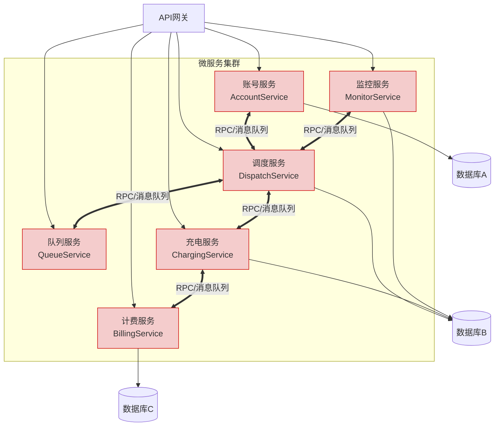

**废弃原因**：
1. **规模不匹配**：本系统服务于单个充电站（2快充+3慢充充电桩），并发量有限。微服务架构的运维开销（服务发现、负载均衡、配置中心）远超这个规模的实际需要。
2. **分布式事务复杂化**：充电请求从提交到完成涉及调度→队列→充电→计费多个步骤，微服务间需分布式事务协调，而单体+分层可通过本地事务保证一致性。
3. **开发与调试成本高**：5人小组需同时理解和调试多个独立服务，增加了协作复杂度，不利于课程作业的交付。
4. **部署复杂度**：微服务需要容器化部署（Docker/K8s），而分层架构单体应用可直接部署，更符合课程验收要求。

#### 1.2.3 废弃方案三：纯事件驱动架构（Pure Event-Driven）

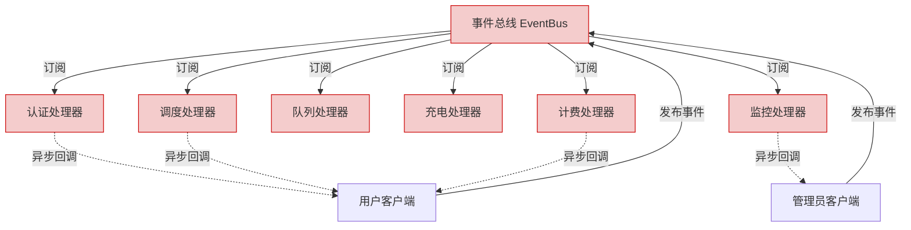

**废弃原因**：
1. **同步操作占主导**：用户登录、提交充电申请、查看状态、结束充电等绝大多数操作为同步请求-响应模式，用户需要立即得到反馈。纯事件驱动适合异步处理，但同步场景需要额外的回调或轮询机制，增加不必要的复杂度。
2. **调试困难**：事件在总线上异步流转，没有清晰的调用链，出现问题难以追踪根因。
3. **时序依赖风险**：充电服务流程有严格时序（先排队→再等待→再充电→再计费），纯事件驱动下缺乏流程编排机制，容易出现事件乱序。

**决策**：保留事件驱动作为**服务器端内部补充模式**，用于故障检测和队列状态变更等异步场景，但整体架构不以此为主。

#### 1.2.4 方案对比总结

| 维度 | 管道-过滤器 | 微服务 | 纯事件驱动 | **分层架构（选定）** |
|------|-----------|--------|-----------|-------------------|
| 业务适配度 | 差（非线性流程） | 中 | 差（同步操作为主） | **优** |
| 开发复杂度 | 低 | 高 | 高 | **低** |
| 可测试性 | 中 | 中 | 差（异步测试困难） | **优** |
| 运维成本 | 低 | 高 | 中 | **低** |
| 扩展性 | 差 | 优 | 优 | **中** |
| 团队适配度（5人） | 中 | 差 | 差 | **优** |

---

### 1.3 系统部署拓扑（逻辑视图）

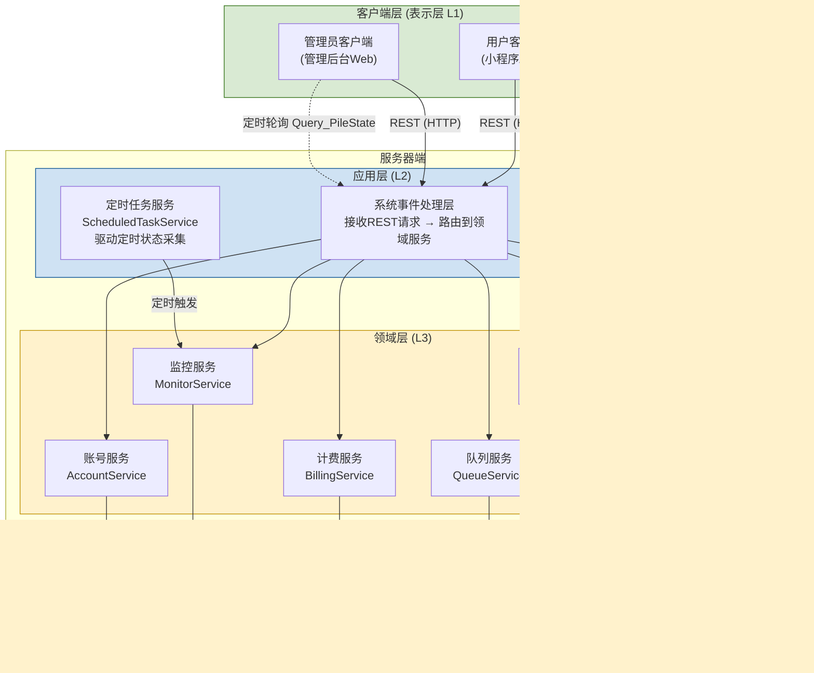
（在实际编程后，对架构调整为以下内容：）
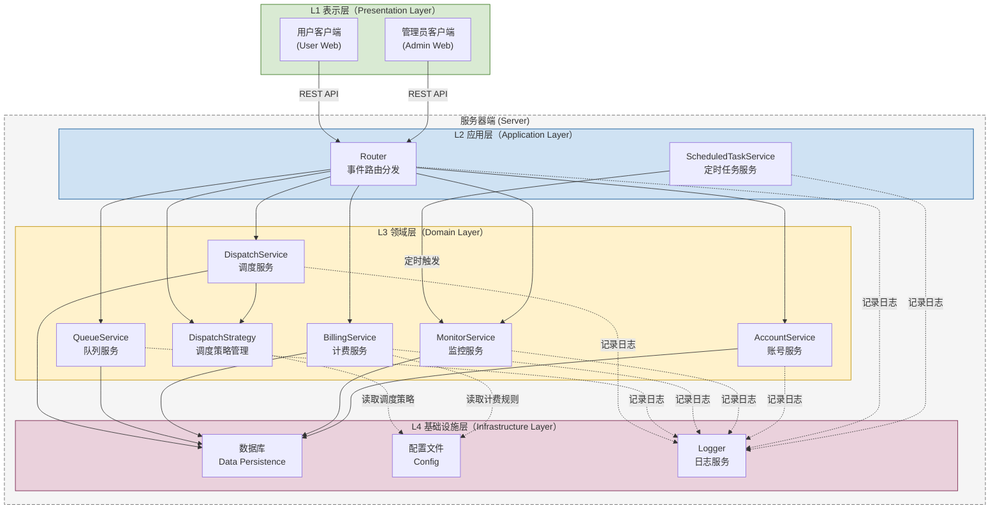

**图例说明**：
- **实线箭头 (→)**：RESTful API 同步调用，客户端发起请求，服务端返回响应
- **虚线箭头 (-.->)**：定时轮询请求，客户端按固定间隔发起
- **绿色 (客户端层)**：表示层，负责用户交互
- **蓝色 (应用层)**：请求路由与协调
- **黄色 (领域层)**：核心业务逻辑
- **紫色 (基础设施层)**：数据持久化

**层间通信规则**：
- 表示层仅能调用应用层接口（通过 REST API）
- 应用层调用领域层服务处理业务逻辑，驱动定时任务
- 领域层通过基础设施层进行数据持久化
- **禁止跨层调用**：表示层不能直接访问领域层或基础设施层
- **禁止反向依赖**：领域层和基础设施层不依赖应用层

在这个拓扑中：
- **用户客户端**通过 REST 调用登录、充电申请、查看账单等接口
- **管理员客户端**通过 REST 调用运行充电桩、设置参数等接口，同时通过定时轮询刷新充电桩状态
- **应用层路由**接收 REST 请求，根据指令类型分发到对应的领域服务
- **应用层定时任务服务(ScheduledTaskService)**定期触发领域层 MonitorService 采集充电桩状态——这是**合法的 L2→L3 调用**，遵循层次单向依赖
- **领域服务之间**通过直接依赖协作（如调度服务通过 DispatchStrategy 获取当前激活策略后执行调度任务）
- **配置文件**存储启动参数指定的默认调度策略，系统启动时由基础设施层读取后注入到 DispatchStrategy

### 1.4 架构与用例的映射

| 用例 | 涉及层级 | 通信方式 | 核心领域服务 |
|------|----------|----------|-------------|
| 注册（UC-22） | 表示层→应用层→领域层→基础设施层 | REST (POST/PUT) | AccountService |
| 登录（UC-01） | 表示层→应用层→领域层→基础设施层 | REST (POST) | AccountService |
| 充电申请（UC-02） | 表示层→应用层→领域层→基础设施层 | REST (GET/POST/PUT/DELETE) | DispatchService, QueueService |
| 查看账单（UC-12） | 表示层→应用层→领域层→基础设施层 | REST (GET) | BillingService |
| 查看详单（UC-12a） | 表示层→应用层→领域层→基础设施层 | REST (GET) | BillingService |
| 运行充电桩（UC-23） | 表示层→应用层→领域层→基础设施层 | REST (POST/PUT) | —（直接管理ChargingPile） |
| 查看充电桩状态（UC-14） | 表示层→应用层→领域层 | REST (GET) + 定时轮询 | MonitorService |
| 查看队列状态（UC-15） | 表示层→应用层→领域层 | REST (GET) | QueueService |
| 管理调度策略（UC-41） | 表示层→应用层→领域层→基础设施层 | REST (GET/PUT) + 配置文件 | DispatchStrategy, ConfigFile |

---

## 二、静态结构设计

### 2.1 领域对象识别

#### 2.1.1 实体（Entity）

| 实体 | 说明 |
|------|------|
| `Station充电桩` | 充电桩，包含三区（排队区/等待区/充电区）容量计数，独立配置基础服务费 |
| `User用户` | 用户与车辆（1:1映射） |
| `ChargingSession充电会话` | 一次充电全过程，贯穿排队/等待/充电/完成状态 |
| `Protocol充电协议` | 充电协议（如 AC 7kW、DC 120kW），每个协议固定功率 |
| `StationProtocol桩协议关联` | 充电桩与支持协议的关联关系 |
| `Bill账单` | 单次充电的完整费用记录（含分时电价明细、服务费阶梯明细） |
| `ElectricityPrice分时电价` | 电价时段配置（峰时/平时/谷时） |
| `ServiceFeeTier服务费阶梯` | 服务费阶梯费率配置 |
| `GlobalConfig全局配置` | 系统运行时配置（调度算法、基础服务费等） |
| `ScheduleLog调度日志` | 调度操作审计日志 |
| `FaultEvent故障事件` | 故障事件记录 |
| `OperationReport运营报表` | 运营报表（充电量/收入/利用率） |

#### 2.1.2 值对象（Value Object）

| 值对象 | 说明 |
|--------|------|
| `TimeOfUseTariffPolicy分时电价策略` | 分时电价策略值对象 |
| `ServiceFeePolicy服务费策略` | 服务费策略值对象 |
| `PileStatus充电桩状态`、`SessionStatus会话状态` | 枚举类型 |
| `ProtocolType协议类型`、`ZoneType区域类型`、`PaymentStatus支付状态` | 枚举类型 |

#### 2.1.3 领域服务（Domain Service）

| 领域服务 | 职责 |
|----------|------|
| `DispatchService调度服务` | 按当前激活策略进行分配与再调度 |
| `QueueService队列服务` | 车辆在排队区/等待区/充电区的流转控制 |
| `BillingService计费服务` | 统一费用计算与账单生成 |
| `MonitorService监控服务` | 充电桩状态定时采集与推送 |
| `DispatchStrategy调度策略` | 封装策略选择与切换逻辑 |

### 2.2 领域模型类图

> 本类图仅使用**定向关联**(`-->`)、**依赖**(`..>`)和**继承**(`<|--`)三种关系。

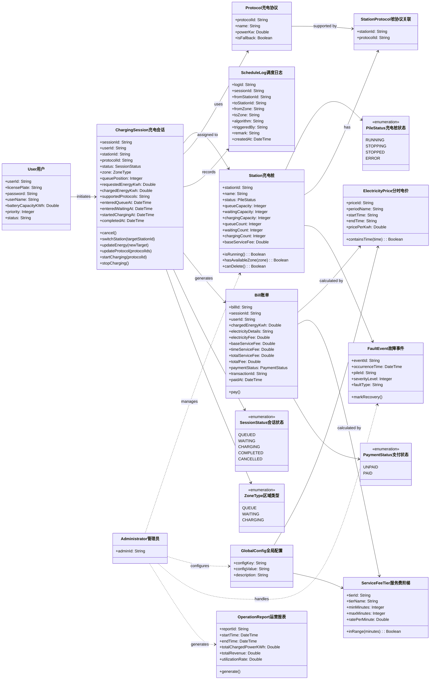

**表 2.1 核心领域类说明**

| 类名 | 属性 | 方法 |
|------|------|------|
| Station充电桩 | stationId, name, status, queue/waiting/chargingCapacity, queue/waiting/chargingCount, baseServiceFee | isRunning(), hasAvailableZone(), canDelete() |
| User用户 | userId, licensePlate, password, userName, batteryCapacityKWh, priority, status | register(), login() |
| Protocol充电协议 | protocolId, name, powerKw, isFallback | — |
| ChargingSession充电会话 | sessionId, userId, stationId, protocolId, status, zone, queuePosition, requestedEnergyKwh, chargedEnergyKwh, supportedProtocols, 时间戳 | cancel(), switchStation(), updateEnergy(), updateProtocol(), startCharging(), stopCharging() |
| Bill账单 | billId, sessionId, userId, chargedEnergyKwh, electricityDetails(JSON), electricityFee, baseServiceFee, timeServiceFee, totalFee, paymentStatus | pay() |
| ElectricityPrice分时电价 | priceId, periodName, startTime, endTime, pricePerKwh | containsTime() |
| ServiceFeeTier服务费阶梯 | tierId, tierName, minMinutes, maxMinutes, ratePerMinute | inRange() |
| ScheduleLog调度日志 | logId, sessionId, fromStationId, toStationId, fromZone, toZone, algorithm, triggeredBy, remark | — |
| FaultEvent故障事件 | eventId, pileId, faultType, severityLevel | markRecovery() |

class DispatchService调度服务 {
  +assignChargingPile(request): Station
  +estimateTotalCompletionTime(request, pile): Integer
  +rescheduleByPriority(vehicles)
  +rescheduleByTimeOrder(vehicles)
  +recoverChargingFault(pileId)
  +rescheduleByShortestTotalTime(vehicles)
  +batchAssignByShortestTotalTime(vehicles, piles)
  +initDispatchStrategy(algorithm, faultStrategy)
  +switchDispatchStrategy(strategyType)
  +switchFaultStrategy(faultType)
  +getActiveFaultStrategy(): String
}

class DispatchStrategy调度策略 {
  +algorithm: String
  +faultStrategy: String
  +availableAlgorithms: String[]
  +availableFaultStrategies: String[]
  +init(configFile)
  +switchAlgorithm(algorithm)
  +switchFault(faultType)
  +getCurrentAlgorithm(): String
  +getCurrentFaultStrategy(): String
}

class QueueService队列服务 {
  +moveToQueueArea(session, station)
  +moveToWaitingArea(session, station)
  +moveToStation(session, targetStation)
  +promoteToCharging(station)
  +getSessionState(sessionId): SessionStatus
  +reorder(station, zone, sessionId, newPosition)
  +changeQueue(sessionId, fromStation, toStation)
}

class BillingService计费服务 {
  +calculateBill(session): Bill
  +getBill(billId): Bill
  +getUserBills(userId): Bill[]
  +processPayment(billId)
}

class MonitorService监控服务 {
  +checkStationStatus(stationId): PileStatus
  +autoDispatchLoop()
  +handleStationFault(stationId, algorithm)
}

class Administrator管理员 {
  +adminId: String
  +manageStation(stationId, action)
  +reorderQueue(stationId, zone, sessionId, newPosition)
  +moveVehicleToStation(sessionId, targetStationId)
  +updateGlobalConfig(configKey, configValue)
  +exportReport()
}

class OperationReport运营报表 {
  +reportId: String
  +startTime: DateTime
  +endTime: DateTime
  +totalChargedPowerKWh: Double
  +totalRevenue: Double
  +utilizationRate: Double
  +generate()
}

classDispatchService调度服务 ..> ChargingSession充电会话
DispatchService调度服务 ..> Station充电桩
QueueService队列服务 ..> Station充电桩
QueueService队列服务 ..> ChargingSession充电会话
BillingService计费服务 ..> ChargingSession充电会话
BillingService计费服务 ..> Bill账单
MonitorService监控服务 ..> Station充电桩

ChargingSession充电会话 --> SessionStatus会话状态
ChargingSession充电会话 --> ZoneType区域类型
Bill账单 --> PaymentStatus支付状态

Administrator管理员 ..> Station充电桩 : manages
Administrator管理员 ..> DispatchService调度服务 : triggers
Administrator管理员 ..> DispatchStrategy调度策略 : configures
Administrator管理员 ..> OperationReport运营报表
Station充电桩 --> FaultEvent故障事件
Administrator管理员 ..> FaultEvent故障事件 : handles
DispatchService调度服务 --> DispatchStrategy调度策略 : uses
DispatchService调度服务 ..> ScheduleLog调度日志 : writes```

### 2.3 关键约束与业务规则映射

| 业务规则 | 实现方式 |
|----------|----------|
| 充电协议匹配 | `ChargingSession充电会话.supportedProtocols`（用户支持协议）∩ `Station充电桩` 关联协议 |
| 三区流转（每桩独立） | `Station充电桩` 的 queueCount/waitingCount/chargingCount 三个计数器 + 调度循环 |
| 桩三区容量 | `Station充电桩.queueCapacity/waitingCapacity/chargingCapacity` |
| 最短完成时间目标 | `DispatchService调度服务.estimateTotalCompletionTime`（Tⱼ = wj + cj） |
| 请求变更与取消 | `ChargingSession充电会话.updateEnergy/updateProtocol/cancel` |
| 故障再调度（五种策略） | `FaultEvent故障事件` + `DispatchService调度服务` 的五个重调度方法 |
| 调度策略可切换 | `DispatchStrategy调度策略` — 系统启动参数决定默认值，管理员运行时可切换 |
| 分时电价 | `ElectricityPrice分时电价` 表，计费引擎按时间段切片计算 |
| 服务费（基础费 + 时长阶梯） | `ServiceFeeTier服务费阶梯` 表，计费引擎按分钟数匹配阶梯区间 |
| 实时金额反馈 | 所有 API 响应中携带 `currentFee` 字段，排队/等待/充电态均实时计算 |
| 定时状态刷新 | 客户端轮询 `GET /sessions/:id` + 服务器端调度循环 `DispatchLoop` |

### 2.4 用例级静态结构类图

按第二次作业要求，使用**依赖、定向关联、继承**三种关系，围绕6组用例绘制静态结构类图。

#### 2.4.1 注册与登录用例类图

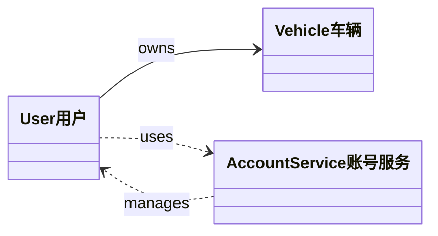

**表 2.1 注册与登录用例类说明**

| 类名 | 属性 | 方法 |
|------|------|------|
| User用户 | userId, userName, licensePlate, password, membershipLevel, accountStatus | createNewAccount(car_Id, userName, car_Capacity), set_pwd(password), login(car_Id, password) |
| Vehicle车辆 | vehicleId, licensePlate, batteryCapacityKWh, currentBatteryPercentage, chargingProtocol | — |
| AccountService账号服务 | — | validateAccount(car_Id), createAccount(user), setPassword(userId, password), authenticate(car_Id, password) |

#### 2.4.2 充电申请用例类图

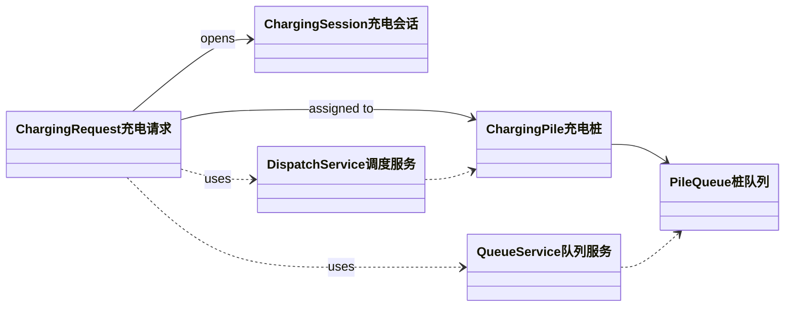

**表 2.2 充电申请用例类说明**

| 类名 | 属性 | 方法 |
|------|------|------|
| ChargingRequest充电请求 | requestId, car_Id, requestTime, chargingMode, Request_Amount, requestStatus, queue_Num, car_Number_before_position | updateRequest(mode, targetPower), cancel() |
| ChargingPile充电桩 | pileId, type, maxPowerKW, status, supportedProtocols, TotalChargeNum, TotalChargeTime, TotalCapacity | estimateCompletionTime(request), startCharging(session), stopCharging(sessionId) |
| ChargingSession充电会话 | sessionId, startTime, endTime, chargedPowerKWh, currentPowerKW, faultInterrupted, interruptedPowerKWh | modifyTargetPower(targetPowerKWh), end(), pause(), resume(targetPileId, resumeFromPower) |
| DispatchService调度服务 | — | assignChargingPile(request), estimateTotalCompletionTime(request, pile) |
| QueueService队列服务 | — | enqueue(request, pileId), getCarState(car_id), dequeue(pileId) |
| PileQueue桩队列 | queueId, capacity | enqueue(request), dequeue(), remove(requestId) |

#### 2.4.3 查看账单与详单用例类图

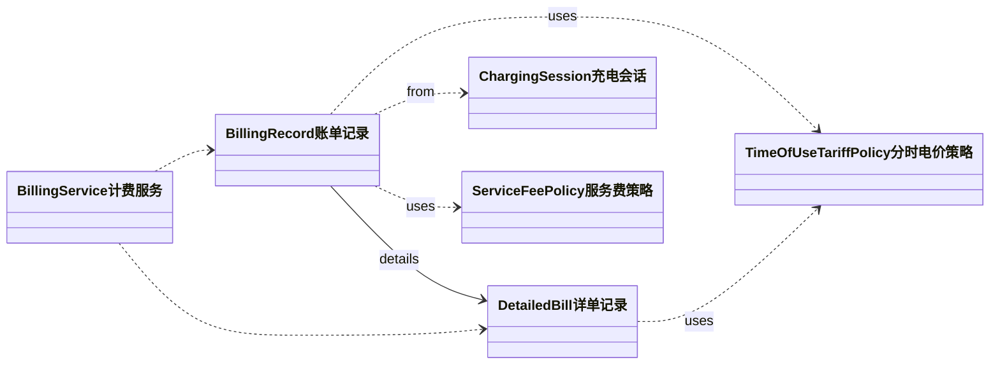

**表 2.3 查看账单与详单用例类说明**

| 类名 | 属性 | 方法 |
|------|------|------|
| BillingRecord账单记录 | billingId, Bill_Id, carId, date, ChargePileNum, ChargeAmount, ChargeDuration, StartTime, EndTime, TotalChargeFee, TotalServiceFee, TotalFee | generateBill(session) |
| DetailedBill详单记录 | Bill_Id, carId, date, ChargePileNum, ChargeAmount, ChargeDuration, StartTime, EndTime, periodChargeFees[], periodServiceFees[], periodSubtotalFees[] | splitByPeriods(tariff) |
| BillingService计费服务 | — | calculateBill(session), queryBillByDate(carId, date), getDetailedBill(Bill_Id) |
| TimeOfUseTariffPolicy分时电价策略 | peakPrice, normalPrice, valleyPrice | queryTimeSlotPrice(time) |
| ServiceFeePolicy服务费策略 | baseServiceFee, timeCoefficient, overtimePenalty | calculateServiceFee(durationMinutes, isOvertime) |

#### 2.4.4 运行充电桩用例类图

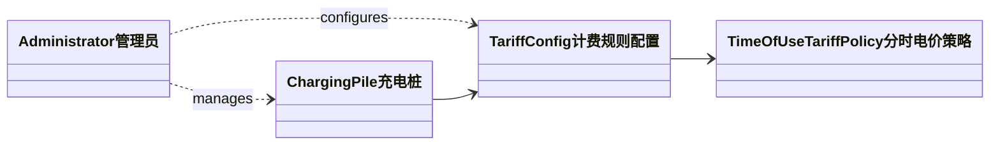

**表 2.4 运行充电桩用例类说明**

| 类名 | 属性 | 方法 |
|------|------|------|
| Administrator管理员 | adminId | powerOn(pile_Id), powerOff(pile_Id), setParameters(pile_Id, tariffConfig, peakPrice, normalPrice, valleyPrice), Start_ChargingPile(pile_Id) |
| ChargingPile充电桩 | pileId, type, maxPowerKW, status, supportedProtocols | — |
| TariffConfig计费规则配置 | pileId, tariffRule, peakPrice, normalPrice, valleyPrice | updateTariff(pileId, peak, normal, valley) |
| TimeOfUseTariffPolicy分时电价策略 | peakPrice, normalPrice, valleyPrice | queryTimeSlotPrice(time) |

#### 2.4.5 查看充电桩状态与队列状态用例类图

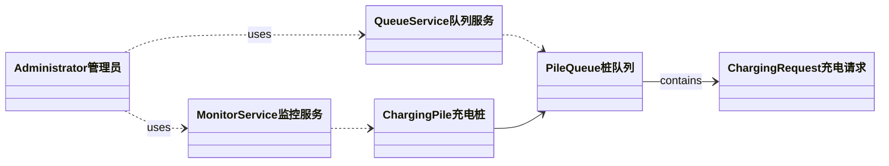

**表 2.5 查看充电桩状态与队列状态用例类说明**

| 类名 | 属性 | 方法 |
|------|------|------|
| MonitorService监控服务 | refreshInterval | getPileStats(pile_Id), batchCollectStats(), startPeriodicRefresh(intervalSeconds) |
| QueueService队列服务 | — | getQueueDetail(queuelist) |
| ChargingPile充电桩 | pileId, type, status, TotalChargeNum, TotalChargeTime, TotalCapacity | — |
| PileQueue桩队列 | queueId, capacity | getVehicles(), calculateWaitTime(vehicle) |
| ChargingRequest充电请求 | car_Id, requestTime, Request_Amount | — |
| Administrator管理员 | adminId | Query_PileState(pile_Id), Query_QueueState(queuelist) |

#### 2.4.6 管理调度策略用例类图

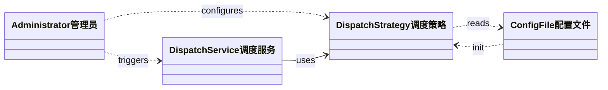

**表 2.6 管理调度策略用例类说明**

| 类名 | 属性 | 方法 |
|------|------|------|
| DispatchStrategy调度策略 | algorithm, faultStrategy, availableAlgorithms[], availableFaultStrategies[] | init(configFile), switchAlgorithm(algorithm), switchFault(faultType), getCurrentAlgorithm(), getCurrentFaultStrategy() |
| DispatchService调度服务 | — | assignChargingPile(request), rescheduleByPriority(vehicles), rescheduleByTimeOrder(vehicles), recoverChargingFault(pileId), rescheduleByShortestTotalTime(vehicles), batchAssignByShortestTotalTime(vehicles, piles), initDispatchStrategy(algorithm, faultStrategy), switchDispatchStrategy(strategyType), switchFaultStrategy(faultType) |
| ConfigFile配置文件 | algorithm, faultStrategy | — |
| Administrator管理员 | adminId | setDispatchStrategy(strategyType), setFaultStrategy(faultType) |

### 2.5 UML活动图（客户充电服务业务流程）

#### 2.5.1 业务流程概述

客户使用充电服务的完整业务流程从注册/登录开始，到结束一次充电服务，涵盖以下主要阶段：

1. **注册/登录**：新用户注册账号并设置密码，已有用户直接登录
2. **登录与队列分配**：用户登录后，系统基于当前选定的调度策略（默认为"完成充电所需时间最短"）计算最佳充电桩队列
3. **排队区阶段**：车辆在排队区等待，可自由更换到其他充电桩队列（退出0费用）
4. **等待区阶段**：排队区排到最前时自动进入等待区，不可更换队列，退出需扣除基础服务费
5. **充电区阶段**：进入充电区后请求用户核对充电协议和电量并确认开始充电（超时未确认扣除基础服务费）
6. **充电中阶段**：充电过程中可修改协议和电量
7. **充电完成与计费**：到达指定电量后自动结束充电，计算阶梯电价和服务费
8. **支付结算**：用户完成支付，驶离充电站

#### 2.5.2 UML活动图

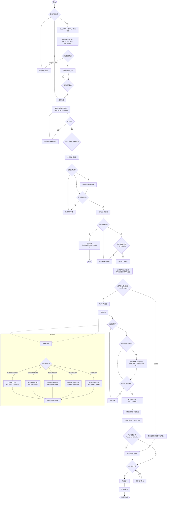

（在实际编程后，对流程调整为以下内容：）
```mermaid
flowchart TD
    %% ============================================================
    %% 子图 0：图例
    %% ============================================================
    subgraph Legend["图例"]
        direction LR
        L_USER(["用户操作节点"]) --- L_SYS{系统判断节点}
        L_SYS --- L_AUTO[("⚡ 自动调度 subgraph")]
        L_AUTO --- L_FAULT[("⚠ 故障处理 subgraph")]
    end

    %% ============================================================
    %% 主流程：注册 & 登录
    %% ============================================================
    Start(["开始"]) --> A{"是否已有账号?"}

    A -->|否| B["输入车牌号、用户名、电池容量"]
    B --> C["createNewAccount<br/>car_Id, userName, car_Capacity<br/>pwd"]
    C --> D{"账号创建成功?"}
    D -->|否 账号已存在| E["提示账号已存在"]
    E --> A
    D -->|是| H["注册完成"]

    A -->|是| I

    H --> I["输入车牌号和密码登录<br/>login car_Id, password"]
    I --> J{"登录验证"}
    J -->|失败| K["提示账号或密码错误"]
    K --> I
    J -->|成功| G["进入主页"]

    %% ============================================================
    %% 主流程：发起充电请求（含 DispatchService 调度计算）
    %% ============================================================
    G --> L["发起充电请求"]
    L --> L1["系统计算最佳充电桩队列<br/>DispatchService.findBestStation()"]

    subgraph DispatchCalc["📍 DispatchService 调度计算"]
        direction TB
        DC_DB[("查询各桩队列深度<br/>+ 兼容协议")]
        DC_ALGO["调用 DispatchStrategy<br/>选用当前算法策略"]
        DC_RESULT["返回最优充电桩 ID"]
        DC_DB --> DC_ALGO --> DC_RESULT
    end

    L1 --> DC_DB
    DC_RESULT --> M["分配进入排队区"]

    %% ============================================================
    %% 主流程：排队区
    %% ============================================================
    M --> N{"是否更换队列?"}
    N -->|是| O["更换到目标队列队尾"]
    O --> P
    N -->|否| P{"是否排到最前?"}
    P -->|否| Q["继续排队等待"]
    Q --> N

    %% ============================================================
    %% 子图①：自动调度 — 排队区 → 等待区
    %% ============================================================
    P -->|"✅ 排到最前"| ASQ_ENTRY

    subgraph AutoSched_Q["⚡ 自动调度：排队区→等待区 (定时轮询，每 5~10s)"]
        direction TB
        ASQ_TITLE["ScheduledTaskService 触发<br/>MonitorService.autoDispatchLoop()"]
        ASQ_TITLE --> ASQ_CHECK{"等待区有空位?"}
        ASQ_CHECK -->|否| ASQ_WAIT["等待下个周期"]
        ASQ_WAIT --> ASQ_TITLE
        ASQ_CHECK -->|"✅ 有空位"| ASQ_MOVE["QueueService.moveToWaiting()<br/>排队区队首 → 等待区队尾"]
        ASQ_MOVE --> ASQ_LOG["写入 ScheduleLog<br/>(triggered_by: system)"]
        ASQ_LOG --> ASQ_DONE(["移入完成"])
    end

    ASQ_ENTRY --> ASQ_CHECK
    ASQ_DONE --> S["进入等待区"]

    %% ============================================================
    %% 主流程：等待区
    %% ============================================================
    S --> U{"是否退出充电?"}
    U -->|是| V["退出充电<br/>扣除基础服务费，电费为0元"]
    V --> End2(["结束"])
    U -->|否| W{"是否排至首位且<br/>上一位充电完毕?"}
    W -->|否| X["继续在等待区等待"]
    X --> U

    %% ============================================================
    %% 子图②：自动调度 — 等待区 → 充电区
    %% ============================================================
    W -->|"✅ 排到首位"| ASW_ENTRY

    subgraph AutoSched_W["⚡ 自动调度：等待区→充电区 (定时轮询，每 5~10s)"]
        direction TB
        ASW_TITLE["ScheduledTaskService 触发<br/>MonitorService.autoDispatchLoop()"]
        ASW_TITLE --> ASW_CHECK{"充电区有空位?"}
        ASW_CHECK -->|否| ASW_WAIT["等待下个周期"]
        ASW_WAIT --> ASW_TITLE
        ASW_CHECK -->|"✅ 有空位"| ASW_MOVE["QueueService.moveToCharging()<br/>等待区队首 → 充电区"]
        ASW_MOVE --> ASW_MATCH["自动匹配最佳充电协议<br/>(选择功率最高且兼容的)"]
        ASW_MATCH --> ASW_LOG["写入 ScheduleLog"]
        ASW_LOG --> ASW_DONE(["移入完成"])
    end

    ASW_ENTRY --> ASW_CHECK
    ASW_DONE --> Y["进入充电区"]

    %% ============================================================
    %% 主流程：充电确认
    %% ============================================================
    Y --> Z["请求用户核对和更改<br/>充电协议及修改充电电量"]
    Z --> AA{"用户确认开始充电?<br/>Start_Charging"}
    AA -->|是| AB["确认开始充电"]
    AA -->|否/超时| AC["取消充电并扣除基本服务费<br/>（可配置，每个充电桩可不同）"]
    AC --> AC_BILL["生成账单明细"]

    %% ============================================================
    %% 主流程：充电中
    %% ============================================================
    AB --> AD["开始充电"]
    AD --> AE{"充电过程中"}

    AE --> AF{"是否修改协议/电量?"}
    AF -->|是| AG["更换充电桩支持的协议<br/>或修改电量（下限为当前已充）"]
    AG --> AH
    AF -->|否| AH{"是否到达指定电量?"}
    AH -->|否| AI["继续充电"]
    AI --> AE

    %% ============================================================
    %% 子图③：异常调度 — 充电桩故障处理
    %% ============================================================
    AE -.->|"💥 充电桩故障"| FH_ENTRY

    subgraph FaultHandle["⚠ 异常调度：充电桩故障处理"]
        direction TB
        FH_TRIGGER["充电桩故障/紧急停止<br/>MonitorService.handleStationFault()"]
        FH_TRIGGER --> FH_STRATEGY{"选择调度策略<br/>DispatchStrategy"}

        FH_STRATEGY -->|优先级调度| FH_PRIO["按优先级排序车辆<br/>依次分配最优充电桩"]
        FH_STRATEGY -->|时间顺序调度| FH_TIME["按请求时间排序车辆<br/>依次分配可用充电桩"]
        FH_STRATEGY -->|充电中故障恢复| FH_RECOVER["保存已充电量快照<br/>优先恢复充电中车辆"]
        FH_STRATEGY -->|单次调度最短时长| FH_SINGLE["遍历兼容桩计算 Tⱼ<br/>每台车辆选最短 T"]
        FH_STRATEGY -->|批量调度最短时长| FH_BATCH["构建 N×M 成本矩阵<br/>匈牙利算法求全局最优"]

        FH_PRIO --> FH_RESULT["DispatchService.redistribute()<br/>批量更新会话 + 写入调度日志"]
        FH_TIME --> FH_RESULT
        FH_RECOVER --> FH_RESULT
        FH_SINGLE --> FH_RESULT
        FH_BATCH --> FH_RESULT
        FH_RESULT --> FH_DONE(["重分配完成<br/>转入目标桩排队区"])
    end

    FH_ENTRY --> FH_TRIGGER
    FH_DONE --> M

    %% ============================================================
    %% 主流程：充电结束 → 通知前端 → 计费 → 支付
    %% ============================================================
    AH -->|"✅ 到达指定电量"| AJ["自动结束充电 End_Charging"]
    AJ --> AK["BillingService.calculateFee()<br/>阶梯电价 + 阶梯服务费"]
    AK --> AL["生成账单记录 Request_Bill"]
    AL --> NOTIFY["📡 系统通知前端<br/>（下次轮询返回 completed 状态）"]
    NOTIFY --> AM{"用户查看详单?<br/>Request_DetailedList"}
    AM -->|是| AM_DETAIL["显示分段详单明细<br/>(各时段电价 + 服务费阶梯)"]
    AM_DETAIL --> AO
    AM -->|否| AO{"用户确认支付?"}
    AO -->|是| AP["BillingService.processPayment()<br/>完成支付"]
    AP --> AQ["驶离充电站"]
    AQ --> End3(["充电服务结束"])
    AO -->|否| AR["等待支付确认"]
    AR --> AO
```

#### 2.5.3 活动图流程特点总结

1. **注册/登录分离**：新用户需完成注册流程（创建账号+设置密码），已有用户直接登录
2. **用户动线简化**：排队区→等待区→充电区均为自动流转，无需用户中断确认
3. **调度策略可配置**：支持五种故障处理策略，系统启动参数决定默认值，管理员可运行时切换
4. **灵活性强**：支持中途队列更换、协议修改、电量调整等灵活操作
5. **容错性好**：五种独立的故障处理策略，保障不同场景下的服务连续性
6. **退出计费阶梯化**：排队区退出0费用，等待区和充电区确认前退出扣除基础服务费
7. **计费透明**：账单概览+分段详单两级查询，费用明细可追溯

---

## 三、动态结构设计

### 3.1 用例图

#### 3.1.1 系统角色

1. **用户 (User)**：电动汽车车主，使用充电服务
2. **管理员 (Administrator)**：充电站管理人员，负责系统监控与配置

#### 3.1.2 用例图

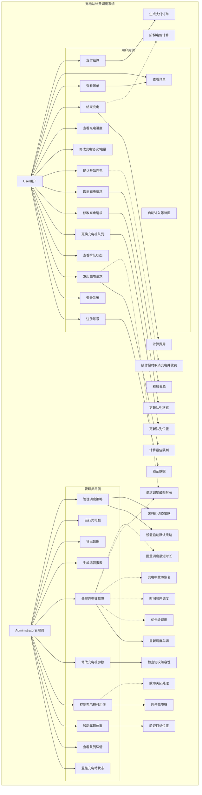

### 3.2 系统顺序图（SSD）

以下为9个用例的系统顺序图。

#### 3.2.1 注册（UC-22）

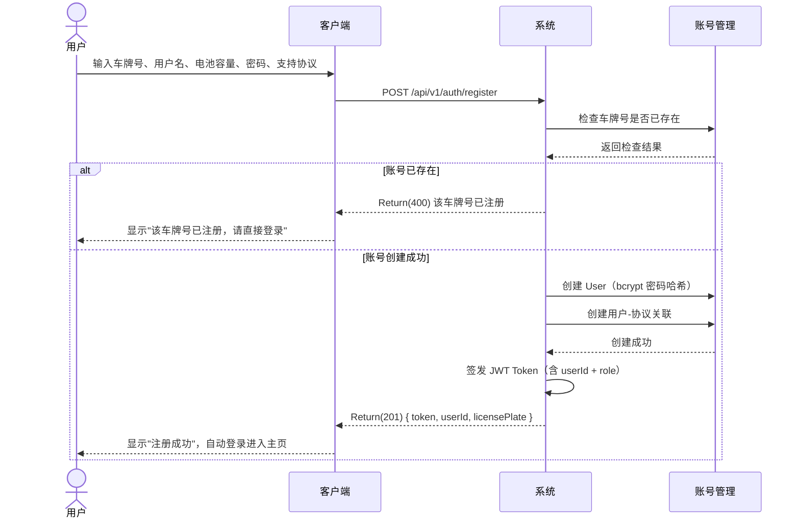

#### 3.2.2 登录（UC-01）

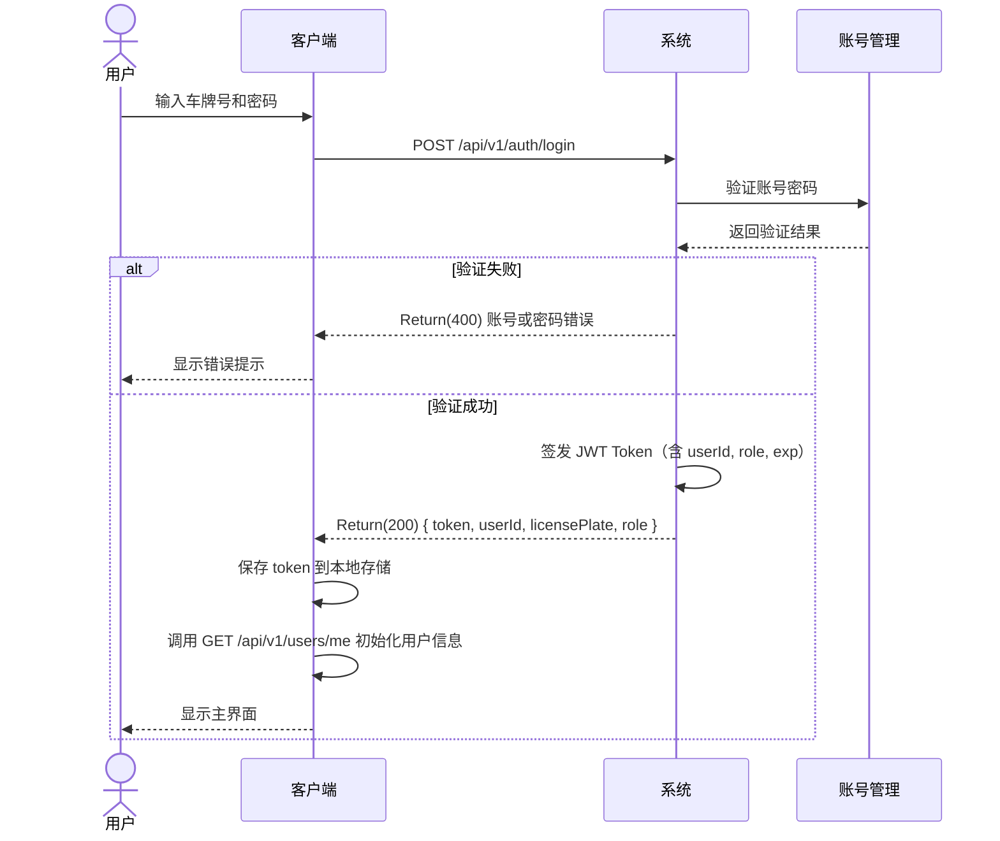

#### 3.2.3 充电申请（UC-02、UC-03、UC-05、UC-08、UC-10、UC-11）

**阶段一：提交充电申请与查看队列状态**

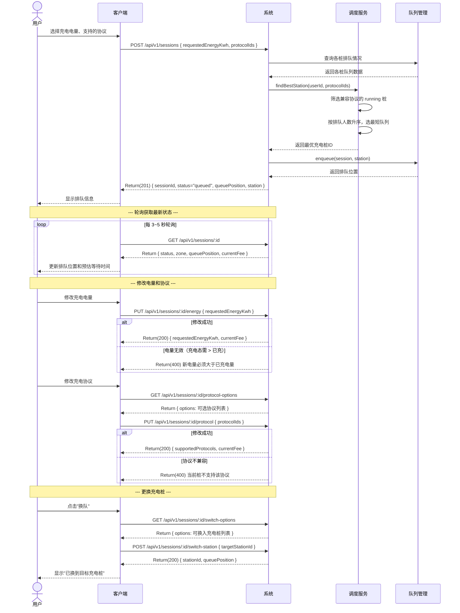

**阶段二：开始充电**

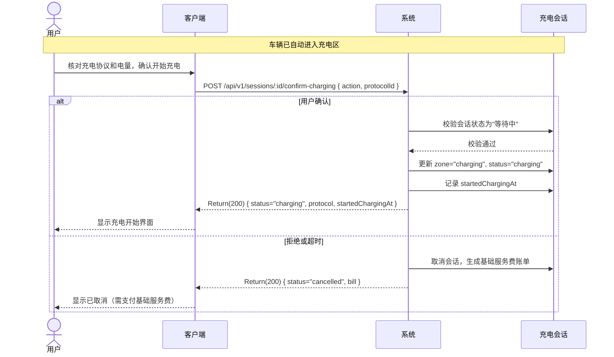

**阶段三：查看充电状态与结束充电**

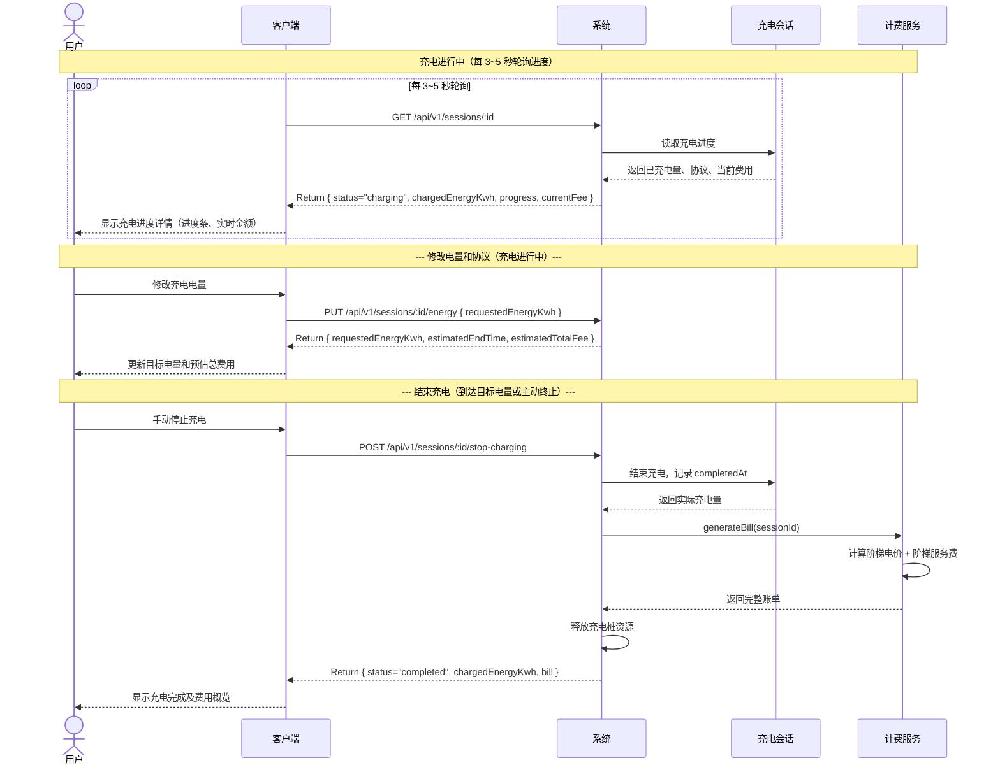

#### 3.2.4 查看账单（UC-12）

```mermaid
sequenceDiagram
    actor User as 用户
    participant Client as 客户端
    participant System as 系统
    participant Billing as 计费服务
    
    User->>Client: 进入历史账单页面
    Client->>System: GET /api/v1/bills?page=1&pageSize=20
    
    alt 无账单记录
        System-->>Client: Return { list: [], total: 0 }
        Client-->>User: 显示"暂无账单记录"
    else 查询成功
        System-->>Client: Return { list: [{ billId, station, totalFee, paymentStatus, createdAt }], total }
        Client-->>User: 显示历史账单列表
    end
    
    User->>Client: 点击某条账单查看详情
    Client->>System: GET /api/v1/bills/:id
    
    System->>Billing: getBill(billId)
    Billing-->>System: 返回完整账单（含分时电费明细+服务费阶梯明细）
    System-->>Client: Return { id, station, chargingDuration, electricityDetails,<br/>serviceFeeTiers, totalFee, paymentStatus }
    Client-->>User: 显示账单完整详情
```

#### 3.2.5 查看账单详情（UC-12a）

> 注意：账单详情含分段详单（分时电费明细 + 服务费阶梯明细），合并为同一个接口 `GET /api/v1/bills/:id`，无需单独调用。

```mermaid
sequenceDiagram
    actor User as 用户
    participant Client as 客户端
    participant System as 系统
    participant Billing as 计费服务
    participant Tariff as 电价策略
    participant FeeTier as 服务费阶梯
    
    User->>Client: 点击某条账单查看详情
    Client->>System: GET /api/v1/bills/:id
    
    System->>Billing: getBill(billId)
    
    Billing->>Tariff: 根据充电时段匹配各时段电价
    Tariff-->>Billing: 返回各时段电价和对应充电量
    
    Billing->>FeeTier: 根据充电时长匹配各阶梯费率
    FeeTier-->>Billing: 返回各阶梯分钟数和费率
    
    Billing->>Billing: 组装完整账单（含明细JSON）
    Billing-->>System: 返回完整账单
    
    System-->>Client: Return { id, station, chargingDuration,<br/>electricityFee, electricityDetails: [{period, energy, price, fee}],<br/>baseServiceFee, timeServiceFee,<br/>serviceFeeTiers: [{tier, minutes, rate, fee}],<br/>totalFee, paymentStatus }
    Client-->>User: 显示账单完整详情（含分时电费+阶梯服务费）
```

#### 3.2.6 运行充电桩（UC-23、UC-17、UC-18）

```mermaid
sequenceDiagram
    actor Admin as 管理员
    participant AdminClient as 管理客户端
    participant System as 系统
    participant Station as 充电桩
    
    Note over Admin,Station: --- 创建充电桩 ---
    
    Admin->>AdminClient: 输入充电桩名称、容量、支持协议
    AdminClient->>System: POST /api/v1/admin/stations { name, queueCapacity, waitingCapacity, chargingCapacity, protocolIds }
    
    System->>Station: 创建充电桩记录
    System->>System: 关联充电桩与支持的协议
    Station-->>System: 创建成功
    System-->>AdminClient: Return(201) { stationId, name, status="stopped" }
    AdminClient-->>Admin: 显示充电桩已创建
    
    Note over Admin,Station: --- 启动充电桩 ---
    
    Admin->>AdminClient: 选择充电桩，点击启动
    AdminClient->>System: POST /api/v1/admin/stations/:id/start
    
    System->>Station: 更新状态为 running
    Station-->>System: 状态更新成功
    System-->>AdminClient: Return(200) { status="running" }
    AdminClient-->>Admin: 显示"已启动"
    
    Note over Admin,Station: --- 修改配置（运行时）---
    
    Admin->>AdminClient: 修改充电桩容量或独立基础服务费
    AdminClient->>System: PUT /api/v1/admin/stations/:id { queueCapacity, baseServiceFee }
    
    System->>Station: 更新配置
    Station-->>System: 更新成功
    System-->>AdminClient: Return(200) { message }
    AdminClient-->>Admin: 显示参数已更新
    
    Note over Admin,Station: --- 正常停止 ---
    
    Admin->>AdminClient: 正常停止充电桩
    AdminClient->>System: POST /api/v1/admin/stations/:id/stop
    
    System->>Station: 更新状态为 stopping（不再接受新请求）
    Station-->>System: 更新成功
    System-->>AdminClient: Return(200) { status="stopping", message:"将在队列清空后自动停止" }
    AdminClient-->>Admin: 显示"停止中"
    
    Note over Admin,Station: --- 删除充电桩（需三区无车）---
    
    Admin->>AdminClient: 选择已停止的充电桩，点击删除
    AdminClient->>System: DELETE /api/v1/admin/stations/:id
    
    alt 仍有车辆
        System-->>AdminClient: Return(400) 充电桩仍有车辆，无法删除
    else 三区无车
        System->>System: 软删除充电桩
        System-->>AdminClient: Return(200) 充电桩已删除
        AdminClient-->>Admin: 显示已删除
    end
```

#### 3.2.7 查看充电桩状态（UC-14）

```mermaid
sequenceDiagram
    actor Admin as 管理员
    participant AdminClient as 管理客户端
    participant System as 系统
    
    Note over Admin,System: 管理员主动查询所有充电桩
    
    Admin->>AdminClient: 打开充电桩列表页面
    AdminClient->>System: GET /api/v1/stations
    
    System->>System: 读取所有充电桩的状态和各区计数
    System-->>AdminClient: Return { stations: [{ id, name, status,<br/>queueCount, waitingCount, chargingCount,<br/>queueCapacity, waitingCapacity, chargingCapacity }] }
    AdminClient-->>Admin: 显示所有充电桩状态概览
    
    Note over Admin,System: 查看充电桩详情
    
    Admin->>AdminClient: 点击某个充电桩
    AdminClient->>System: GET /api/v1/stations/:id
    
    System-->>AdminClient: Return { id, name, status,<br/>queueList, waitingList, chargingList,<br/>supportedProtocols }
    AdminClient-->>Admin: 显示充电桩三区车辆列表
```

#### 3.2.8 查看队列状态（UC-15）

```mermaid
sequenceDiagram
    actor Admin as 管理员
    participant AdminClient as 管理客户端
    participant System as 系统
    participant Queue as 队列管理
    
    Admin->>AdminClient: 打开队列管理页面
    AdminClient->>System: GET /api/v1/admin/queues
    
    System->>Queue: 读取所有充电桩的三区车辆列表
    Queue-->>System: 返回各桩各区域车辆
    System-->>AdminClient: Return { stations: [{ stationId, stationName,<br/>queue: [{sessionId, licensePlate, position, requestedEnergy}],<br/>waiting: [...], charging: [...] }] }
    AdminClient-->>Admin: 显示所有队列详情
    
    Note over Admin,Queue: 拖拽修改排队位置
    
    Admin->>AdminClient: 拖拽车辆到新的排队位置
    AdminClient->>System: PUT /api/v1/admin/queues/reorder { stationId, zone, sessionId, newPosition }
    
    System->>Queue: 重新排列队列顺序
    Queue-->>System: 更新成功
    System-->>AdminClient: Return(200) 队列已更新
    AdminClient-->>Admin: 显示更新后的队列
    
    Note over Admin,Queue: 拖拽移动到其他桩
    
    Admin->>AdminClient: 拖拽车辆到其他充电桩
    AdminClient->>System: PUT /api/v1/admin/queues/move { sessionId, targetStationId, targetPosition }
    
    System->>Queue: 从原桩移除，加入目标桩队列
    Queue-->>System: 移动成功
    System-->>AdminClient: Return(200) 已调度到目标充电桩
    AdminClient-->>Admin: 显示更新后队列
```

#### 3.2.9 管理调度策略（UC-41、UC-42、UC-43）

**系统启动时设置默认调度策略**

```mermaid
sequenceDiagram
    participant Admin as 管理员
    participant Config as 配置文件
    participant System as 系统
    participant Dispatch as 调度服务
    
    Note over Admin,Dispatch: 系统启动前
    
    Admin->>Config: 编辑配置文件<br/>dispatch.algorithm=SHORTEST_TOTAL_TIME<br/>fault.strategy=TIME_ORDER
    
    Note over Admin,Dispatch: 系统启动时
    
    Config->>System: 读取配置参数
    System->>Dispatch: initDispatchStrategy(algorithm, faultStrategy)
    
    Dispatch->>Dispatch: 加载正常分配策略：单次调度最短时长
    Dispatch->>Dispatch: 加载故障处理策略：时间顺序调度（默认）
    
    Dispatch-->>System: 策略初始化完成
    System-->>Admin: 系统启动，策略就绪
```

**管理员运行时切换策略**

```mermaid
sequenceDiagram
    actor Admin as 管理员
    participant AdminClient as 管理客户端
    participant System as 系统
    participant Dispatch as 调度服务（策略中心）
    participant StrategyPool as 策略池
    
    Admin->>AdminClient: 打开系统管理界面
    AdminClient->>System: getCurrentStrategies()
    System->>Dispatch: 查询当前激活策略
    Dispatch-->>System: 返回策略状态
    System-->>AdminClient: 显示当前策略信息
    
    Note over Admin,StrategyPool: 切换正常分配策略
    
    Admin->>AdminClient: 选择新的分配策略
    AdminClient->>System: setDispatchStrategy(strategyType="BATCH_SHORTEST_TIME")
    
    System->>Dispatch: switchDispatchStrategy("BATCH_SHORTEST_TIME")
    Dispatch->>StrategyPool: 从策略池中激活新策略
    StrategyPool-->>Dispatch: 策略切换就绪
    
    alt 切换成功
        Dispatch-->>System: Return(1) 策略已切换
        System-->>AdminClient: Return(1) 切换成功
        AdminClient-->>Admin: 显示"分配策略已切换为：批量调度最短时长"
    else 切换失败（策略无效）
        Dispatch-->>System: Return(0) 未知策略
        System-->>AdminClient: Return(0) 切换失败
        AdminClient-->>Admin: 显示错误提示
    end
    
    Note over Admin,StrategyPool: 切换故障处理策略
    
    Admin->>AdminClient: 选择新的故障策略
    AdminClient->>System: setFaultStrategy(faultType="PRIORITY")
    
    System->>Dispatch: switchFaultStrategy("PRIORITY")
    Dispatch->>StrategyPool: 检查策略是否在池中
    StrategyPool-->>Dispatch: 策略存在，切换成功
    
    Dispatch-->>System: Return(1) 故障策略已切换
    System-->>AdminClient: Return(1) 切换成功
    AdminClient-->>Admin: 显示"故障处理策略已切换为：优先级调度"
```

**可用策略一览**

| 策略类型 | 策略名称 | 标识符 | 适用场景 |
|----------|---------|--------|---------|
| 正常分配 | 单次调度最短时长 | SHORTEST_TOTAL_TIME | 默认。单台车辆提交申请时，遍历所有兼容桩选总完成时间最短 |
| 正常分配 | 批量调度最短时长 | BATCH_SHORTEST_TIME | 多台车辆同时分配时，匈牙利算法求全局最优 |
| 故障处理 | 优先级调度 | PRIORITY | 故障时按区域+会员+等待时间排序后分配 |
| 故障处理 | 时间顺序调度 | TIME_ORDER | 故障时按请求时间先来后到排序 |
| 故障处理 | 充电中故障恢复 | FAULT_RECOVERY | 充电中故障时保存快照，优先恢复充电中车辆 |
| 故障处理 | 单次调度最短时长 | SHORTEST_TOTAL_TIME | 故障时用贪心算法为每台车选最优桩 |
| 故障处理 | 批量调度最短时长 | BATCH_SHORTEST_TIME | 故障时用匈牙利算法批量求全局最优分配 |

### 3.3 故障调度交互图

以下为五种故障处理交互过程。策略由系统启动参数决定默认值，管理员运行期间可动态切换。

#### 3.3.1 优先级调度（SSD-F1）

```mermaid
sequenceDiagram
    participant Monitor as 监控系统
    participant System as 系统
    participant Dispatch as 调度服务
    participant FaultPile as 故障充电桩
    participant TargetPile as 目标充电桩
    
    Monitor->>System: detectFault(pile_Id)
    System->>System: 记录故障事件
    
    Note over System,Dispatch: 获取当前激活的故障处理策略
    System->>Dispatch: getActiveFaultStrategy()
    Dispatch-->>System: 当前策略 = "优先级调度"
    
    System->>FaultPile: getAffectedVehicles(pile_Id)
    FaultPile-->>System: 返回三区域所有受影响车辆列表
    
    System->>Dispatch: rescheduleByPriority(affectedVehicles)
    
    Dispatch->>Dispatch: 计算每辆车的优先级权重<br/>（充电中车辆 > 等待区车辆 > 排队区车辆）
    Dispatch->>Dispatch: 按优先级降序排列车辆
    
    loop 按优先级顺序处理每辆车
        Dispatch->>Dispatch: findBestAvailablePile(vehicle, protocol)
        Dispatch-->>Dispatch: 返回最优可用充电桩ID
        
        alt 找到可用充电桩
            Dispatch->>TargetPile: assignVehicle(vehicleId, targetPileId)
            TargetPile-->>Dispatch: 分配成功
        else 无可用充电桩
            Dispatch->>Dispatch: 将车辆加入全局等待队列最前
        end
    end
    
    Dispatch-->>System: 返回调度结果列表
    System->>System: 更新故障充电桩状态为"故障关闭"
    System->>System: 发送调度结果通知给管理员
```

#### 3.3.2 时间顺序调度（SSD-F2）

```mermaid
sequenceDiagram
    participant Monitor as 监控系统
    participant System as 系统
    participant Dispatch as 调度服务
    participant FaultPile as 故障充电桩
    participant TargetPile as 目标充电桩
    
    Monitor->>System: detectFault(pile_Id)
    System->>System: 记录故障事件
    
    Note over System,Dispatch: 获取当前激活的故障处理策略
    System->>Dispatch: getActiveFaultStrategy()
    Dispatch-->>System: 当前策略 = "时间顺序调度"
    
    System->>FaultPile: getAffectedVehicles(pile_Id)
    FaultPile-->>System: 返回三区域所有受影响车辆列表
    
    System->>Dispatch: rescheduleByTimeOrder(affectedVehicles)
    
    Dispatch->>Dispatch: 获取每辆车的请求到达时间(request_time)
    Dispatch->>Dispatch: 按请求时间升序排列（先到先处理）
    
    loop 按时间顺序处理每辆车
        Dispatch->>Dispatch: findAvailablePileByType(vehicle, protocol)
        Dispatch-->>Dispatch: 返回可用充电桩ID
        
        alt 找到可用充电桩
            Dispatch->>TargetPile: enqueueVehicle(vehicleId, targetPileId, position="队尾")
            TargetPile-->>Dispatch: 入队成功
        else 无可用充电桩
            Dispatch->>Dispatch: 将车辆加入全局等待队列队尾
        end
    end
    
    Dispatch-->>System: 返回调度结果列表
    System->>System: 更新故障充电桩状态为"故障关闭"
    System->>System: 发送调度结果通知给管理员
```

#### 3.3.3 充电中故障恢复（SSD-F3）

```mermaid
sequenceDiagram
    participant Monitor as 监控系统
    participant System as 系统
    participant Dispatch as 调度服务
    participant FaultPile as 故障充电桩
    participant Session as 充电会话
    participant TargetPile as 目标充电桩
    
    Monitor->>System: detectChargingFault(pile_Id)
    System->>System: 识别故障类型 = "充电中故障"
    
    Note over System,Dispatch: 获取当前激活的故障处理策略
    System->>Dispatch: getActiveFaultStrategy()
    Dispatch-->>System: 当前策略 = "充电中故障恢复"
    
    System->>FaultPile: getChargingVehicles(pile_Id)
    FaultPile-->>System: 返回正在充电的车辆列表
    
    System->>FaultPile: getOtherAffectedVehicles(pile_Id)
    FaultPile-->>System: 返回排队区和等待区车辆列表
    
    Note over System,Session: 第一步：处理充电中车辆（最高优先级）
    
    loop 每个充电中车辆
        System->>Session: pauseChargingSession(sessionId)
        Session->>Session: 保存当前已充电量(currentChargedPower)
        Session->>Session: 标记会话状态为"故障中断"
        Session-->>System: 返回会话快照
        
        System->>Dispatch: findSameTypeAvailablePile(protocol, currentChargedPower)
        Dispatch->>Dispatch: 搜索同类型可用充电桩
        
        alt 找到同类型可用桩
            Dispatch-->>System: 返回目标充电桩ID
            System->>TargetPile: reassignChargingSession(sessionId, targetPileId)
            TargetPile-->>System: 重新分配成功
            
            System->>Session: resumeCharging(sessionId, targetPileId, resumeFromPower)
            Session->>Session: 从已充电量继续充电
            Session-->>System: 恢复充电成功
        else 无同类型可用桩
            System->>Session: markSessionPending(sessionId)
            System->>System: 将充电会话加入故障恢复等待队列
        end
    end
    
    Note over System,TargetPile: 第二步：处理排队区和等待区车辆
    
    System->>Dispatch: rescheduleByTimeOrder(otherAffectedVehicles)
    Dispatch-->>System: 对其他车辆按时间顺序重新调度
    
    System->>System: 更新故障充电桩状态为"故障关闭"
    System->>System: 记录完整故障恢复日志
    System->>System: 发送故障恢复通知
```

#### 3.3.4 单次调度最短时长 — 故障场景（SSD-F4）

```mermaid
sequenceDiagram
    participant Monitor as 监控系统
    participant System as 系统
    participant Dispatch as 调度服务
    participant FaultPile as 故障充电桩
    participant TargetPile as 目标充电桩
    
    Monitor->>System: detectFault(pile_Id)
    System->>System: 记录故障事件
    
    Note over System,Dispatch: 获取当前激活的故障处理策略
    System->>Dispatch: getActiveFaultStrategy()
    Dispatch-->>System: 当前策略 = "单次调度最短时长"
    
    System->>FaultPile: getAffectedVehicles(pile_Id)
    FaultPile-->>System: 返回所有受影响车辆列表
    
    System->>Dispatch: rescheduleByShortestTotalTime(affectedVehicles)
    
    loop 遍历每台受影响车辆
        Dispatch->>Dispatch: getCompatiblePiles(protocol, mode)
        Dispatch-->>Dispatch: 返回同类型可用桩列表
        
        loop 遍历每个可用充电桩
            Dispatch->>Dispatch: 计算 wj（当前排队总充电时间）
            Dispatch->>Dispatch: 计算 cj（预计充电时间）
            Dispatch->>Dispatch: 计算 Tj = wj + cj
        end
        
        Dispatch->>Dispatch: 选择 min(Tj) 对应的充电桩
        
        Dispatch->>TargetPile: assignVehicle(vehicle, pile)
        TargetPile-->>Dispatch: 分配成功
    end
    
    Dispatch-->>System: 返回调度结果列表
    System->>System: 更新故障充电桩状态为"故障关闭"
    System->>System: 发送调度结果通知给管理员
```

#### 3.3.5 批量调度最短时长 — 故障场景（SSD-F5）

```mermaid
sequenceDiagram
    participant Monitor as 监控系统
    participant System as 系统
    participant Dispatch as 调度服务
    participant FaultPile as 故障充电桩
    participant TargetPile as 目标充电桩
    
    Monitor->>System: detectFault(pile_Id)
    System->>System: 记录故障事件
    
    Note over System,Dispatch: 获取当前激活的故障处理策略
    System->>Dispatch: getActiveFaultStrategy()
    Dispatch-->>System: 当前策略 = "批量调度最短时长"
    
    System->>FaultPile: getAffectedVehicles(pile_Id)
    FaultPile-->>System: 返回所有受影响车辆列表
    
    System->>Dispatch: getAvailableCompatiblePilesForBatch(vehicles)
    Dispatch-->>System: 返回可用充电桩列表
    
    System->>Dispatch: batchAssignByShortestTotalTime(vehicles, piles)
    
    Note over Dispatch: 步骤1：构建 N×M 成本矩阵
    
    loop 每辆车
        loop 每个充电桩
            Dispatch->>Dispatch: 计算 C[i][j] = wj + (Request_Amount / maxPowerKW)
        end
    end
    
    Note over Dispatch: 步骤2：执行匈牙利算法求全局最优
    
    Dispatch-->>System: 返回最优分配方案
    
    par 并行分配
        loop 每个车辆→充电桩对
            System->>TargetPile: assignVehicle(vehicle, pile)
            TargetPile-->>System: 分配成功
        end
    end
    
    System->>System: 更新故障充电桩状态为"故障关闭"
    System->>System: 记录批量调度结果
    System->>System: 发送批量调度结果通知给管理员
```

### 3.4 操作契约

#### 3.4.1 用户相关操作契约

**契约1：POST /api/v1/auth/register（注册账号）**

- **操作**：POST /api/v1/auth/register(licensePlate, userName, batteryCapacity, password, confirmPassword, protocolIds)
- **交叉引用**：UC-22 注册账号
- **前置条件**：
  1. licensePlate 格式正确且唯一
  2. password === confirmPassword，长度 ≥ 6
  3. batteryCapacity > 0
  4. protocolIds 非空且均为已存在的协议ID
- **后置条件**：
  1. 创建新的 User 对象（bcrypt 哈希密码）
  2. 创建用户与充电协议的关联
  3. 签发 JWT Token（payload: { user_id, role="user", exp, iat }）
  4. 返回 201 + token + 用户基本信息
- **异常处理**：
  - licensePlate 已存在：Return(400) "该车牌号已注册"
  - protocolIds 无效：Return(400) "协议 ID 不存在"

**契约2：POST /api/v1/auth/login（登录）**

- **操作**：POST /api/v1/auth/login(licensePlate, password)
- **交叉引用**：UC-01 登录系统
- **前置条件**：
  1. 账号已注册
- **后置条件**：
  1. 验证账号密码匹配（使用 bcrypt verify）
  2. 签发 JWT Token（含 userId, role, exp）
  3. 返回 200 + token + 用户基本信息
- **异常处理**：
  - 账号不存在或密码错误：Return(400) "账号或密码错误"（防撞库，不区分具体错误）

**契约3：GET /api/v1/users/me（获取当前用户信息）**

- **操作**：GET /api/v1/users/me
- **交叉引用**：UC-01 登录系统（子步骤）
- **前置条件**：
  1. 用户已登录，携带有效 JWT Token
- **后置条件**：
  1. 从 JWT 提取 userId
  2. 返回用户完整信息（含 batteryCapacity, protocols, activeSession）
  3. activeSession 查询该用户是否有进行中的会话
- **异常处理**：
  - Token 无效或过期：Return(401)

**契约4：POST /api/v1/sessions（发起充电请求）**

- **操作**：POST /api/v1/sessions(requestedEnergyKwh, protocolIds)
- **交叉引用**：UC-02 发起充电请求
- **前置条件**：
  1. 用户已登录
  2. requestedEnergyKwh > 0
  3. protocolIds 非空且在用户注册协议范围内
  4. 用户没有进行中的会话
  5. 至少有一个 running 状态的充电桩且有可用排队位
- **后置条件**：
  1. DispatchService 选择最优充电桩（筛选兼容桩 → 按排队人数升序）
  2. 创建 ChargingSession（status=queued, zone=queue）
  3. 分配 queuePosition
  4. 写入 ScheduleLog
  5. 返回 201 + session 状态
- **异常处理**：
  - 所有充电桩排队区已满：Return(400) "当前所有充电桩排队区已满"
  - 已有进行中会话：Return(409) "您已有进行中的充电会话"

**契约4a：findBestStation（调度分配逻辑）**

- **操作**：DispatchService.findBestStation(userId, protocolIds) → Station
- **交叉引用**：UC-02 发起充电请求（单次调度最短时长策略）
- **前置条件**：
  1. 存在至少一个 running 状态且有可用排队位的充电桩
  2. 存在至少一个充电桩支持用户请求的协议
- **后置条件**：
  1. 筛选 running 状态且排队区未满的充电桩
  2. 筛选兼容用户 protocolIds 的充电桩
  3. 按 queueCount 升序排列，选排队人数最少的
  4. 返回最优充电桩ID
- **异常处理**：
  - 无兼容充电桩：抛出 AppException "无可用充电资源"

**契约5：Modify_Amount(car_Id, Amount)**

- **操作**：Modify_Amount(car_Id: String, Amount: Double)
- **交叉引用**：UC-05 修改充电请求
- **前置条件**：
  1. 充电请求存在且状态为"排队中"或"等待中"
  2. Amount > 当前电量
- **后置条件**：
  1. 更新 ChargingRequest.targetPowerKWh
  2. 重新计算预计充电时长
- **异常处理**：
  - 请求不存在：Return(0)
  - Amount 无效：Return(0)

**契约6：Modify_Mode(car_Id, Mode)**

- **操作**：Modify_Mode(car_Id: String, Mode: ChargeMode)
- **交叉引用**：UC-05 修改充电请求
- **前置条件**：
  1. 充电请求存在且状态为"排队中"
  2. Mode 有效
- **后置条件**：
  1. 更新 ChargingRequest.chargingMode
  2. 从原队列移除，加入新模式对应队列队尾
  3. 重新计算排队位置
- **异常处理**：
  - 请求不存在：Return(0)
  - 新模式无可用充电桩：Return(0)

**契约7：Query_Car_State(car_id)**

- **操作**：Query_Car_State(car_id: String)
- **交叉引用**：UC-03 查看排队状态
- **前置条件**：
  1. 用户已登录
  2. car_id 对应的充电请求存在
- **后置条件**：
  1. 返回 car_Number_before_position（前面排队车辆数）
  2. 返回 car_state（排队中/等待中/充电中/已完成）
  3. 返回 queue_Num（所在队列编号）
  4. 返回 request_time（请求时间）
- **异常处理**：
  - 请求不存在：Return 空

**契约8：Start_Charging(car_id, ChargePileNum)**

- **操作**：Start_Charging(car_id: String, ChargePileNum: String)
- **交叉引用**：UC-08 确认开始充电
- **前置条件**：
  1. 充电请求存在且状态为"等待中"
  2. 车辆在等待区排到首位
  3. 充电桩 ChargePileNum 状态为可用
- **后置条件**：
  1. 创建 ChargingSession 对象
  2. 请求状态更新为"充电中"
  3. 充电桩状态更新为"充电中"
  4. 记录开始充电时间
- **异常处理**：
  - 充电桩不可用：Return(0)
  - 操作超时：取消充电并扣除基本服务费

**契约9：Query_Charging_State(car_id)**

- **操作**：Query_Charging_State(car_id: String)
- **交叉引用**：UC-10 查看充电进度
- **前置条件**：
  1. car_id 对应的充电会话存在且状态为"充电中"
- **后置条件**：
  1. 返回详单信息：当前电量、已充电量、充电功率、预计剩余时间、当前时段电价、已产生费用等
- **异常处理**：
  - 会话不存在：Return 空

**契约10：End_Charging(car_id, ChargingPileNum)**

- **操作**：End_Charging(car_id: String, ChargingPileNum: String)
- **交叉引用**：UC-11 结束充电
- **前置条件**：
  1. 充电会话存在且状态为"充电中"
  2. 到达目标电量或用户主动终止
  3. ChargingPileNum 与当前充电桩匹配
- **后置条件**：
  1. 充电会话状态更新为"已完成"
  2. 记录结束时间和实际充电量
  3. 释放充电桩资源
  4. 生成账单记录（BillingRecord）
  5. 请求状态更新为"已完成"
- **异常处理**：
  - ChargingPileNum 不匹配：Return(0)
  - 会话不存在：Return(0)

**契约11：Request_Bill(carId, date)**

- **操作**：Request_Bill(carId: String, date: Date)
- **交叉引用**：UC-12 查看账单
- **前置条件**：
  1. 用户已登录
  2. 日期有效
- **后置条件**：
  1. 查询指定日期该用户的所有账单记录
  2. 返回每条账单的概览信息（11个字段）
- **异常处理**：
  - 无账单记录：Return null
  - 日期无效：Return(0)

**契约12：Request_DetailedList(Bill_Id)**

- **操作**：Request_DetailedList(Bill_Id: String)
- **交叉引用**：UC-12a 查看详单
- **前置条件**：
  1. Bill_Id 对应的账单存在
- **后置条件**：
  1. 返回账单基础信息
  2. 返回各时段分段明细
- **异常处理**：
  - Bill_Id 不存在：Return(0)

#### 3.4.2 管理员相关操作契约

**契约13：powerOn(pile_Id)**

- **操作**：powerOn(pile_Id: String)
- **交叉引用**：UC-17 控制充电桩可用性
- **前置条件**：
  1. 管理员已登录
  2. 充电桩存在且处于关闭状态
- **后置条件**：
  1. 充电桩电源开启
  2. 充电桩状态更新为"可用"
  3. 记录操作日志
- **异常处理**：
  - 充电桩不存在：Return(0)
  - 充电桩已在运行：Return(0)

**契约14：setParameters(pile_Id, tariffConfig, peakPrice, normalPrice, valleyPrice)**

- **操作**：setParameters(pile_Id: String, tariffConfig, peakPrice: Double, normalPrice: Double, valleyPrice: Double)
- **交叉引用**：UC-18 修改充电桩参数
- **前置条件**：
  1. 管理员已登录
  2. 充电桩存在
  3. 电价数据有效（>0）
- **后置条件**：
  1. 充电桩的计费规则配置更新
  2. 三个时段电价数据更新
  3. 记录参数变更日志
- **异常处理**：
  - 电价数据无效：Return(0)
  - 充电桩不存在：Return(0)

**契约15：Start_ChargingPile(pile_Id)**

- **操作**：Start_ChargingPile(pile_Id: String)
- **交叉引用**：UC-23 运行充电桩
- **前置条件**：
  1. 管理员已登录
  2. 充电桩状态为"可用"
  3. 充电桩已完成参数配置
- **后置条件**：
  1. 充电桩状态更新为"运行中"
  2. 充电桩开始接受充电请求
  3. 记录启动日志
- **异常处理**：
  - 充电桩未就绪：Return(0)
  - 参数未配置：Return(0)

**契约16：powerOff(pile_Id)**

- **操作**：powerOff(pile_Id: String)
- **交叉引用**：UC-17 控制充电桩可用性
- **前置条件**：
  1. 管理员已登录
  2. 充电桩存在
  3. 充电桩无正在充电的车辆
- **后置条件**：
  1. 充电桩电源关闭
  2. 充电桩状态更新为"关闭"
  3. 记录操作日志
- **异常处理**：
  - 充电桩正在使用中：Return(0)
  - 充电桩不存在：Return(0)

**契约17：Query_PileState(pile_Id)**

- **操作**：Query_PileState(pile_Id: String)
- **交叉引用**：UC-14 监控充电站状态
- **前置条件**：
  1. 管理员已登录
  2. 充电桩存在
- **后置条件**：
  1. 返回 workingState（工作状态）
  2. 返回 TotalChargeNum（累计充电次数）
  3. 返回 TotalChargeTime（累计充电时长）
  4. 返回 TotalCapacity（累计充电容量）
- **异常处理**：
  - 充电桩不存在：Return(0)

**契约18：Query_QueueState(queuelist)**

- **操作**：Query_QueueState(queuelist: List)
- **交叉引用**：UC-15 查看队列详情
- **前置条件**：
  1. 管理员已登录
  2. queuelist 非空
- **后置条件**：
  1. 遍历每个队列中的所有车辆
  2. 返回每辆车的 car_Id, car_Capacity, Request_Amount, waitTime
- **异常处理**：
  - 队列为空：Return 空列表

#### 3.4.3 故障调度相关操作契约

**契约19：rescheduleByPriority(pile_Id)**

- **操作**：rescheduleByPriority(pile_Id: String)
- **交叉引用**：UC-19 处理充电桩故障（优先级调度）
- **前置条件**：
  1. 充电桩发生故障
  2. 管理员选择调度策略为"优先级调度"
  3. 故障充电桩上有车辆
- **后置条件**：
  1. 受影响车辆按优先级排序
  2. 每辆车按优先级顺序分配最优可用充电桩
  3. 无可用桩的车辆加入全局等待队列最前
  4. 故障桩状态更新为"故障关闭"
- **异常处理**：
  - 所有充电桩均不可用：通知管理员人工介入

**契约20：rescheduleByTimeOrder(pile_Id)**

- **操作**：rescheduleByTimeOrder(pile_Id: String)
- **交叉引用**：UC-19 处理充电桩故障（时间顺序调度）
- **前置条件**：
  1. 充电桩发生故障
  2. 管理员选择调度策略为"时间顺序调度"
  3. 故障充电桩上有车辆
- **后置条件**：
  1. 受影响车辆按请求时间升序排列
  2. 每辆车按时间顺序依次分配可用充电桩
  3. 故障桩状态更新为"故障关闭"
- **异常处理**：
  - 所有充电桩均不可用：通知管理员人工介入

**契约21：recoverChargingFault(pile_Id)**

- **操作**：recoverChargingFault(pile_Id: String)
- **交叉引用**：UC-19 处理充电桩故障（充电中故障恢复）
- **前置条件**：
  1. 充电桩在充电过程中发生故障
  2. 故障桩上有正在充电的车辆
- **后置条件**：
  1. 充电中会话暂停，保存已充电量快照
  2. 充电中车辆优先调度至同类型可用充电桩
  3. 充电会话从已充电量继续，记录中断时长
  4. 排队区和等待区车辆按时间顺序重新调度
  5. 故障桩状态更新为"故障关闭"
- **异常处理**：
  - 无同类型可用桩：会话加入故障恢复等待队列

**契约22：rescheduleByShortestTotalTime(vehicles)（故障场景）**

- **操作**：rescheduleByShortestTotalTime(vehicles: List)
- **交叉引用**：UC-19 处理充电桩故障（单次调度最短时长）
- **前置条件**：
  1. 充电桩发生故障
  2. 管理员选择故障策略为"单次调度最短时长"
  3. 故障桩上有车辆
- **后置条件**：
  1. 对每台受影响车辆，遍历所有兼容桩计算 Tj = wj + cj
  2. 每台车辆独立选择 min(Tj) 的充电桩
  3. 车辆分配至目标充电桩排队区
  4. 故障桩状态更新为"故障关闭"
- **异常处理**：
  - 车辆无兼容桩：标记该车辆，通知管理员人工介入

**契约23：batchAssignByShortestTotalTime(vehicles, piles)（故障场景）**

- **操作**：batchAssignByShortestTotalTime(vehicles: List, piles: List)
- **交叉引用**：UC-19 处理充电桩故障（批量调度最短时长）
- **前置条件**：
  1. 充电桩发生故障
  2. 管理员选择故障策略为"批量调度最短时长"
  3. 故障桩上有车辆
  4. piles 中至少有一个可用充电桩
- **后置条件**：
  1. 构建 N×M 成本矩阵
  2. 执行匈牙利算法求最小权完美匹配
  3. 按最优分配方案批量分配车辆
  4. 故障桩状态更新为"故障关闭"
  5. 记录批量调度总完成时间
- **异常处理**：
  - N > M 时：分批处理
  - 车辆无任何兼容桩：标记为"待处理"

#### 3.4.4 策略管理相关操作契约

**契约24：initDispatchStrategy(algorithm, faultStrategy)**

- **操作**：initDispatchStrategy(algorithm: String, faultStrategy: String)
- **交叉引用**：UC-42 设置启动默认策略
- **前置条件**：
  1. 系统启动时，配置文件提供有效的策略标识符
- **后置条件**：
  1. 创建 DispatchStrategy 配置对象
  2. 正常分配算法加载为 algorithm 对应的策略
  3. 故障处理策略加载为 faultStrategy 对应的策略
  4. 后续所有调度操作按当前激活策略执行
- **异常处理**：
  - 无效策略标识符：使用默认值（SHORTEST_TOTAL_TIME 和 TIME_ORDER）

**契约25：switchDispatchStrategy(strategyType)**

- **操作**：switchDispatchStrategy(strategyType: String)
- **交叉引用**：UC-43 运行时切换策略
- **前置条件**：
  1. 管理员已登录
  2. 系统运行中
  3. strategyType 有效
- **后置条件**：
  1. 系统当前激活的分配策略切换为 strategyType
  2. 后续所有正常分配操作使用新策略
  3. 记录策略切换日志
- **异常处理**：
  - 策略标识符无效：Return(0)，策略不变

**契约26：switchFaultStrategy(faultType)**

- **操作**：switchFaultStrategy(faultType: String)
- **交叉引用**：UC-43 运行时切换策略
- **前置条件**：
  1. 管理员已登录
  2. 系统运行中
  3. faultType 有效
- **后置条件**：
  1. 系统当前激活的故障处理策略切换为 faultType
  2. 后续所有故障处理操作使用新策略
  3. 记录策略切换日志
- **异常处理**：
  - 策略标识符无效：Return(0)，策略不变

### 3.5 指令对应表

| 用例 | 指令（API） | 参数 | 返回 |
|------|-------------|------|------|
| **注册** |
| 1、注册账号 | POST /api/v1/auth/register | licensePlate, userName, batteryCapacity, password, confirmPassword, protocolIds | Return(201) { token, userId, licensePlate } |
| **登录** |
| 1、登录 | POST /api/v1/auth/login | licensePlate, password | Return(200) { token, userId, licensePlate, role } |
| 2、获取用户信息 | GET /api/v1/users/me | —（从JWT提取身份） | Return(200) { userId, batteryCapacity, protocols, activeSession } |
| **充电会话** |
| 1、发起充电请求 | POST /api/v1/sessions | requestedEnergyKwh, protocolIds | Return(201) { sessionId, status="queued", queuePosition, station } |
| 2、查看会话详情 | GET /api/v1/sessions/:id | — | Return(200) { status, zone, queuePosition, chargedEnergyKwh, currentFee, bill } |
| 3、修改电量 | PUT /api/v1/sessions/:id/energy | requestedEnergyKwh | Return(200) { requestedEnergyKwh, currentFee, estimatedTotalFee } |
| 4、查询候选协议 | GET /api/v1/sessions/:id/protocol-options | — | Return(200) { options: 协议列表 } |
| 5、修改协议 | PUT /api/v1/sessions/:id/protocol | protocolIds | Return(200) { supportedProtocols, currentFee } |
| 6、查询可换入桩 | GET /api/v1/sessions/:id/switch-options | — | Return(200) { options: 充电桩列表 } |
| 7、更换充电桩 | POST /api/v1/sessions/:id/switch-station | targetStationId | Return(200) { stationId, queuePosition } |
| 8、取消充电 | POST /api/v1/sessions/:id/cancel | — | Return(200) { status="cancelled", bill(仅收费) } |
| 9、确认开始充电 | POST /api/v1/sessions/:id/confirm-charging | action, protocolId | Return(200) { status="charging" } 或 cancelled |
| 10、停止充电 | POST /api/v1/sessions/:id/stop-charging | — | Return(200) { status="completed", chargedEnergyKwh, bill } |
| **账单** |
| 1、查看历史账单 | GET /api/v1/bills | page, pageSize, paymentStatus | Return(200) { list: 账单列表, page, total } |
| 2、查看账单详情 | GET /api/v1/bills/:id | — | Return(200) { 完整账单: 含分时电费+服务费阶梯 } |
| 3、支付账单 | POST /api/v1/bills/:id/pay | paymentMethod | Return(200) { paymentStatus="paid", transactionId } |
| **管理充电桩** |
| 1、创建充电桩 | POST /api/v1/admin/stations | name, queueCapacity, waitingCapacity, chargingCapacity, protocolIds | Return(201) { stationId } |
| 2、修改充电桩 | PUT /api/v1/admin/stations/:id | 可选字段 | Return(200) |
| 3、删除充电桩 | DELETE /api/v1/admin/stations/:id | — | Return(200) 或 400（有车辆） |
| 4、启动充电桩 | POST /api/v1/admin/stations/:id/start | — | Return(200) { status="running" } |
| 5、正常停止 | POST /api/v1/admin/stations/:id/stop | — | Return(200) { status="stopping" } |
| 6、紧急停止+重分配 | POST /api/v1/admin/stations/:id/emergency-stop | algorithm, excludeStationIds | Return(200) { redistributedSessions[] } |
| **查看状态** |
| 1、查看充电桩列表 | GET /api/v1/stations | — | Return(200) { stations: 所有桩状态 } |
| 2、查看充电桩详情 | GET /api/v1/stations/:id | — | Return(200) { 三区车辆列表 } |
| **队列管理** |
| 1、查看所有队列 | GET /api/v1/admin/queues | — | Return(200) { stations: 各桩队列 } |
| 2、拖拽修改位置 | PUT /api/v1/admin/queues/reorder | stationId, zone, sessionId, newPosition | Return(200) |
| 3、移动到其他桩 | PUT /api/v1/admin/queues/move | sessionId, targetStationId | Return(200) |
| **配置** |
| 1、获取全局配置 | GET /api/v1/admin/config | — | Return(200) { 算法, 服务费, 电价, 阶梯 } |
| 2、更新全局配置 | PUT /api/v1/admin/config | 可选配置字段 | Return(200) { 更新后配置 } |
| **管理会话/账单** |
| 1、查看所有用户会话 | GET /api/v1/admin/sessions | page, status, stationId | Return(200) 分页会话列表 |
| 2、查看所有账单 | GET /api/v1/admin/bills | page, userId, paymentStatus | Return(200) 分页账单列表 |
| **报表** |
| 1、充电量统计 | GET /api/v1/admin/reports/charging-volume | startDate, endDate, granularity | Return(200) { totalEnergyKwh, dataPoints[] } |
| 2、收入统计 | GET /api/v1/admin/reports/revenue | startDate, endDate, granularity | Return(200) { totalRevenue, dataPoints[] } |
| 3、充电桩利用率 | GET /api/v1/admin/reports/utilization | startDate, endDate | Return(200) { overallUtilization, stations[] } |
## 四、系统事件人员分配

### 4.1 专业分工方向

| 组员 | 角色 | 专业方向 |
|------|------|----------|
| 杜昊阳 | 组长 | 系统架构设计与核心调度策略 |
| 赫金科 | 组员 | 领域数据建模与静态结构设计 |
| 康忆文 | 组员 | 用户服务流程与充电业务交互 |
| 陆昱衡 | 组员 | 计费账单与管理功能设计 |
| 米梓润 | 组员 | 调度优化策略与文档规范 |

### 4.2 用户端事件分配

| 用例 | 指令 | 负责人 |
|------|------|--------|
| **注册** | createNewAccount(car_Id, userName, car_Capacity) | 康忆文 |
| **注册** | set_pwd(******) | 康忆文 |
| **登录** | login(car_Id, password) | 康忆文 |
| **充电申请** | E_chargingRequest(car_Id, Request_Amount, Request_Mode) | 康忆文 |
| **充电申请** | Modify_Amount(car_Id, Amount) | 康忆文 |
| **充电申请** | Modify_Mode(car_Id, Mode) | 康忆文 |
| **充电申请** | Query_Car_State(car_id) | 米梓润 |
| **充电申请** | Start_Charging(car_id, ChargePileNum) | 陆昱衡 |
| **充电申请** | Query_Charging_State(car_id) | 陆昱衡 |
| **充电申请** | End_Charging(car_id, ChargingPileNum) | 陆昱衡 |
| **查看账单** | Request_Bill(carId, date) | 陆昱衡 |
| **查看详单** | Request_DetailedList(Bill_Id) | 陆昱衡 |

### 4.3 管理员端事件分配

| 用例 | 指令 | 负责人 |
|------|------|--------|
| **运行充电桩** | powerOn(pile_Id) | 赫金科 |
| **运行充电桩** | setParameters(计费规则，三个时段的电价数据等) | 赫金科 |
| **运行充电桩** | Start_ChargingPile(pile_Id) | 赫金科 |
| **运行充电桩** | powerOff(pile_Id) | 赫金科 |
| **查看充电桩状态** | Query_PileState(pile_Id) | 米梓润 |
| **查看队列状态** | Query_QueueState(queuelist) | 米梓润 |

### 4.4 故障调度事件分配

| 调度策略 | 核心逻辑 | 负责人 |
|----------|----------|--------|
| 优先级调度（SSD-F1） | 按区域+会员+等待时间排序，依次分配最优桩 | 杜昊阳 |
| 时间顺序调度（SSD-F2） | 按请求时间先来后到排序，依次分配可用桩 | 杜昊阳 |
| 充电中故障恢复（SSD-F3） | 暂停会话+保存快照+优先恢复充电中车辆 | 杜昊阳 |
| 单次调度最短时长（SSD-F4） | 遍历兼容桩，每台车独立选T最短（贪心） | 米梓润 |
| 批量调度最短时长（SSD-F5） | 成本矩阵+匈牙利算法求全局最优分配 | 米梓润 |

### 4.5 静态结构设计分配

| 任务 | 内容 | 负责人 |
|------|------|--------|
| 领域模型类图修正 | 关系调整（去除组合关联面向关联）、新增DispatchStrategy/TariffConfig/DetailedBill类 | 赫金科 |
| 用例级静态结构类图 | 6组用例类图（注册登录/充电申请/账单详单/运行充电桩/充电桩队列状态/调度策略）+ 类说明表 | 赫金科 |
| 活动图修改 | 注册登录分离入口 + 五种故障策略分支 + 账单详单两级查询 | 赫金科 |

### 4.6 其他任务分配

| 任务 | 内容 | 负责人 |
|------|------|--------|
| 系统架构选择及说明 | 架构风格选择与对比、分层架构理由、部署拓扑图、废弃方案分析 | 杜昊阳 |
| 调度策略可切换机制设计 | 启动参数配置文件 + 运行时切换的SSD和操作契约 | 米梓润 |
| 文档整合与规范性检查 | 汇总组员内容，检查格式一致性，确保符合作业模板要求 | 杜昊阳 |
| 工作量统计 | 填写工作量统计表 | 杜昊阳 |

---

## 五、工作量统计

表：作业工作内容及工作量统计

| 任务类别 | 具体任务 | 杜昊阳 | 赫金科 | 康忆文 | 陆昱衡 | 米梓润 |
|----------|---------|:------:|:------:|:------:|:------:|:------:|
| 动态结构 | 注册+登录SSD及操作契约 | | | ● | | |
| 动态结构 | 充电申请SSD及操作契约（7条指令） | | ● | ● | ● | ● |
| 动态结构 | 查看账单+详单SSD及操作契约 | | | | ● | |
| 动态结构 | 运行充电桩SSD及操作契约（4条指令） | | ● | | | |
| 动态结构 | 查看充电桩状态+队列状态SSD及操作契约 | | | ● | | ● |
| 动态结构 | 优先级调度交互图（SSD-F1） | ● | | | | |
| 动态结构 | 时间顺序调度交互图（SSD-F2） | ● | | | | |
| 动态结构 | 充电中故障恢复交互图（SSD-F3） | ● | | | | |
| 动态结构 | 单次调度最短时长交互图（SSD-F4） | | | | | ● |
| 动态结构 | 批量调度最短时长交互图（SSD-F5） | | | | | ● |
| 动态结构 | 调度策略切换交互图 | | | | ● | ● |
| 静态结构 | 领域模型类图修正 | | ● | | | |
| 静态结构 | 用例级静态结构类图（6组） | | ● | | | |
| 静态结构 | 活动图修改 | | ● | | | |
| 架构 | 系统架构选择及说明 | ● | | | | |
| 架构 | 调度策略可切换机制 | | | | | ● |
| 文档 | 整合、规范性检查、人员分配表 | ● | | | | |
| 文档 | 工作量统计 | ● | | | | | |

---

