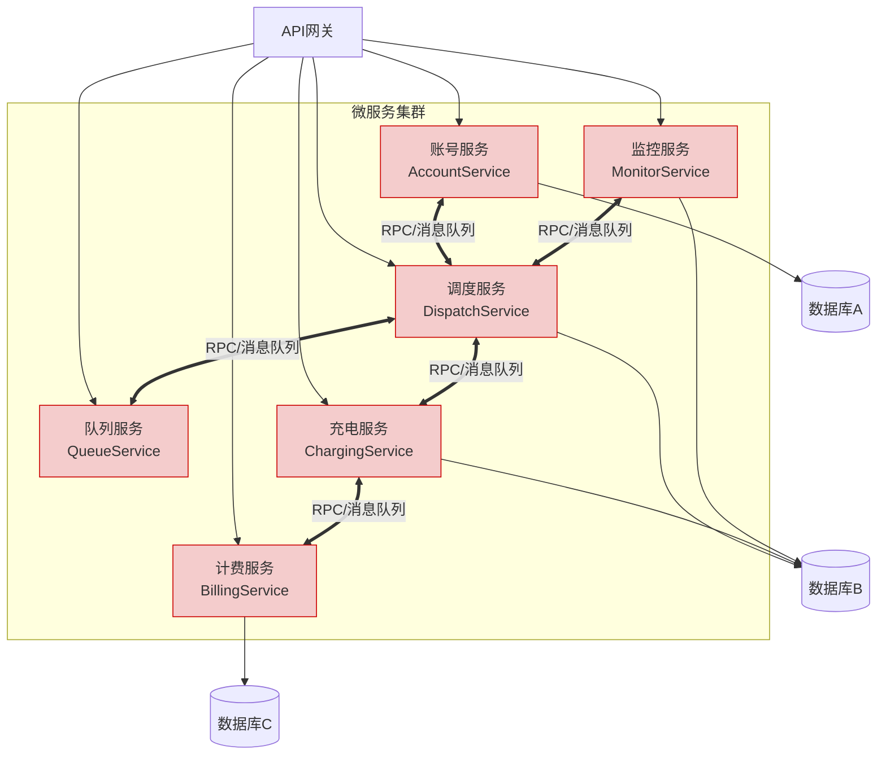
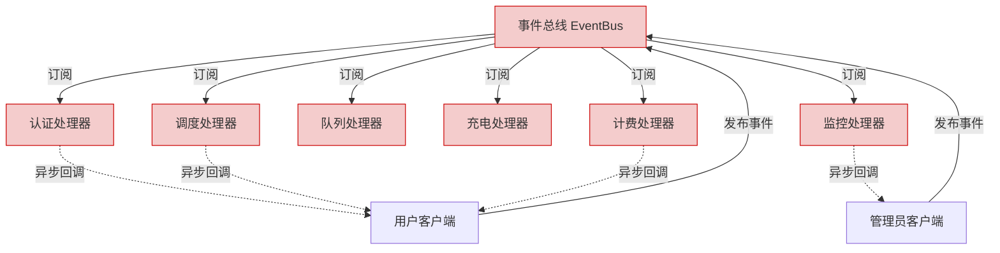
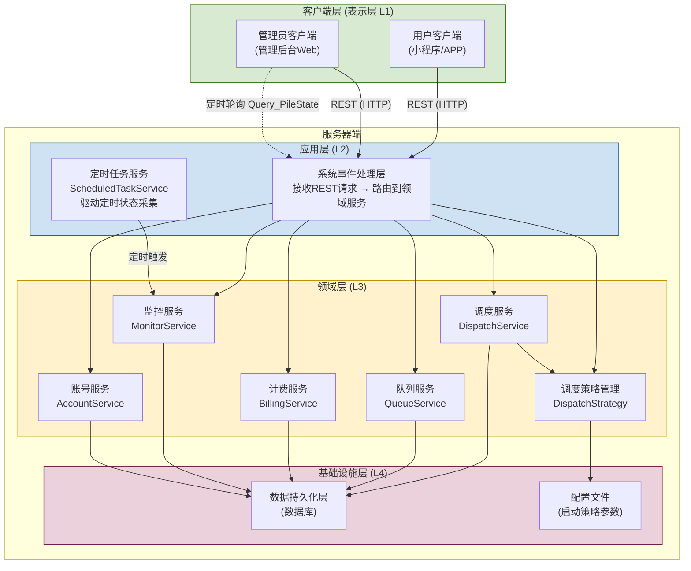

# 第二次作业 — 系统架构选择及分工说明

## 一、系统架构选择及说明

### 1.1 架构风格选择

本系统采用**分层架构（Layered Architecture）**风格，结合**事件驱动**模式进行设计。选择理由如下：

#### 1.1.1 分层架构说明

系统从逻辑上划分为以下四层：

| 层级 | 名称 | 职责 | 对应组件 |
|------|------|------|----------|
| L1 | 表示层（Presentation） | 用户交互界面展示，接收用户输入，展示系统响应 | 用户客户端、管理员客户端 |
| L2 | 应用层（Application） | 处理用例流程，协调领域对象，管理事务边界，驱动定时采集任务 | 系统主控（事件分发器）、ScheduledTaskService（定时任务服务） |
| L3 | 领域层（Domain） | 核心业务逻辑：调度算法、计费规则、队列管理、故障处理策略 | DispatchService、BillingService、QueueService、MonitorService |
| L4 | 基础设施层（Infrastructure） | 数据持久化、消息推送、外部接口 | 数据库、消息中间件 |

#### 1.1.2 选择分层架构的理由

1. **职责分离清晰**：表示层只负责界面逻辑，领域层封装核心业务规则，适合团队分工协作
2. **业务逻辑可测试**：领域层可独立于UI和数据层进行单元测试，核心调度和计费算法可充分验证
3. **易于扩展**：计费规则变更、调度策略增加（如可选的最短时长策略）只需修改领域层，不影响其他层
4. **符合课程要求**：分层架构是UML建模中最常用的架构风格，便于绘制系统顺序图和类图

#### 1.1.3 通信协议选择：RESTful API

客户端与服务器端之间采用 **RESTful API** 风格进行通信，理由如下：

1. **语义清晰**：每个系统事件（指令）直接映射为一个 REST 接口，URL 体现资源，HTTP 方法体现操作
2. **无状态通信**：每个请求独立，服务器不需维护客户端会话状态，便于水平扩展
3. **广泛支持**：各类客户端（小程序/APP/Web）均可通过 HTTP 调用，开发调试方便
4. **与分层架构匹配**：表示层通过 HTTP 调用应用层接口，应用层再将请求转发至领域层处理

**指令与 REST 接口映射表**：

| 系统指令 | HTTP方法 | REST路径 | 说明 |
|----------|----------|----------|------|
| createNewAccount | POST | /api/accounts | 创建新账号 |
| set_pwd | PUT | /api/accounts/{car_Id}/password | 设置密码 |
| login | POST | /api/auth/login | 登录认证 |
| E_chargingRequest | POST | /api/charging/requests | 提交充电申请 |
| Modify_Amount | PUT | /api/charging/requests/{car_Id}/amount | 修改充电量 |
| Modify_Mode | PUT | /api/charging/requests/{car_Id}/mode | 修改充电模式 |
| Query_Car_State | GET | /api/charging/requests/{car_Id}/state | 查询车辆队列状态 |
| Start_Charging | POST | /api/charging/sessions | 开始充电 |
| Query_Charging_State | GET | /api/charging/sessions/{car_Id} | 查询充电状态 |
| End_Charging | DELETE | /api/charging/sessions/{car_Id} | 结束充电 |
| Request_Bill | GET | /api/bills?carId=&date= | 查看账单 |
| Request_DetailedList | GET | /api/bills/{Bill_Id}/details | 查看详单 |
| powerOn | POST | /api/piles/{pile_Id}/power/on | 启动充电桩 |
| setParameters | PUT | /api/piles/{pile_Id}/parameters | 设置参数 |
| Start_ChargingPile | POST | /api/piles/{pile_Id}/run | 运行充电桩 |
| powerOff | POST | /api/piles/{pile_Id}/power/off | 关闭充电桩 |
| Query_PileState | GET | /api/piles/{pile_Id}/state | 查询充电桩状态 |
| Query_QueueState | GET | /api/queues/state | 查询队列状态 |

#### 1.1.4 实时状态更新机制：客户端定时轮询

充电桩状态的更新采用**客户端定时轮询（Polling）**机制，理由如下：

1. **符合作业要求**：作业明确要求"定时刷新所有充电桩的状态并在客户端显示"，轮询是最直接的实现方式
2. **实现简单可靠**：客户端定时调用 `GET /api/piles/{pile_Id}/state` 拉取最新状态，无需维护长连接
3. **与 REST 风格一致**：复用已有的 REST 接口，不需引入 WebSocket 等额外协议

轮询流程：
- 管理员客户端启动后，设置轮询间隔（默认 N 秒）
- 每隔 N 秒，客户端向服务端发送 `Query_PileState(pile_Id)` 请求
- 服务端 MonitorService 实时读取充电桩状态数据，返回 `(workingState, TotalChargeNum, TotalChargeTime, TotalCapacity)`
- 客户端对比新旧数据，仅更新变更部分，减少界面重绘开销

#### 1.1.5 服务器端事件驱动补充

系统在以下服务器内部场景中采用事件驱动模式：

- **充电桩故障检测**：监控系统检测到故障后发布故障事件，触发调度服务执行对应策略（优先级/时间顺序/充电中故障恢复）
- **队列状态变更**：车辆入队/出队/换队时发布事件，通知相关模块更新内部状态

### 1.2 废弃架构方案及废弃原因

以下列出在设计过程中被考虑但最终废弃的三种架构方案，并说明废弃原因。

#### 1.2.1 废弃方案一：管道-过滤器架构（Pipe-Filter）

**废弃原因**：
1. **业务流程非线性**：充电业务存在大量分支和回路——用户在排队区可更换队列（回退到排队分配）、充电中可修改协议电量（不需要经过排队分配）、故障恢复需要跳跃到调度分配。管道模型要求数据严格单向流动，无法优雅处理这些场景。
2. **状态管理困难**：每个过滤器是无状态的，但充电请求的生命周期状态（排队中→等待中→充电中→已完成）需要跨多个过滤器维护，管道模型缺少统一的状态管理中心。
3. **交互复杂性**：用户可随时取消充电、修改请求，这要求管道内的某个过滤器能"打断"上游的流水线，管道模型对此支持不足。

#### 1.2.2 废弃方案二：微服务架构（Microservices）

**废弃原因**：
1. **规模不匹配**：本系统服务于单个充电站（2快充+3慢充充电桩），并发量有限。微服务架构的运维开销（服务发现、负载均衡、配置中心）远超这个规模的实际需要。
2. **分布式事务复杂化**：充电请求从提交到完成涉及调度→队列→充电→计费多个步骤，微服务间需分布式事务协调，而单体+分层可通过本地事务保证一致性。
3. **开发与调试成本高**：5人小组需同时理解和调试多个独立服务，增加了协作复杂度，不利于课程作业的交付。
4. **部署复杂度**：微服务需要容器化部署（Docker/K8s），而分层架构单体应用可直接部署，更符合课程验收要求。

#### 1.2.3 废弃方案三：纯事件驱动架构（Pure Event-Driven）

**废弃原因**：
1. **同步操作占主导**：用户登录、提交充电申请、查看状态、结束充电等绝大多数操作为同步请求-响应模式，用户需要立即得到反馈。纯事件驱动适合异步处理，但同步场景需要额外的回调或轮询机制，增加不必要的复杂度。
2. **调试困难**：事件在总线上异步流转，没有清晰的调用链，出现问题难以追踪根因。
3. **时序依赖风险**：充电服务流程有严格时序（先排队→再等待→再充电→再计费），纯事件驱动下缺乏流程编排机制，容易出现事件乱序。

**决策**：保留事件驱动作为**服务器端内部补充模式**，用于故障检测和队列状态变更等异步场景，但整体架构不以此为主。

#### 1.2.4 方案对比总结

| 维度 | 管道-过滤器 | 微服务 | 纯事件驱动 | **分层架构（选定）** |
|------|-----------|--------|-----------|-------------------|
| 业务适配度 | 差（非线性流程） | 中 | 差（同步操作为主） | **优** |
| 开发复杂度 | 低 | 高 | 高 | **低** |
| 可测试性 | 中 | 中 | 差（异步测试困难） | **优** |
| 运维成本 | 低 | 高 | 中 | **低** |
| 扩展性 | 差 | 优 | 优 | **中** |
| 团队适配度（5人） | 中 | 差 | 差 | **优** |

---

### 1.3 系统部署拓扑（逻辑视图）

**图例说明**：
- **实线箭头 (→)**：RESTful API 同步调用，客户端发起请求，服务端返回响应
- **虚线箭头 (-.->)**：定时轮询请求，客户端按固定间隔发起
- **绿色 (客户端层)**：表示层，负责用户交互
- **蓝色 (应用层)**：请求路由与协调
- **黄色 (领域层)**：核心业务逻辑
- **紫色 (基础设施层)**：数据持久化

**层间通信规则**：
- 表示层仅能调用应用层接口（通过 REST API）
- 应用层调用领域层服务处理业务逻辑，驱动定时任务
- 领域层通过基础设施层进行数据持久化
- **禁止跨层调用**：表示层不能直接访问领域层或基础设施层
- **禁止反向依赖**：领域层和基础设施层不依赖应用层

在这个拓扑中：
- **用户客户端**通过 REST 调用登录、充电申请、查看账单等接口
- **管理员客户端**通过 REST 调用运行充电桩、设置参数等接口，同时通过定时轮询刷新充电桩状态
- **应用层路由**接收 REST 请求，根据指令类型分发到对应的领域服务
- **应用层定时任务服务(ScheduledTaskService)**定期触发领域层 MonitorService 采集充电桩状态——这是**合法的 L2→L3 调用**，遵循层次单向依赖
- **领域服务之间**通过直接依赖协作（如调度服务通过 DispatchStrategy 获取当前激活策略后执行调度任务）
- **配置文件**存储启动参数指定的默认调度策略，系统启动时由基础设施层读取后注入到 DispatchStrategy

### 1.4 架构与用例的映射

| 用例 | 涉及层级 | 通信方式 | 核心领域服务 |
|------|----------|----------|-------------|
| 注册（UC-22） | 表示层→应用层→领域层→基础设施层 | REST (POST/PUT) | AccountService |
| 登录（UC-01） | 表示层→应用层→领域层→基础设施层 | REST (POST) | AccountService |
| 充电申请（UC-02） | 表示层→应用层→领域层→基础设施层 | REST (GET/POST/PUT/DELETE) | DispatchService, QueueService |
| 查看账单（UC-12） | 表示层→应用层→领域层→基础设施层 | REST (GET) | BillingService |
| 查看详单（UC-12a） | 表示层→应用层→领域层→基础设施层 | REST (GET) | BillingService |
| 运行充电桩（UC-23） | 表示层→应用层→领域层→基础设施层 | REST (POST/PUT) | —（直接管理ChargingPile） |
| 查看充电桩状态（UC-14） | 表示层→应用层→领域层 | REST (GET) + 定时轮询 | MonitorService |
| 查看队列状态（UC-15） | 表示层→应用层→领域层 | REST (GET) | QueueService |
| 管理调度策略（UC-41） | 表示层→应用层→领域层→基础设施层 | REST (GET/PUT) + 配置文件 | DispatchStrategy, ConfigFile |

---

## 二、系统事件人员分配

### 2.1 专业分工方向

| 组员 | 角色 | 专业方向 |
|------|------|----------|
| 杜昊阳 | 组长 | 系统架构设计与核心调度策略 |
| 赫金科 | 组员 | 领域数据建模与静态结构设计 |
| 康忆文 | 组员 | 用户服务流程与充电业务交互 |
| 陆昱衡 | 组员 | 计费账单与管理功能设计 |
| 米梓润 | 组员 | 调度优化策略与文档规范 |

### 2.2 用户端事件分配

| 用例 | 指令 | 负责人 |
|------|------|--------|
| **注册** | createNewAccount(car_Id, userName, car_Capacity) | 康忆文 |
| **注册** | set_pwd(******) | 康忆文 |
| **登录** | login(car_Id, password) | 康忆文 |
| **充电申请** | E_chargingRequest(car_Id, Request_Amount, Request_Mode) | 康忆文 |
| **充电申请** | Modify_Amount(car_Id, Amount) | 康忆文 |
| **充电申请** | Modify_Mode(car_Id, Mode) | 康忆文 |
| **充电申请** | Query_Car_State(car_id) | 米梓润 |
| **充电申请** | Start_Charging(car_id, ChargePileNum) | 陆昱衡 |
| **充电申请** | Query_Charging_State(car_id) | 陆昱衡 |
| **充电申请** | End_Charging(car_id, ChargingPileNum) | 陆昱衡 |
| **查看账单** | Request_Bill(carId, date) | 陆昱衡 |
| **查看详单** | Request_DetailedList(Bill_Id) | 陆昱衡 |

### 2.3 管理员端事件分配

| 用例 | 指令 | 负责人 |
|------|------|--------|
| **运行充电桩** | powerOn(pile_Id) | 赫金科 |
| **运行充电桩** | setParameters(计费规则，三个时段的电价数据等) | 赫金科 |
| **运行充电桩** | Start_ChargingPile(pile_Id) | 赫金科 |
| **运行充电桩** | powerOff(pile_Id) | 赫金科 |
| **查看充电桩状态** | Query_PileState(pile_Id) | 米梓润 |
| **查看队列状态** | Query_QueueState(queuelist) | 米梓润 |

### 2.4 故障调度事件分配

| 调度策略 | 核心逻辑 | 负责人 |
|----------|----------|--------|
| 优先级调度（SSD-F1） | 按区域+会员+等待时间排序，依次分配最优桩 | 杜昊阳 |
| 时间顺序调度（SSD-F2） | 按请求时间先来后到排序，依次分配可用桩 | 杜昊阳 |
| 充电中故障恢复（SSD-F3） | 暂停会话+保存快照+优先恢复充电中车辆 | 杜昊阳 |
| 单次调度最短时长（SSD-F4） | 遍历兼容桩，每台车独立选T最短（贪心） | 米梓润 |
| 批量调度最短时长（SSD-F5） | 成本矩阵+匈牙利算法求全局最优分配 | 米梓润 |

### 2.5 静态结构设计分配

| 任务 | 内容 | 负责人 |
|------|------|--------|
| 领域模型类图修正 | 关系调整（去除组合关联面向关联）、新增DispatchStrategy/TariffConfig/DetailedBill类 | 赫金科 |
| 用例级静态结构类图 | 6组用例类图（注册登录/充电申请/账单详单/运行充电桩/充电桩队列状态/调度策略）+ 类说明表 | 赫金科 |
| 活动图修改 | 注册登录分离入口 + 五种故障策略分支 + 账单详单两级查询 | 赫金科 |

### 2.6 其他任务分配

| 任务 | 内容 | 负责人 |
|------|------|--------|
| 系统架构选择及说明 | 架构风格选择与对比、分层架构理由、部署拓扑图、废弃方案分析 | 杜昊阳 |
| 调度策略可切换机制设计 | 启动参数配置文件 + 运行时切换的SSD和操作契约 | 米梓润 |
| 文档整合与规范性检查 | 汇总组员内容，检查格式一致性，确保符合作业模板要求 | 杜昊阳 |
| 工作量统计 | 填写工作量统计表 | 杜昊阳 |

---

## 三、工作量统计

表：作业工作内容及工作量统计

| 任务类别 | 具体任务 | 杜昊阳 | 赫金科 | 康忆文 | 陆昱衡 | 米梓润 |
|----------|---------|:------:|:------:|:------:|:------:|:------:|
| 动态结构 | 注册+登录SSD及操作契约 | | | ● | | |
| 动态结构 | 充电申请SSD及操作契约（7条指令） | | ● | ● | ● | ● |
| 动态结构 | 查看账单+详单SSD及操作契约 | | | | ● | |
| 动态结构 | 运行充电桩SSD及操作契约（4条指令） | | ● | | | |
| 动态结构 | 查看充电桩状态+队列状态SSD及操作契约 | | | ● | | ● |
| 动态结构 | 优先级调度交互图（SSD-F1） | ● | | | | |
| 动态结构 | 时间顺序调度交互图（SSD-F2） | ● | | | | |
| 动态结构 | 充电中故障恢复交互图（SSD-F3） | ● | | | | |
| 动态结构 | 单次调度最短时长交互图（SSD-F4） | | | | | ● |
| 动态结构 | 批量调度最短时长交互图（SSD-F5） | | | | | ● |
| 动态结构 | 调度策略切换交互图 | | | | ● | ● |
| 静态结构 | 领域模型类图修正 | | ● | | | |
| 静态结构 | 用例级静态结构类图（6组） | | ● | | | |
| 静态结构 | 活动图修改 | | ● | | | |
| 架构 | 系统架构选择及说明 | ● | | | | |
| 架构 | 调度策略可切换机制 | | | | | ● |
| 文档 | 整合、规范性检查、人员分配表 | ● | | | | |
| 文档 | 工作量统计 | ● | | | | | |
