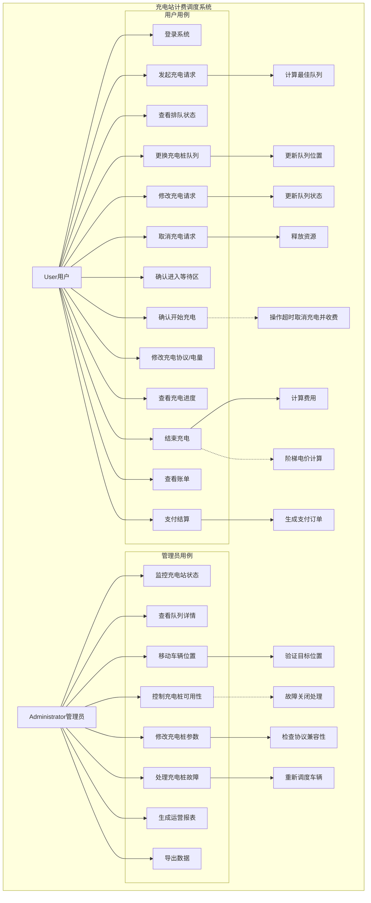
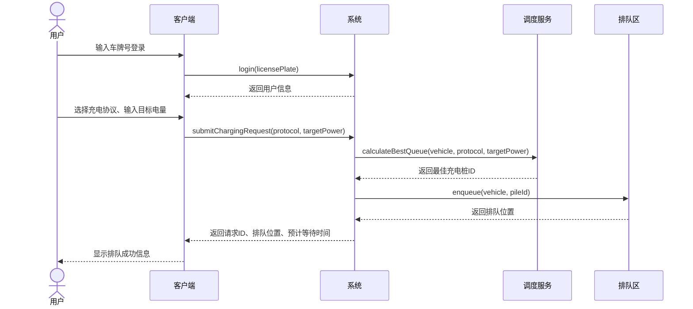
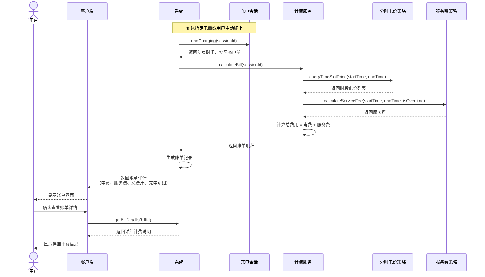
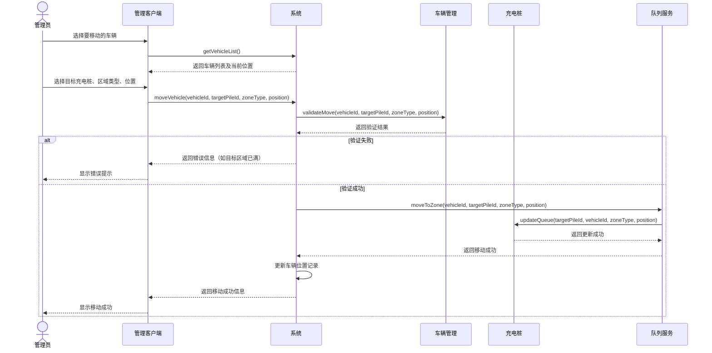
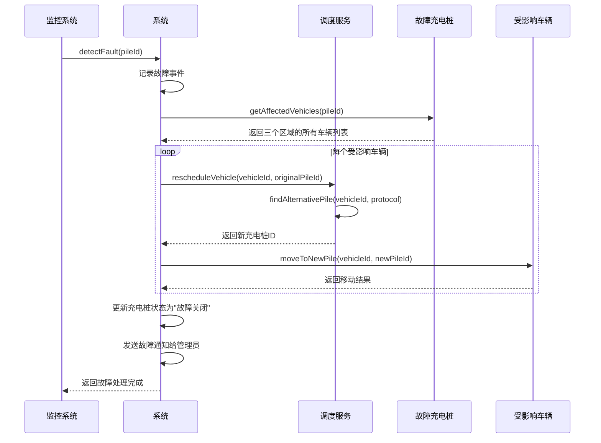

# 充电站计费调度系统用例模型

## 一、用例图

### 1.1 系统角色

1. **用户 (User)**：电动汽车车主，使用充电服务
2. **管理员 (Administrator)**：充电站管理人员，负责系统监控与配置

### 1.2 用例图（Mermaid）



### 1.3 用例描述

#### 1.3.1 用户主要用例

| 用例编号 | 用例名称 | 描述 | 主要参与者 |
|---------|---------|------|-----------|
| UC-01 | 登录系统 | 用户输入车牌号登录系统，系统计算最佳充电桩队列并分配进入排队区 | 用户 |
| UC-02 | 发起充电请求 | 用户提交充电请求，包括充电协议和电量需求 | 用户 |
| UC-03 | 查看排队状态 | 查看当前排队位置、预计等待时间、充电进度等信息 | 用户 |
| UC-04 | 更换充电桩队列 | 用户在排队区自由更换到其他充电桩队列，更换后排至目标队列队尾 | 用户 |
| UC-05 | 修改充电请求 | 修改充电协议或目标电量，系统相应更新队列状态 | 用户 |
| UC-06 | 取消充电请求 | 取消充电请求，系统从队列中移除并释放资源 | 用户 |
| UC-07 | 确认进入等待区 | 排队区排到最前时确认进入等待区（超时自动确认） | 用户 |
| UC-08 | 确认开始充电 | 进入充电区后确认充电协议和电量，开始充电 | 用户 |
| UC-09 | 修改充电协议/电量 | 充电过程中修改充电协议或电量（下限为当前已充） | 用户 |
| UC-10 | 查看充电进度 | 查看实时充电进度、已充电量、剩余时间等 | 用户 |
| UC-11 | 结束充电 | 到达指定电量后自动结束充电，或用户主动终止 | 用户 |
| UC-12 | 查看账单 | 查看充电费用明细，包括电费和服务费 | 用户 |
| UC-13 | 支付结算 | 完成支付，生成支付订单 | 用户 |

#### 1.3.2 管理员主要用例

| 用例编号 | 用例名称 | 描述 | 主要参与者 |
|---------|---------|------|-----------|
| UC-14 | 监控充电站状态 | 查看充电站整体运行状态，各充电桩实时状态 | 管理员 |
| UC-15 | 查看队列详情 | 查看各充电桩三个区域（排队区、等待区、充电区）的车辆详情 | 管理员 |
| UC-16 | 移动车辆位置 | 将车辆移动到任何未满队列的任何区域的任意位置 | 管理员 |
| UC-17 | 控制充电桩可用性 | 设置充电桩状态：常规关闭（拒绝新增）、故障关闭（重新调度） | 管理员 |
| UC-18 | 修改充电桩参数 | 修改充电桩功率上限、增加或删除支持协议 | 管理员 |
| UC-19 | 处理充电桩故障 | 充电桩故障时，重新调度受影响车辆 | 管理员 |
| UC-20 | 生成运营报表 | 生成充电量、收入、利用率等运营报表 | 管理员 |
| UC-21 | 导出数据 | 导出报表数据为Excel/PDF格式 | 管理员 |

## 二、系统顺序图（SSD）

### 2.1 用户发起充电请求（UC-02）



### 2.2 用户确认开始充电（UC-07）

```mermaid
sequenceDiagram
    actor User as 用户
    participant Client as 客户端
    participant System as 系统
    participant Pile as 充电桩
    participant Session as 充电会话
    
    Note over User,System: 车辆已进入充电区
    
    System->>Client: 显示充电协议确认界面<br/>支持协议列表、当前电量、目标电量
    User->>Client: 核对并确认协议和电量
    Client->>System: confirmChargingStart(requestId, protocol, targetPower)
    
    alt 操作超时
        System->>System: 记录超时事件
        System->>System: 取消充电并扣除基本服务费x
        System-->>Client: 返回取消充电通知
        Client-->>User: 显示取消充电信息
        break
    end
    
    System->>Pile: startCharging(requestId, protocol, targetPower)
    Pile->>Session: createChargingSession(requestId, protocol, targetPower)
    Session-->>Pile: 返回会话ID
    Pile-->>System: 返回开始充电成功
    
    System->>System: 更新请求状态为"充电中"
    System-->>Client: 返回充电开始时间、预计结束时间
    Client-->>User: 显示充电开始界面
```

### 2.3 充电完成与计费（UC-10, UC-11）



### 2.4 管理员移动车辆（UC-15）



### 2.5 充电桩故障处理（UC-18）



## 三、操作契约

### 3.1 契约格式说明

每个操作契约包含以下部分：
- **操作**：系统操作名称
- **交叉引用**：对应的用例
- **前置条件**：执行操作前必须满足的条件
- **后置条件**：操作执行后系统状态的变化
- **异常处理**：可能出现的异常及处理方式

### 3.2 用户相关操作契约

#### 契约1：login(licensePlate)
- **操作**：login(licensePlate: String)
- **交叉引用**：UC-01 登录系统
- **前置条件**：
  1. 用户已打开客户端应用
  2. 车牌号格式正确
- **后置条件**：
  1. 创建用户会话（如果用户不存在则创建新用户）
  2. 系统记录用户登录时间
  3. 返回用户当前车辆信息
- **异常处理**：
  - 车牌号格式错误：返回错误提示
  - 系统繁忙：返回重试提示

#### 契约2：submitChargingRequest(protocol, targetPower)
- **操作**：submitChargingRequest(protocol: ChargingProtocol, targetPower: Double)
- **交叉引用**：UC-02 发起充电请求
- **前置条件**：
  1. 用户已登录
  2. 用户车辆在充电站等候区
  3. 目标电量大于当前电量
- **后置条件**：
  1. 创建新的ChargingRequest充电请求对象
  2. 请求状态初始化为"排队中"
  3. 系统基于"完成时间最短"策略分配最佳充电桩
  4. 车辆进入对应充电桩的排队区
  5. 返回请求ID和排队信息
- **异常处理**：
  - 目标电量无效：返回错误提示
  - 无兼容充电桩：返回无可用资源提示

#### 契约3：confirmEnterWaitingArea(requestId)
- **操作**：confirmEnterWaitingArea(requestId: String)
- **交叉引用**：UC-06 确认进入等待区
- **前置条件**：
  1. 请求存在且状态为"排队中"
  2. 车辆在排队区排到最前
  3. 用户操作未超时（或超时自动确认）
- **后置条件**：
  1. 请求状态更新为"等待中"
  2. 车辆从排队区移动到等待区
  3. 记录进入等待区时间
- **异常处理**：
  - 请求不存在：返回错误提示
  - 车辆不在排队区最前：返回状态错误

#### 契约4：confirmChargingStart(requestId, protocol, targetPower)
- **操作**：confirmChargingStart(requestId: String, protocol: ChargingProtocol, targetPower: Double)
- **交叉引用**：UC-07 确认开始充电
- **前置条件**：
  1. 请求存在且状态为"等待中"
  2. 车辆在等待区排到首位且上一位充电完毕
  3. 充电协议受充电桩支持
  4. 目标电量有效（≥当前电量）
- **后置条件**：
   1. 请求状态更新为"充电中"
   2. 创建ChargingSession充电会话对象
   3. 记录开始充电时间
   4. 返回充电会话信息
- **异常处理**：
  - 操作超时：取消充电并扣除基本服务费
  - 协议不支持：返回协议错误
  - 目标电量无效：返回电量错误

#### 契约5：modifyCharging(sessionId, newProtocol, newTargetPower)
- **操作**：modifyCharging(sessionId: String, newProtocol: ChargingProtocol, newTargetPower: Double)
- **交叉引用**：UC-08 修改充电协议/电量
- **前置条件**：
  1. 充电会话存在且状态为"充电中"
  2. 新协议受充电桩支持
  3. 新目标电量 ≥ 当前已充电量
- **后置条件**：
  1. 更新充电会话的协议和目标电量
  2. 重新计算预计结束时间
  3. 记录修改日志
- **异常处理**：
  - 新电量低于当前已充电量：返回错误提示
  - 协议不支持：返回协议错误

#### 契约6：endCharging(sessionId)
- **操作**：endCharging(sessionId: String)
- **交叉引用**：UC-10 结束充电
- **前置条件**：
  1. 充电会话存在且状态为"充电中"
  2. 到达指定电量或用户主动终止
- **后置条件**：
  1. 充电会话状态更新为"已完成"
  2. 记录结束时间和实际充电量
  3. 释放充电桩资源
  4. 生成账单记录
  5. 请求状态更新为"已完成"
- **异常处理**：
  - 会话不存在：返回错误提示
  - 充电异常终止：记录异常原因

#### 契约7：payBill(billId, paymentMethod)
- **操作**：payBill(billId: String, paymentMethod: PaymentMethod)
- **交叉引用**：UC-12 支付结算
- **前置条件**：
  1. 账单存在且状态为"未支付"
  2. 支付方式有效
  3. 用户账户余额充足（如适用）
- **后置条件**：
  1. 账单状态更新为"已支付"
  2. 创建PaymentOrder支付订单
  3. 记录支付时间和方式
  4. 更新充电站收入统计
- **异常处理**：
  - 支付失败：返回支付错误
  - 余额不足：返回余额不足提示

### 3.3 管理员相关操作契约

#### 契约8：moveVehicle(vehicleId, targetPileId, zoneType, position)
- **操作**：moveVehicle(vehicleId: String, targetPileId: String, zoneType: ZoneType, position: Integer)
- **交叉引用**：UC-15 移动车辆位置
- **前置条件**：
  1. 管理员已登录且具有相应权限
  2. 车辆存在且处于充电站内
  3. 目标充电桩存在且状态正常
  4. 目标区域未满
  5. 目标位置有效（1 ≤ position ≤ 容量）
- **后置条件**：
  1. 车辆从原位置移除
  2. 车辆插入到目标位置
  3. 更新车辆位置记录
  4. 记录管理员操作日志
- **异常处理**：
  - 目标区域已满：返回区域已满错误
  - 权限不足：返回权限错误
  - 车辆不存在：返回车辆不存在错误

#### 契约9：setPileAvailability(pileId, status)
- **操作**：setPileAvailability(pileId: String, status: PileStatus)
- **交叉引用**：UC-16 控制充电桩可用性
- **前置条件**：
  1. 管理员已登录且具有相应权限
  2. 充电桩存在
- **后置条件**：
  1. 充电桩状态更新为新状态
  2. 如果状态为"常规关闭"：该充电桩排队区拒绝新增车辆
  3. 如果状态为"故障关闭"：所有队列中车辆重新调度
  4. 记录状态变更日志
- **异常处理**：
  - 充电桩不存在：返回设备不存在错误
  - 状态无效：返回状态值错误

#### 契约10：updatePileParameters(pileId, maxPower, protocols)
- **操作**：updatePileParameters(pileId: String, maxPower: Double, protocols: List<ChargingProtocol>)
- **交叉引用**：UC-17 修改充电桩参数
- **前置条件**：
  1. 管理员已登录且具有相应权限
  2. 充电桩存在
  3. 新功率上限有效（>0）
  4. 新协议列表非空
- **后置条件**：
  1. 充电桩功率上限更新
  2. 充电桩支持协议列表更新
  3. 如果删除某协议且队列中有该协议车辆：询问是否更改为其他协议或重新调度
  4. 记录参数变更日志
- **异常处理**：
  - 功率上限无效：返回参数错误
  - 协议列表为空：返回协议列表错误

#### 契约11：generateReport(reportType, startDate, endDate)
- **操作**：generateReport(reportType: ReportType, startDate: Date, endDate: Date)
- **交叉引用**：UC-19 生成运营报表
- **前置条件**：
  1. 管理员已登录且具有相应权限
  2. 时间范围有效（startDate ≤ endDate）
  3. 报表类型有效
- **后置条件**：
  1. 创建OperationReport运营报表对象
  2. 根据报表类型聚合相关数据
  3. 生成报表文件（Excel/PDF）
  4. 记录报表生成日志
- **异常处理**：
  - 时间范围无效：返回时间范围错误
  - 无数据：返回无数据提示

### 3.4 系统自动操作契约

#### 契约12：calculateBestQueue(vehicle, protocol, targetPower)
- **操作**：calculateBestQueue(vehicle: Vehicle, protocol: ChargingProtocol, targetPower: Double)
- **交叉引用**：UC-02 包含用例
- **前置条件**：
  1. 车辆信息有效
  2. 充电协议有效
  3. 目标电量有效
- **后置条件**：
  1. 计算所有兼容充电桩的预计完成时间（等待时间+充电时间）
  2. 选择完成时间最短的充电桩
  3. 返回最佳充电桩ID
- **异常处理**：
  - 无兼容充电桩：返回无可用资源
  - 计算错误：返回系统错误

#### 契约13：rescheduleByFault(pileId)
- **操作**：rescheduleByFault(pileId: String)
- **交叉引用**：UC-18 处理充电桩故障
- **前置条件**：
  1. 充电桩发生故障
  2. 故障充电桩上有车辆（排队区、等待区、充电区）
- **后置条件**：
  1. 故障充电桩状态更新为"故障关闭"
  2. 所有受影响车辆重新调度至同类型可用充电桩
  3. 记录故障事件和重新调度日志
- **异常处理**：
  - 无可用替代充电桩：将车辆移至排队区最前
  - 调度失败：记录异常并通知管理员

## 四、总结

本用例模型完整描述了充电站计费调度系统的功能需求，包括：

1. **用例图**：展示了用户和管理员两个角色的20个主要用例及其关系
2. **系统顺序图**：为5个关键用例绘制了详细的交互流程
3. **操作契约**：定义了13个核心操作的前置条件、后置条件和异常处理

该模型为系统设计和实现提供了清晰的指导，特别是：
- **用户流程**：从登录到支付结算的完整充电服务流程
- **管理员控制**：全面的监控、配置和干预能力
- **异常处理**：完善的错误处理和恢复机制
- **计费规则**：阶梯电价和服务费计算的详细说明

模型充分考虑了系统的核心需求，特别是三区队列管理、智能调度、动态计费和管理员控制等功能，为后续系统开发奠定了坚实基础。