# 充电站计费调度系统用例模型

## 一、用例图

### 1.1 系统角色

1. **用户 (User)**：电动汽车车主，使用充电服务
2. **管理员 (Administrator)**：充电站管理人员，负责系统监控与配置

### 1.2 用例图（Mermaid）

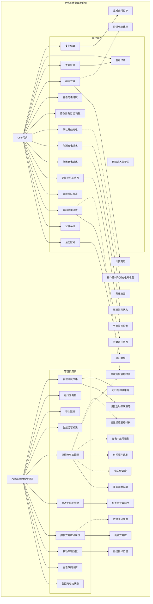
```mermaid
graph TD
    subgraph 充电站计费调度系统
        subgraph 用户用例
            UC22[注册账号]
            UC01[登录系统]
            UC02[发起充电请求]
            UC03[查看排队状态]
            UC04[更换充电桩队列]
            UC05[修改充电请求]
            UC06[取消充电请求]
            UC07[自动进入等待区]
            UC08[确认开始充电]
            UC09[修改充电协议/电量]
            UC10[查看充电进度]
            UC11[结束充电]
            UC12[查看账单]
            UC12a[查看详单]
            UC13[支付结算]
        end
        
        subgraph 管理员用例
            UC14[监控充电站状态]
            UC15[查看队列详情]
            UC16[移动车辆位置]
            UC17[控制充电桩可用性]
            UC18[修改充电桩参数]
            UC19[处理充电桩故障]
            UC20[生成运营报表]
            UC21[导出数据]
            UC23[运行充电桩]
            UC41[管理调度策略]
        end

    
      User用户 --> UC22
      User用户 --> UC01
      User用户 --> UC02
      User用户 --> UC03
      User用户 --> UC04
      User用户 --> UC05
      User用户 --> UC06
      User用户 --> UC08
      User用户 --> UC09
      User用户 --> UC10
      User用户 --> UC11
      User用户 --> UC12
      User用户 --> UC12a
      User用户 --> UC13

      Administrator管理员 --> UC14
      Administrator管理员 --> UC15
      Administrator管理员 --> UC16
      Administrator管理员 --> UC17
      Administrator管理员 --> UC18
      Administrator管理员 --> UC19
      Administrator管理员 --> UC20
      Administrator管理员 --> UC21
      Administrator管理员 --> UC23
      Administrator管理员 --> UC41
    
      %% 包含关系
      UC22 --> UC24[验证数据]
      UC02 --> UC25[计算最佳队列]
      UC04 --> UC26[更新队列位置]
      UC05 --> UC27[更新队列状态]
      UC06 --> UC28[释放资源]
      UC11 --> UC29[计算费用]
      UC12 --> UC12a
      UC13 --> UC30[生成支付订单]
      UC16 --> UC31[验证目标位置]
      UC18 --> UC32[检查协议兼容性]
      UC19 --> UC33[重新调度车辆]
      UC17 --> UC34[启停充电桩]
      UC41 --> UC42[设置启动默认策略]
      UC41 --> UC43[运行时切换策略]
    
      %% 扩展关系
      UC08 -.-> UC35[操作超时取消充电并收费]
      UC11 -.-> UC36[阶梯电价计算]
      UC17 -.-> UC37[故障关闭处理]
      UC19 -.-> UC38[优先级调度]
      UC19 -.-> UC39[时间顺序调度]
      UC19 -.-> UC40[充电中故障恢复]
      UC19 -.-> UC44[单次调度最短时长]
      UC19 -.-> UC45[批量调度最短时长]
      UC02 -.-> UC44
    end
```

### 1.3 用例描述

#### 1.3.1 用户主要用例

| 用例编号 | 用例名称 | 描述 | 主要参与者 |
|---------|---------|------|-----------|
| UC-22 | 注册账号 | 新用户创建账号（输入车牌号、用户名、电池容量）并设置密码 | 用户 |
| UC-01 | 登录系统 | 已注册用户输入车牌号和密码登录系统 | 用户 |
| UC-02 | 发起充电请求 | 用户提交充电请求，包括充电电量和充电模式 | 用户 |
| UC-03 | 查看排队状态 | 查看当前排队位置、预计等待时间等信息 | 用户 |
| UC-04 | 更换充电桩队列 | 用户在排队区自由更换到其他充电桩队列，更换后排至目标队列队尾 | 用户 |
| UC-05 | 修改充电请求 | 修改充电电量或充电模式，系统相应更新队列状态 | 用户 |
| UC-06 | 取消充电请求 | 取消充电请求，系统从队列中移除并释放资源 | 用户 |
| UC-07 | 自动进入等待区 | 排队区排到最前时，车辆自动进入等待区（系统处理，无需用户确认） | 系统 |
| UC-08 | 确认开始充电 | 进入充电区后确认充电协议和电量，开始充电 | 用户 |
| UC-09 | 修改充电协议/电量 | 充电过程中修改充电协议或电量（下限为当前已充） | 用户 |
| UC-10 | 查看充电进度 | 查看实时充电进度、已充电量、剩余时间等详单信息 | 用户 |
| UC-11 | 结束充电 | 到达指定电量后自动结束充电，或用户主动终止 | 用户 |
| UC-12 | 查看账单 | 查看充电费用概览信息（11个字段） | 用户 |
| UC-12a | 查看详单 | 查看单条账单的分段明细（峰/平/谷电费+服务费拆分） | 用户 |
| UC-13 | 支付结算 | 完成支付，生成支付订单 | 用户 |

#### 1.3.2 管理员主要用例

| 用例编号 | 用例名称 | 描述 | 主要参与者 |
|---------|---------|------|-----------|
| UC-14 | 监控充电站状态 | 定时刷新所有充电桩的工作状态、累计充电次数、累计充电时长、累计充电容量 | 管理员 |
| UC-15 | 查看队列详情 | 查看各充电桩队列中车辆详情（车牌号、电池容量、请求电量、等待时间） | 管理员 |
| UC-16 | 移动车辆位置 | 将车辆移动到任何未满队列的任何区域的任意位置 | 管理员 |
| UC-17 | 控制充电桩可用性 | 设置充电桩状态：常规关闭、故障关闭，以及启停充电桩电源 | 管理员 |
| UC-18 | 修改充电桩参数 | 修改充电桩功率上限、支持协议列表、计费规则及三个时段电价数据 | 管理员 |
| UC-19 | 处理充电桩故障 | 充电桩故障时，按所选策略（优先级调度/时间顺序调度/充电中故障恢复/单次调度最短时长/批量调度最短时长）重新调度受影响车辆 | 管理员 |
| UC-20 | 生成运营报表 | 生成充电量、收入、利用率等运营报表 | 管理员 |
| UC-21 | 导出数据 | 导出报表数据为Excel/PDF格式 | 管理员 |
| UC-23 | 运行充电桩 | 启动充电桩进入运行状态，使其可接受充电请求 | 管理员 |
| UC-41 | 管理调度策略 | 系统启动时根据参数选择默认调度策略，管理员运行期间可动态切换正常分配策略和故障处理策略 | 管理员 |
| UC-42 | 设置启动默认策略 | 系统启动前通过配置文件或启动参数设置初始调度策略 | 管理员 |
| UC-43 | 运行时切换策略 | 管理员在系统运行期间动态切换当前调度策略，切换后后续的调度操作使用新策略 | 管理员 |

---

## 二、系统顺序图（SSD）

以下按第二次作业要求，为7个用例及1个子用例绘制系统顺序图。

### 2.1 注册（UC-22）

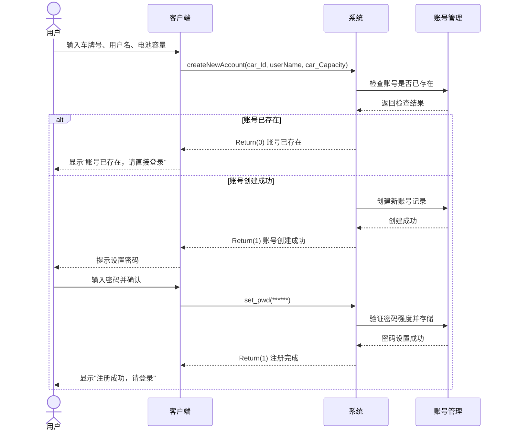
```mermaid
sequenceDiagram
    actor User as 用户
    participant Client as 客户端
    participant System as 系统
    participant Account as 账号管理
    
    User->>Client: 输入车牌号、用户名、电池容量
    Client->>System: createNewAccount(car_Id, userName, car_Capacity)
    
    System->>Account: 检查账号是否已存在
    Account-->>System: 返回检查结果
    
    alt 账号已存在
        System-->>Client: Return(0) 账号已存在
        Client-->>User: 显示"账号已存在，请直接登录"
    else 账号创建成功
        System->>Account: 创建新账号记录
        Account-->>System: 创建成功
        System-->>Client: Return(1) 账号创建成功
        Client-->>User: 提示设置密码
        
        User->>Client: 输入密码并确认
        Client->>System: set_pwd(******)
        
        System->>Account: 验证密码强度并存储
        Account-->>System: 密码设置成功
        System-->>Client: Return(1) 注册完成
        Client-->>User: 显示"注册成功，请登录"
    end
```

### 2.2 登录（UC-01）

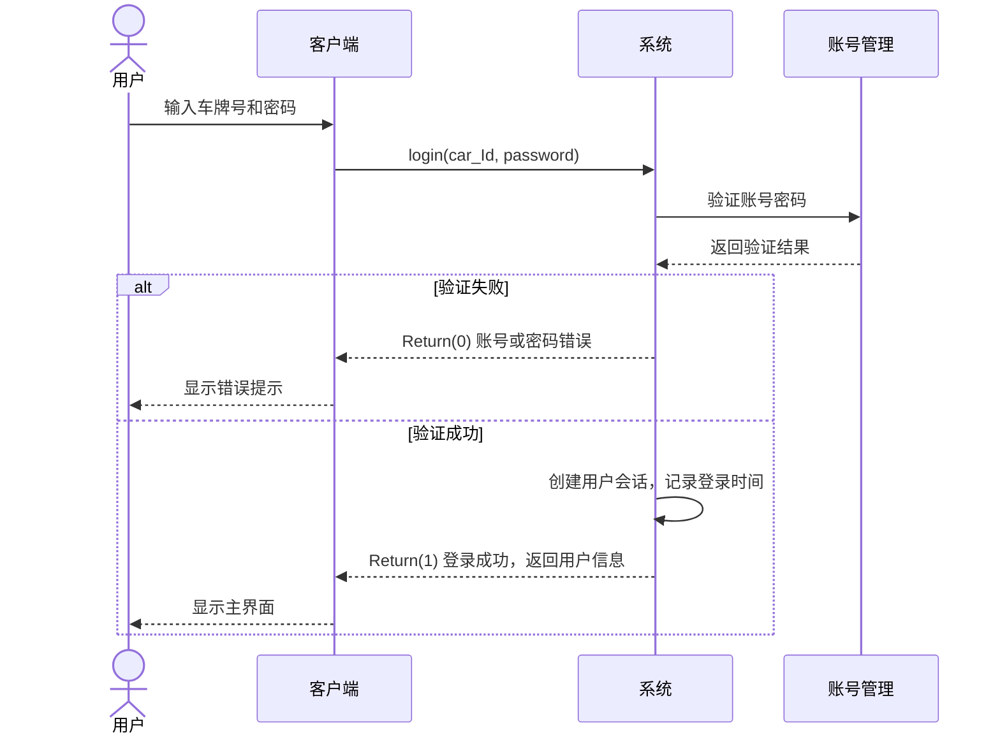
```mermaid
sequenceDiagram
    actor User as 用户
    participant Client as 客户端
    participant System as 系统
    participant Account as 账号管理
    
    User->>Client: 输入车牌号和密码
    Client->>System: login(car_Id, password)
    
    System->>Account: 验证账号密码
    Account-->>System: 返回验证结果
    
    alt 验证失败
        System-->>Client: Return(0) 账号或密码错误
        Client-->>User: 显示错误提示
    else 验证成功
        System->>System: 创建用户会话，记录登录时间
        System-->>Client: Return(1) 登录成功，返回用户信息
        Client-->>User: 显示主界面
    end
```

### 2.3 充电申请（UC-02、UC-03、UC-05、UC-08、UC-10、UC-11）

本用例覆盖作业要求的7条指令。以下按阶段分为三个子图。

#### 2.3.1 提交充电申请与查看队列状态

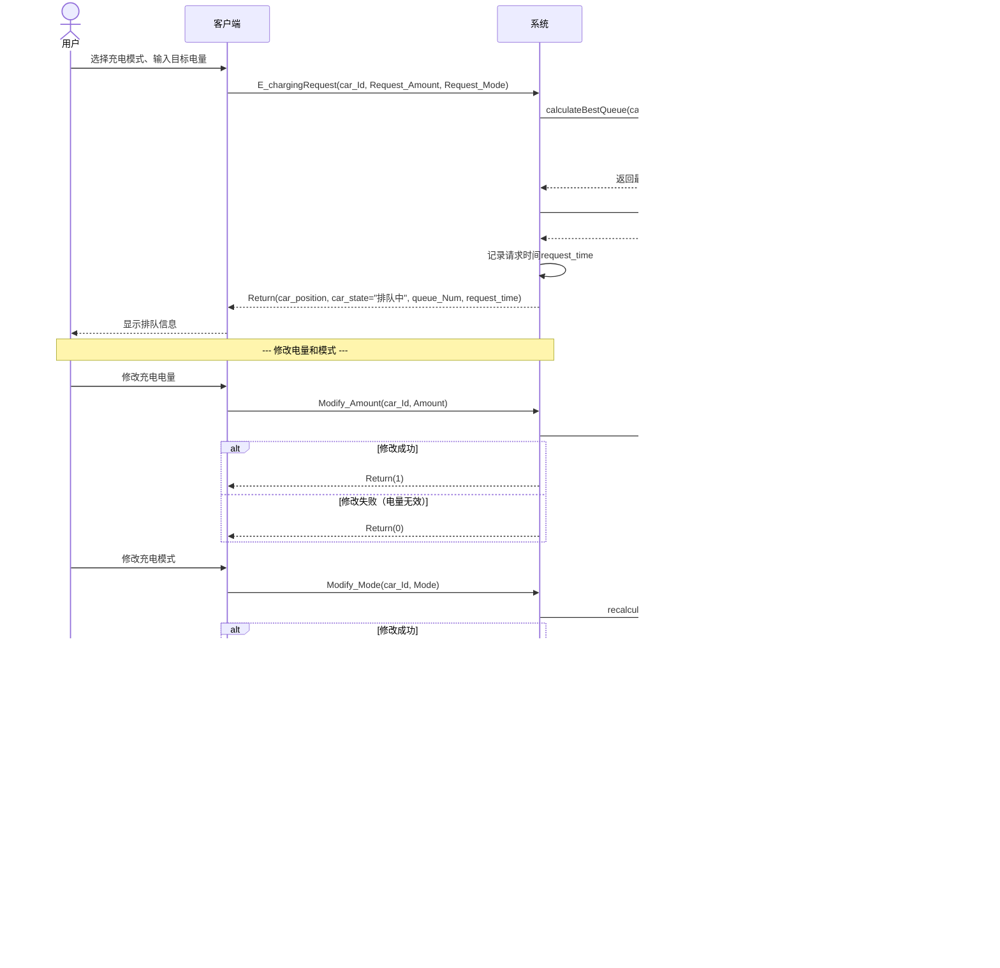
```mermaid
sequenceDiagram
    actor User as 用户
    participant Client as 客户端
    participant System as 系统
    participant Dispatch as 调度服务
    participant Queue as 队列管理
    
    User->>Client: 选择充电模式、输入目标电量
    Client->>System: E_chargingRequest(car_Id, Request_Amount, Request_Mode)
    
    System->>Dispatch: calculateBestQueue(car_Id, Request_Amount, Request_Mode)
    Dispatch->>Dispatch: 计算所有兼容充电桩的预计完成时间
    Dispatch-->>System: 返回最佳充电桩ID及排队位置
    
    System->>Queue: enqueue(car_Id, pileId, Request_Mode)
    Queue-->>System: 返回排队信息
    System->>System: 记录请求时间request_time
    
    System-->>Client: Return(car_position, car_state="排队中", queue_Num, request_time)
    Client-->>User: 显示排队信息
    
    Note over User,System: --- 修改电量和模式 ---
    
    User->>Client: 修改充电电量
    Client->>System: Modify_Amount(car_Id, Amount)
    System->>Queue: updateTargetAmount(car_Id, Amount)
    alt 修改成功
        System-->>Client: Return(1)
    else 修改失败（电量无效）
        System-->>Client: Return(0)
    end
    
    User->>Client: 修改充电模式
    Client->>System: Modify_Mode(car_Id, Mode)
    System->>Dispatch: recalculateQueue(car_Id, Mode)
    alt 修改成功
        System-->>Client: Return(1)
    else 修改失败（模式不支持）
        System-->>Client: Return(0)
    end
    
    Note over User,System: --- 查看队列状态 ---
    
    User->>Client: 查看当前排队状态
    Client->>System: Query_Car_State(car_id)
    System->>Queue: getCarState(car_id)
    Queue-->>System: 返回排队信息
    System-->>Client: Return(car_Number_before_position, car_state, queue_Num, request_time)
    Client-->>User: 显示排队详情
```

#### 2.3.2 开始充电

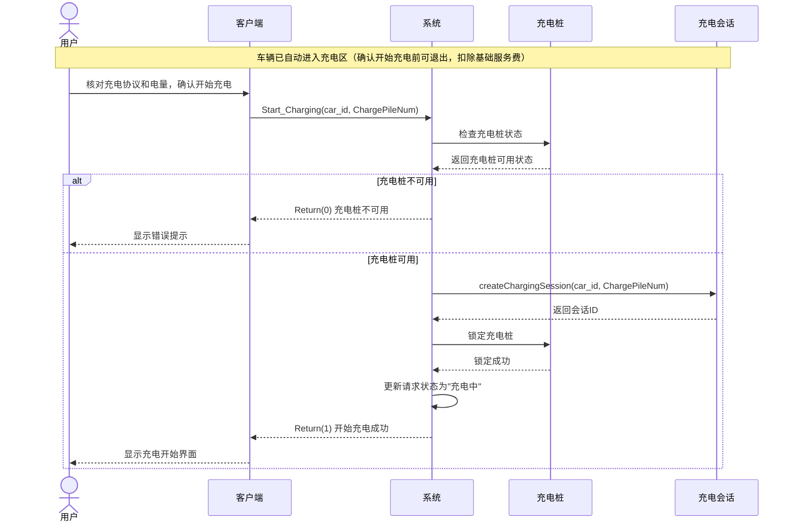
```mermaid
sequenceDiagram
    actor User as 用户
    participant Client as 客户端
    participant System as 系统
    participant Pile as 充电桩
    participant Session as 充电会话
    
    Note over User,Session: 车辆已自动进入充电区（确认开始充电前可退出，扣除基础服务费）
    
    User->>Client: 核对充电协议和电量，确认开始充电
    Client->>System: Start_Charging(car_id, ChargePileNum)
    
    System->>Pile: 检查充电桩状态
    Pile-->>System: 返回充电桩可用状态
    
    alt 充电桩不可用
        System-->>Client: Return(0) 充电桩不可用
        Client-->>User: 显示错误提示
    else 充电桩可用
        System->>Session: createChargingSession(car_id, ChargePileNum)
        Session-->>System: 返回会话ID
        
        System->>Pile: 锁定充电桩
        Pile-->>System: 锁定成功
        
        System->>System: 更新请求状态为"充电中"
        System-->>Client: Return(1) 开始充电成功
        Client-->>User: 显示充电开始界面
    end
```

#### 2.3.3 查看充电状态与结束充电

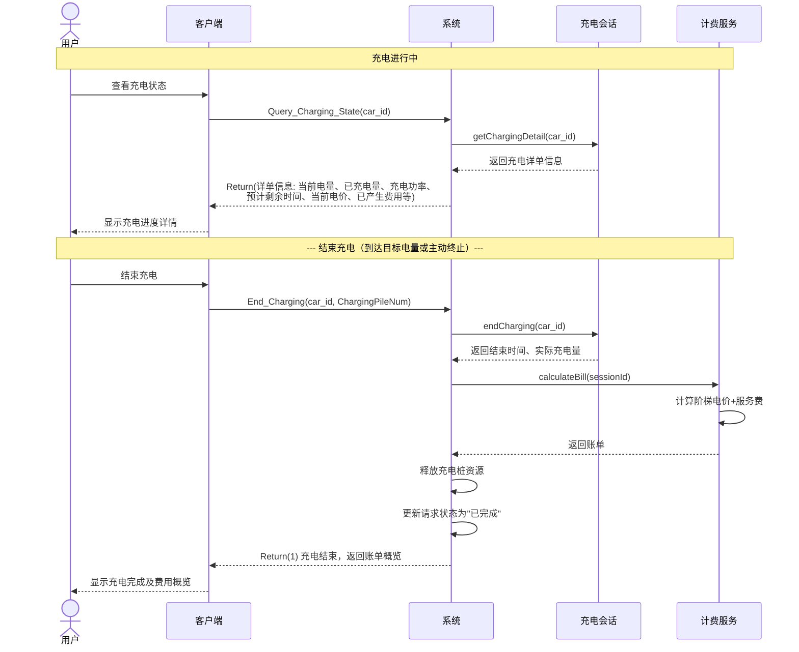
```mermaid
sequenceDiagram
    actor User as 用户
    participant Client as 客户端
    participant System as 系统
    participant Session as 充电会话
    participant Billing as 计费服务
    
    Note over User,Billing: 充电进行中
    
    User->>Client: 查看充电状态
    Client->>System: Query_Charging_State(car_id)
    System->>Session: getChargingDetail(car_id)
    Session-->>System: 返回充电详单信息
    System-->>Client: Return(详单信息: 当前电量、已充电量、充电功率、<br/>预计剩余时间、当前电价、已产生费用等)
    Client-->>User: 显示充电进度详情
    
    Note over User,Billing: --- 结束充电（到达目标电量或主动终止）---
    
    User->>Client: 结束充电
    Client->>System: End_Charging(car_id, ChargingPileNum)
    
    System->>Session: endCharging(car_id)
    Session-->>System: 返回结束时间、实际充电量
    
    System->>Billing: calculateBill(sessionId)
    Billing->>Billing: 计算阶梯电价+服务费
    Billing-->>System: 返回账单
    
    System->>System: 释放充电桩资源
    System->>System: 更新请求状态为"已完成"
    
    System-->>Client: Return(1) 充电结束，返回账单概览
    Client-->>User: 显示充电完成及费用概览
```

### 2.4 查看账单（UC-12）

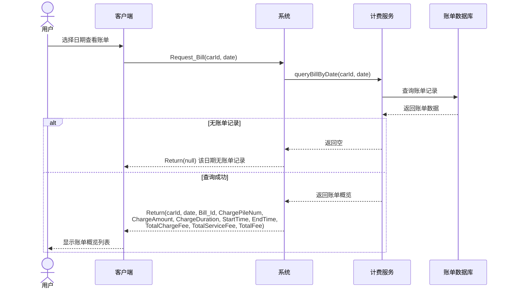
```mermaid
sequenceDiagram
    actor User as 用户
    participant Client as 客户端
    participant System as 系统
    participant Billing as 计费服务
    participant DB as 账单数据库
    
    User->>Client: 选择日期查看账单
    Client->>System: Request_Bill(carId, date)
    
    System->>Billing: queryBillByDate(carId, date)
    Billing->>DB: 查询账单记录
    DB-->>Billing: 返回账单数据
    
    alt 无账单记录
        Billing-->>System: 返回空
        System-->>Client: Return(null) 该日期无账单记录
    else 查询成功
        Billing-->>System: 返回账单概览
        System-->>Client: Return(carId, date, Bill_Id, ChargePileNum,<br/>ChargeAmount, ChargeDuration, StartTime, EndTime,<br/>TotalChargeFee, TotalServiceFee, TotalFee)
        Client-->>User: 显示账单概览列表
    end
```

### 2.5 查看详单（UC-12a，子用例）

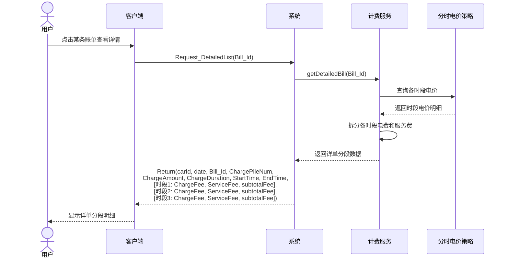
```mermaid
sequenceDiagram
    actor User as 用户
    participant Client as 客户端
    participant System as 系统
    participant Billing as 计费服务
    participant Tariff as 分时电价策略
    
    User->>Client: 点击某条账单查看详情
    Client->>System: Request_DetailedList(Bill_Id)
    
    System->>Billing: getDetailedBill(Bill_Id)
    Billing->>Tariff: 查询各时段电价
    Tariff-->>Billing: 返回时段电价明细
    
    Billing->>Billing: 拆分各时段电费和服务费
    
    Billing-->>System: 返回详单分段数据
    System-->>Client: Return(carId, date, Bill_Id, ChargePileNum,<br/>ChargeAmount, ChargeDuration, StartTime, EndTime,<br/>[时段1: ChargeFee, ServiceFee, subtotalFee],<br/>[时段2: ChargeFee, ServiceFee, subtotalFee],<br/>[时段3: ChargeFee, ServiceFee, subtotalFee])
    Client-->>User: 显示详单分段明细
```

### 2.6 运行充电桩（UC-23、UC-17、UC-18）

本用例覆盖作业要求的4条指令，其中 `powerOn`/`powerOff` 合入 `setPileAvailability`，`setParameters` 合入 `updatePileParameters`。

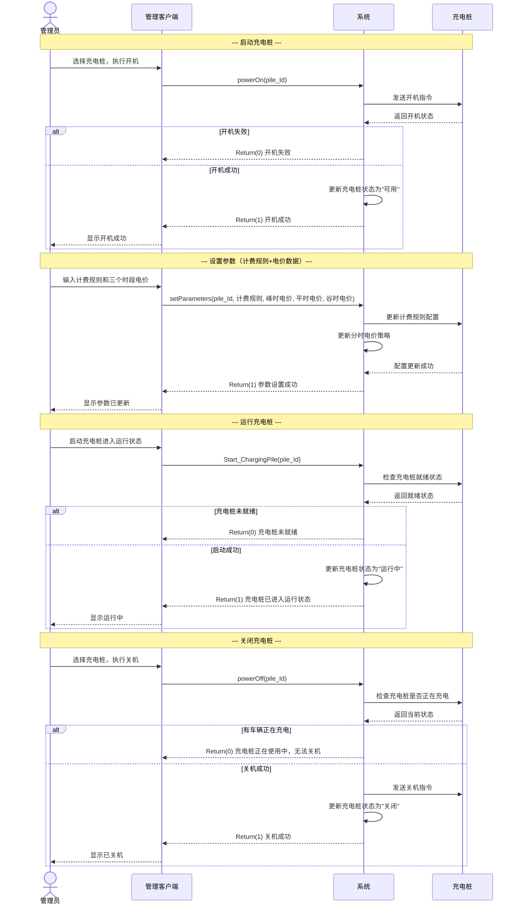
```mermaid
sequenceDiagram
    actor Admin as 管理员
    participant AdminClient as 管理客户端
    participant System as 系统
    participant Pile as 充电桩
    
    Note over Admin,Pile: --- 启动充电桩 ---
    
    Admin->>AdminClient: 选择充电桩，执行开机
    AdminClient->>System: powerOn(pile_Id)
    
    System->>Pile: 发送开机指令
    Pile-->>System: 返回开机状态
    
    alt 开机失败
        System-->>AdminClient: Return(0) 开机失败
    else 开机成功
        System->>System: 更新充电桩状态为"可用"
        System-->>AdminClient: Return(1) 开机成功
        AdminClient-->>Admin: 显示开机成功
    end
    
    Note over Admin,Pile: --- 设置参数（计费规则+电价数据）---
    
    Admin->>AdminClient: 输入计费规则和三个时段电价
    AdminClient->>System: setParameters(pile_Id, 计费规则, 峰时电价, 平时电价, 谷时电价)
    
    System->>Pile: 更新计费规则配置
    System->>System: 更新分时电价策略
    Pile-->>System: 配置更新成功
    
    System-->>AdminClient: Return(1) 参数设置成功
    AdminClient-->>Admin: 显示参数已更新
    
    Note over Admin,Pile: --- 运行充电桩 ---
    
    Admin->>AdminClient: 启动充电桩进入运行状态
    AdminClient->>System: Start_ChargingPile(pile_Id)
    
    System->>Pile: 检查充电桩就绪状态
    Pile-->>System: 返回就绪状态
    
    alt 充电桩未就绪
        System-->>AdminClient: Return(0) 充电桩未就绪
    else 启动成功
        System->>System: 更新充电桩状态为"运行中"
        System-->>AdminClient: Return(1) 充电桩已进入运行状态
        AdminClient-->>Admin: 显示运行中
    end
    
    Note over Admin,Pile: --- 关闭充电桩 ---
    
    Admin->>AdminClient: 选择充电桩，执行关机
    AdminClient->>System: powerOff(pile_Id)
    
    System->>Pile: 检查充电桩是否正在充电
    Pile-->>System: 返回当前状态
    
    alt 有车辆正在充电
        System-->>AdminClient: Return(0) 充电桩正在使用中，无法关机
    else 关机成功
        System->>Pile: 发送关机指令
        System->>System: 更新充电桩状态为"关闭"
        System-->>AdminClient: Return(1) 关机成功
        AdminClient-->>Admin: 显示已关机
    end
```

### 2.7 查看充电桩状态（UC-14）

要求定时刷新所有充电桩状态并在客户端显示。

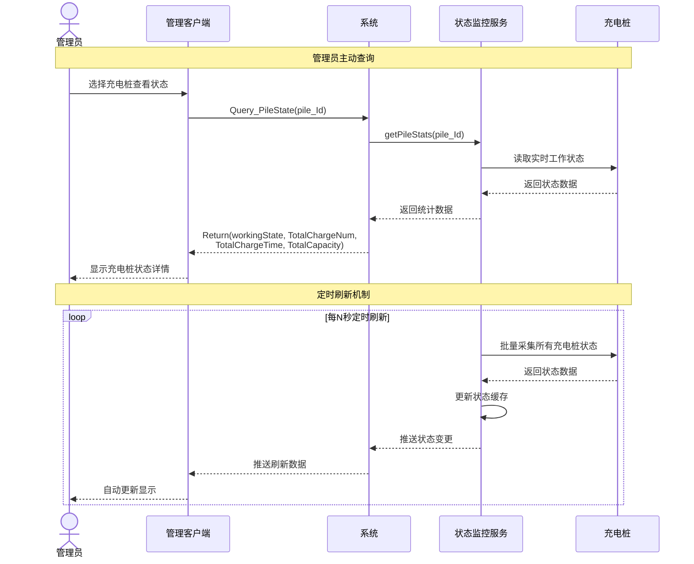
```mermaid
sequenceDiagram
    actor Admin as 管理员
    participant AdminClient as 管理客户端
    participant System as 系统
    participant Monitor as 状态监控服务
    participant Pile as 充电桩
    
    Note over Admin,Pile: 管理员主动查询
    
    Admin->>AdminClient: 选择充电桩查看状态
    AdminClient->>System: Query_PileState(pile_Id)
    
    System->>Monitor: getPileStats(pile_Id)
    Monitor->>Pile: 读取实时工作状态
    Pile-->>Monitor: 返回状态数据
    Monitor-->>System: 返回统计数据
    
    System-->>AdminClient: Return(workingState, TotalChargeNum,<br/>TotalChargeTime, TotalCapacity)
    AdminClient-->>Admin: 显示充电桩状态详情
    
    Note over Admin,Pile: 定时刷新机制
    
    loop 每N秒定时刷新
        Monitor->>Pile: 批量采集所有充电桩状态
        Pile-->>Monitor: 返回状态数据
        Monitor->>Monitor: 更新状态缓存
        Monitor-->>System: 推送状态变更
        System-->>AdminClient: 推送刷新数据
        AdminClient-->>Admin: 自动更新显示
    end
```

### 2.8 查看队列状态（UC-15）

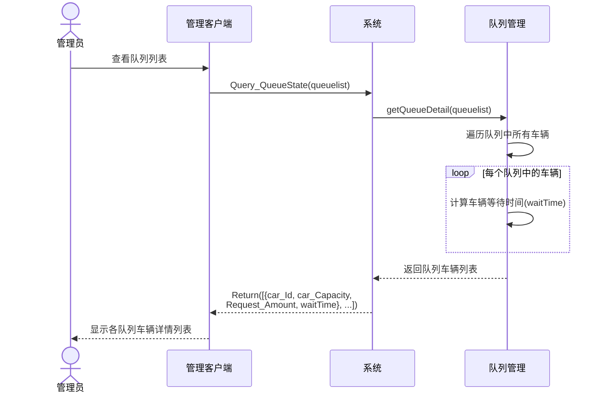
```mermaid
sequenceDiagram
    actor Admin as 管理员
    participant AdminClient as 管理客户端
    participant System as 系统
    participant Queue as 队列管理
    
    Admin->>AdminClient: 查看队列列表
    AdminClient->>System: Query_QueueState(queuelist)
    
    System->>Queue: getQueueDetail(queuelist)
    Queue->>Queue: 遍历队列中所有车辆
    
    loop 每个队列中的车辆
        Queue->>Queue: 计算车辆等待时间(waitTime)
    end
    
    Queue-->>System: 返回队列车辆列表
    
    System-->>AdminClient: Return([{car_Id, car_Capacity,<br/>Request_Amount, waitTime}, ...])
    AdminClient-->>Admin: 显示各队列车辆详情列表
```

### 2.9 管理调度策略（UC-41、UC-42、UC-43）

本用例包含两部分：系统启动时通过参数设置默认策略，管理员运行期间动态切换策略。

#### 2.9.1 系统启动时设置默认调度策略

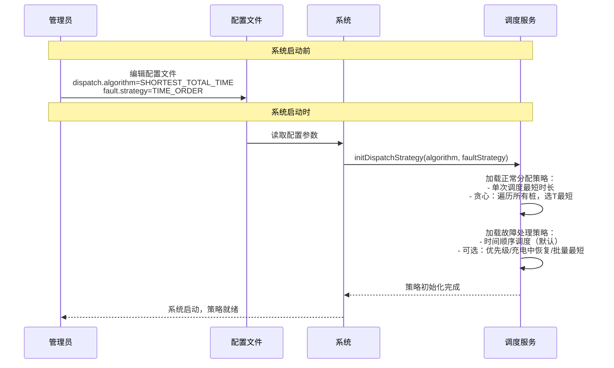
```mermaid
sequenceDiagram
    participant Admin as 管理员
    participant Config as 配置文件
    participant System as 系统
    participant Dispatch as 调度服务
    
    Note over Admin,Dispatch: 系统启动前
    
    Admin->>Config: 编辑配置文件<br/>dispatch.algorithm=SHORTEST_TOTAL_TIME<br/>fault.strategy=TIME_ORDER
    
    Note over Admin,Dispatch: 系统启动时
    
    Config->>System: 读取配置参数
    System->>Dispatch: initDispatchStrategy(algorithm, faultStrategy)
    
    Dispatch->>Dispatch: 加载正常分配策略：<br/>- 单次调度最短时长<br/>- 贪心：遍历所有桩，选T最短
    
    Dispatch->>Dispatch: 加载故障处理策略：<br/>- 时间顺序调度（默认）<br/>- 可选：优先级/充电中恢复/批量最短
    
    Dispatch-->>System: 策略初始化完成
    System-->>Admin: 系统启动，策略就绪
```

#### 2.9.2 管理员运行时切换策略

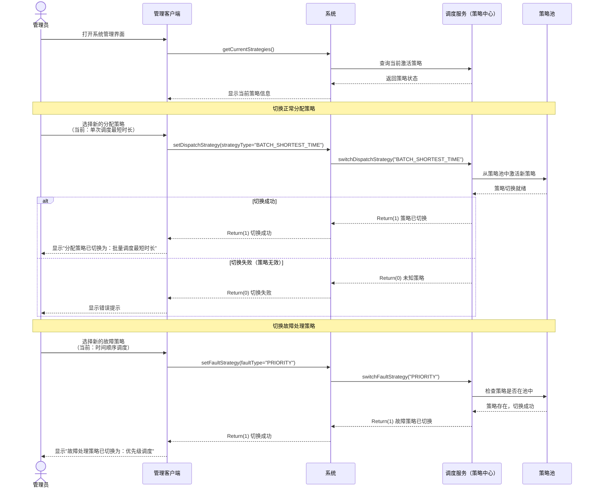
```mermaid
sequenceDiagram
    actor Admin as 管理员
    participant AdminClient as 管理客户端
    participant System as 系统
    participant Dispatch as 调度服务（策略中心）
    participant StrategyPool as 策略池
    
    Admin->>AdminClient: 打开系统管理界面
    AdminClient->>System: getCurrentStrategies()
    System->>Dispatch: 查询当前激活策略
    Dispatch-->>System: 返回策略状态
    System-->>AdminClient: 显示当前策略信息
    
    Note over Admin,StrategyPool: 切换正常分配策略
    
    Admin->>AdminClient: 选择新的分配策略<br/>（当前：单次调度最短时长）
    AdminClient->>System: setDispatchStrategy(strategyType="BATCH_SHORTEST_TIME")
    
    System->>Dispatch: switchDispatchStrategy("BATCH_SHORTEST_TIME")
    Dispatch->>StrategyPool: 从策略池中激活新策略
    StrategyPool-->>Dispatch: 策略切换就绪
    
    alt 切换成功
        Dispatch-->>System: Return(1) 策略已切换
        System-->>AdminClient: Return(1) 切换成功
        AdminClient-->>Admin: 显示"分配策略已切换为：批量调度最短时长"
    else 切换失败（策略无效）
        Dispatch-->>System: Return(0) 未知策略
        System-->>AdminClient: Return(0) 切换失败
        AdminClient-->>Admin: 显示错误提示
    end
    
    Note over Admin,StrategyPool: 切换故障处理策略
    
    Admin->>AdminClient: 选择新的故障策略<br/>（当前：时间顺序调度）
    AdminClient->>System: setFaultStrategy(faultType="PRIORITY")
    
    System->>Dispatch: switchFaultStrategy("PRIORITY")
    Dispatch->>StrategyPool: 检查策略是否在池中
    StrategyPool-->>Dispatch: 策略存在，切换成功
    
    Dispatch-->>System: Return(1) 故障策略已切换
    System-->>AdminClient: Return(1) 切换成功
    AdminClient-->>Admin: 显示"故障处理策略已切换为：优先级调度"
```

#### 2.9.3 可用策略一览

| 策略类型 | 策略名称 | 标识符 | 适用场景 |
|----------|---------|--------|---------|
| 正常分配 | 单次调度最短时长 | SHORTEST_TOTAL_TIME | 默认。单台车辆提交申请时，遍历所有兼容桩选总完成时间最短 |
| 正常分配 | 批量调度最短时长 | BATCH_SHORTEST_TIME | 多台车辆同时分配时（初始批量），匈牙利算法求全局最优 |
| 故障处理 | 优先级调度 | PRIORITY | 故障时按区域+会员+等待时间排序后分配 |
| 故障处理 | 时间顺序调度 | TIME_ORDER | 故障时按请求时间先来后到排序 |
| 故障处理 | 充电中故障恢复 | FAULT_RECOVERY | 充电中故障时保存快照，优先恢复充电中车辆 |
| 故障处理 | 单次调度最短时长 | SHORTEST_TOTAL_TIME | 故障时用贪心算法为每台车选最优桩 |
| 故障处理 | 批量调度最短时长 | BATCH_SHORTEST_TIME | 故障时用匈牙利算法批量求全局最优分配 |

---

## 三、故障调度交互图

以下为五种故障处理交互过程。策略由系统启动参数决定默认值，管理员运行期间可动态切换。各流程开始前先获取当前激活的策略。

### 3.1 优先级调度（SSD-F1）

管理员选择"优先级调度"策略后，充电桩发生故障时的处理流程。优先级综合考虑车辆类型、会员等级、已等待时间等因素。

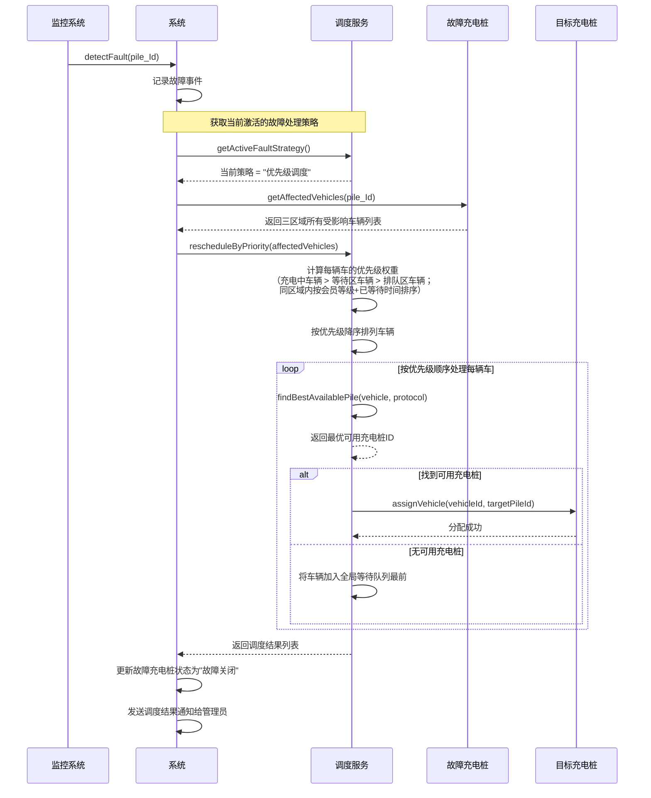
```mermaid
sequenceDiagram
    participant Monitor as 监控系统
    participant System as 系统
    participant Dispatch as 调度服务
    participant FaultPile as 故障充电桩
    participant TargetPile as 目标充电桩
    
    Monitor->>System: detectFault(pile_Id)
    System->>System: 记录故障事件
    
    Note over System,Dispatch: 获取当前激活的故障处理策略
    System->>Dispatch: getActiveFaultStrategy()
    Dispatch-->>System: 当前策略 = "优先级调度"
    
    System->>FaultPile: getAffectedVehicles(pile_Id)
    FaultPile-->>System: 返回三区域所有受影响车辆列表
    
    System->>Dispatch: rescheduleByPriority(affectedVehicles)
    
    Dispatch->>Dispatch: 计算每辆车的优先级权重<br/>（充电中车辆 > 等待区车辆 > 排队区车辆；<br/>同区域内按会员等级+已等待时间排序）
    Dispatch->>Dispatch: 按优先级降序排列车辆
    
    loop 按优先级顺序处理每辆车
        Dispatch->>Dispatch: findBestAvailablePile(vehicle, protocol)
        Dispatch-->>Dispatch: 返回最优可用充电桩ID
        
        alt 找到可用充电桩
            Dispatch->>TargetPile: assignVehicle(vehicleId, targetPileId)
            TargetPile-->>Dispatch: 分配成功
        else 无可用充电桩
            Dispatch->>Dispatch: 将车辆加入全局等待队列最前
        end
    end
    
    Dispatch-->>System: 返回调度结果列表
    System->>System: 更新故障充电桩状态为"故障关闭"
    System->>System: 发送调度结果通知给管理员
```

### 3.2 时间顺序调度（SSD-F2）

管理员选择"时间顺序调度"策略后，充电桩发生故障时的处理流程。严格按请求到达时间先后处理。

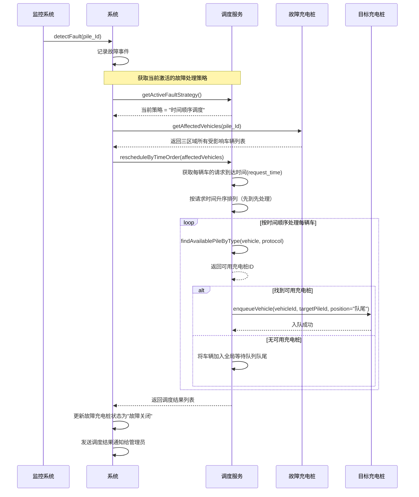
```mermaid
sequenceDiagram
    participant Monitor as 监控系统
    participant System as 系统
    participant Dispatch as 调度服务
    participant FaultPile as 故障充电桩
    participant TargetPile as 目标充电桩
    
    Monitor->>System: detectFault(pile_Id)
    System->>System: 记录故障事件
    
    Note over System,Dispatch: 获取当前激活的故障处理策略
    System->>Dispatch: getActiveFaultStrategy()
    Dispatch-->>System: 当前策略 = "时间顺序调度"
    
    System->>FaultPile: getAffectedVehicles(pile_Id)
    FaultPile-->>System: 返回三区域所有受影响车辆列表
    
    System->>Dispatch: rescheduleByTimeOrder(affectedVehicles)
    
    Dispatch->>Dispatch: 获取每辆车的请求到达时间(request_time)
    Dispatch->>Dispatch: 按请求时间升序排列（先到先处理）
    
    loop 按时间顺序处理每辆车
        Dispatch->>Dispatch: findAvailablePileByType(vehicle, protocol)
        Dispatch-->>Dispatch: 返回可用充电桩ID
        
        alt 找到可用充电桩
            Dispatch->>TargetPile: enqueueVehicle(vehicleId, targetPileId, position="队尾")
            TargetPile-->>Dispatch: 入队成功
        else 无可用充电桩
            Dispatch->>Dispatch: 将车辆加入全局等待队列队尾
        end
    end
    
    Dispatch-->>System: 返回调度结果列表
    System->>System: 更新故障充电桩状态为"故障关闭"
    System->>System: 发送调度结果通知给管理员
```

### 3.3 充电中故障恢复（SSD-F3）

充电桩在充电过程中发生故障时的专门处理流程，优先恢复充电中车辆。

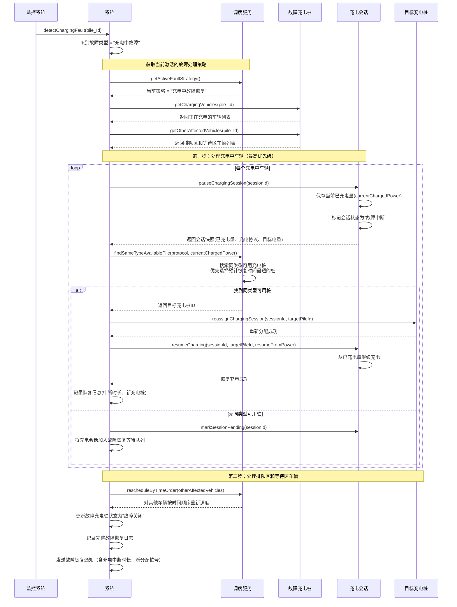
```mermaid
sequenceDiagram
    participant Monitor as 监控系统
    participant System as 系统
    participant Dispatch as 调度服务
    participant FaultPile as 故障充电桩
    participant Session as 充电会话
    participant TargetPile as 目标充电桩
    
    Monitor->>System: detectChargingFault(pile_Id)
    System->>System: 识别故障类型 = "充电中故障"
    
    Note over System,Dispatch: 获取当前激活的故障处理策略
    System->>Dispatch: getActiveFaultStrategy()
    Dispatch-->>System: 当前策略 = "充电中故障恢复"
    
    System->>FaultPile: getChargingVehicles(pile_Id)
    FaultPile-->>System: 返回正在充电的车辆列表
    
    System->>FaultPile: getOtherAffectedVehicles(pile_Id)
    FaultPile-->>System: 返回排队区和等待区车辆列表
    
    Note over System,Session: 第一步：处理充电中车辆（最高优先级）
    
    loop 每个充电中车辆
        System->>Session: pauseChargingSession(sessionId)
        Session->>Session: 保存当前已充电量(currentChargedPower)
        Session->>Session: 标记会话状态为"故障中断"
        Session-->>System: 返回会话快照(已充电量、充电协议、目标电量)
        
        System->>Dispatch: findSameTypeAvailablePile(protocol, currentChargedPower)
        Dispatch->>Dispatch: 搜索同类型可用充电桩<br/>优先选择预计恢复时间最短的桩
        
        alt 找到同类型可用桩
            Dispatch-->>System: 返回目标充电桩ID
            System->>TargetPile: reassignChargingSession(sessionId, targetPileId)
            TargetPile-->>System: 重新分配成功
            
            System->>Session: resumeCharging(sessionId, targetPileId, resumeFromPower)
            Session->>Session: 从已充电量继续充电
            Session-->>System: 恢复充电成功
            
            System->>System: 记录恢复信息(中断时长、新充电桩)
        else 无同类型可用桩
            System->>Session: markSessionPending(sessionId)
            System->>System: 将充电会话加入故障恢复等待队列
        end
    end
    
    Note over System,TargetPile: 第二步：处理排队区和等待区车辆
    
    System->>Dispatch: rescheduleByTimeOrder(otherAffectedVehicles)
    Dispatch-->>System: 对其他车辆按时间顺序重新调度
    
    System->>System: 更新故障充电桩状态为"故障关闭"
    System->>System: 记录完整故障恢复日志
    System->>System: 发送故障恢复通知（含充电中断时长、新分配桩号）
```

### 3.4 单次调度最短时长 — 故障场景（SSD-F4）

当故障处理策略设为"单次调度最短时长"时，对每台受影响车辆独立计算最优充电桩，贪心选择总完成时间最短的。

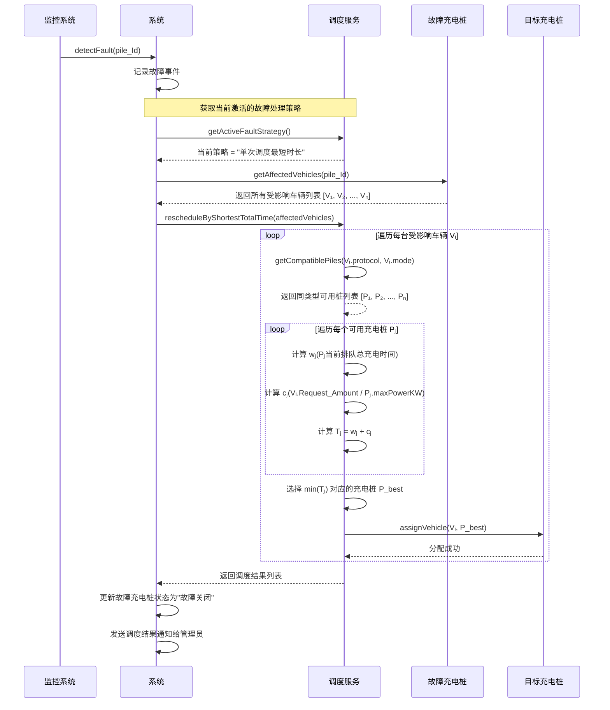
```mermaid
sequenceDiagram
    participant Monitor as 监控系统
    participant System as 系统
    participant Dispatch as 调度服务
    participant FaultPile as 故障充电桩
    participant TargetPile as 目标充电桩
    
    Monitor->>System: detectFault(pile_Id)
    System->>System: 记录故障事件
    
    Note over System,Dispatch: 获取当前激活的故障处理策略
    System->>Dispatch: getActiveFaultStrategy()
    Dispatch-->>System: 当前策略 = "单次调度最短时长"
    
    System->>FaultPile: getAffectedVehicles(pile_Id)
    FaultPile-->>System: 返回所有受影响车辆列表 [V₁, V₂, ..., Vₙ]
    
    System->>Dispatch: rescheduleByShortestTotalTime(affectedVehicles)
    
    loop 遍历每台受影响车辆 Vᵢ
        Dispatch->>Dispatch: getCompatiblePiles(Vᵢ.protocol, Vᵢ.mode)
        Dispatch-->>Dispatch: 返回同类型可用桩列表 [P₁, P₂, ..., Pₙ]
        
        loop 遍历每个可用充电桩 Pⱼ
            Dispatch->>Dispatch: 计算 wⱼ(Pⱼ当前排队总充电时间)
            Dispatch->>Dispatch: 计算 cⱼ(Vᵢ.Request_Amount / Pⱼ.maxPowerKW)
            Dispatch->>Dispatch: 计算 Tⱼ = wⱼ + cⱼ
        end
        
        Dispatch->>Dispatch: 选择 min(Tⱼ) 对应的充电桩 P_best
        
        Dispatch->>TargetPile: assignVehicle(Vᵢ, P_best)
        TargetPile-->>Dispatch: 分配成功
    end
    
    Dispatch-->>System: 返回调度结果列表
    System->>System: 更新故障充电桩状态为"故障关闭"
    System->>System: 发送调度结果通知给管理员
```

#### 3.4.1 策略对比：与传统 SCTF 的区别

| 维度 | 传统 SCTF（最短充电时间优先） | 本策略（单次调度最短时长） |
|------|---------------------------|-------------------------|
| 考虑因素 | 仅考虑充电时长 | 排队等待时长 + 充电时长 |
| 调度触发 | 充电桩空闲时选择最短充电车辆 | 车辆到达时选择最优充电桩 |
| 公平性 | 长充电车辆可能被饿死 | 总时长最短兼顾等待，不易饿死 |

#### 3.4.2 计算过程示例

以下展示车辆A（60kWh，快充模式）提交请求时，两个候选充电桩的完成时间计算：

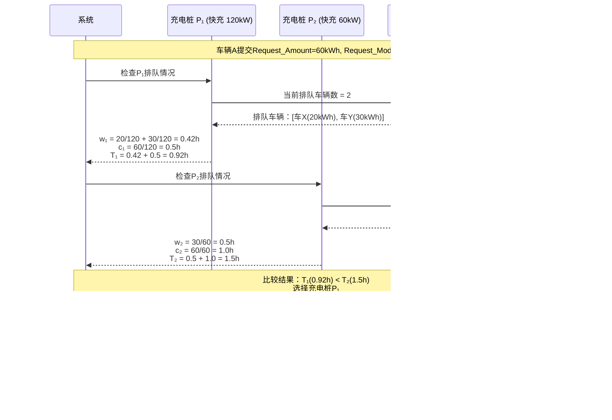
```mermaid
sequenceDiagram
    participant System as 系统
    participant P1 as 充电桩 P₁ (快充 120kW)
    participant P2 as 充电桩 P₂ (快充 60kW)
    participant Q1 as P₁ 排队区
    participant Q2 as P₂ 排队区
    
    Note over System,Q2: 车辆A提交Request_Amount=60kWh, Request_Mode=快充
    
    System->>P1: 检查P₁排队情况
    P1->>Q1: 当前排队车辆数 = 2
    Q1-->>P1: 排队车辆：[车X(20kWh), 车Y(30kWh)]
    P1-->>System: w₁ = 20/120 + 30/120 = 0.42h<br/>c₁ = 60/120 = 0.5h<br/>T₁ = 0.42 + 0.5 = 0.92h
    
    System->>P2: 检查P₂排队情况
    P2->>Q2: 当前排队车辆数 = 1
    Q2-->>P2: 排队车辆：[车Z(30kWh)]
    P2-->>System: w₂ = 30/60 = 0.5h<br/>c₂ = 60/60 = 1.0h<br/>T₂ = 0.5 + 1.0 = 1.5h
    
    Note over System,Q2: 比较结果：T₁(0.92h) < T₂(1.5h)<br/>选择充电桩P₁
    
    System->>System: 车辆A分配至充电桩P₁排队区
    System-->>System: P₁排队区更新：[车X, 车Y, 车A(新增)]
```

#### 3.4.3 边界情况处理

**情况1：有完全空闲的同类型充电桩**

当存在空闲充电桩时，等待时间 w₀ = 0，总时间 T₀ = c₀（直接充电时间），该值一定小于任何有排队等待的充电桩的总时间，因此直接选择空闲桩。

**情况2：所有兼容充电桩总时长相等**

当 T₁ = T₂ = ... = Tₙ 全部相等时，使用二次规则：选择排队车辆最少（或编号最小）的充电桩。该规则确保在最优解相同时有确定的仲裁逻辑，避免系统随机选择。

（注：此策略作为**正常分配算法**时默认启用，实现于 `assignByShortestTotalTime` 契约中）

---

### 3.5 批量调度最短时长 — 故障场景（SSD-F5）

当故障处理策略设为"批量调度最短时长"时，将所有受影响车辆视为一个批量，用匈牙利算法求全局最优分配。

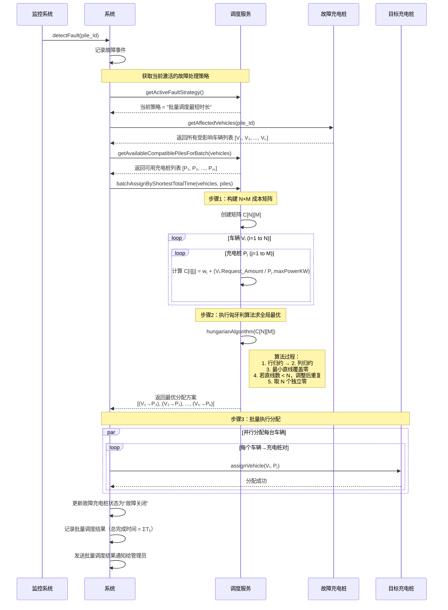
```mermaid
sequenceDiagram
    participant Monitor as 监控系统
    participant System as 系统
    participant Dispatch as 调度服务
    participant FaultPile as 故障充电桩
    participant TargetPile as 目标充电桩
    
    Monitor->>System: detectFault(pile_Id)
    System->>System: 记录故障事件
    
    Note over System,Dispatch: 获取当前激活的故障处理策略
    System->>Dispatch: getActiveFaultStrategy()
    Dispatch-->>System: 当前策略 = "批量调度最短时长"
    
    System->>FaultPile: getAffectedVehicles(pile_Id)
    FaultPile-->>System: 返回所有受影响车辆列表 [V₁, V₂, ..., Vₙ]
    
    System->>Dispatch: getAvailableCompatiblePilesForBatch(vehicles)
    Dispatch-->>System: 返回可用充电桩列表 [P₁, P₂, ..., Pₘ]
    
    System->>Dispatch: batchAssignByShortestTotalTime(vehicles, piles)
    
    Note over Dispatch: 步骤1：构建 N×M 成本矩阵
    Dispatch->>Dispatch: 创建矩阵 C[N][M]
    
    loop 车辆 Vᵢ (i=1 to N)
        loop 充电桩 Pⱼ (j=1 to M)
            Dispatch->>Dispatch: 计算 C[i][j] = wⱼ + (Vᵢ.Request_Amount / Pⱼ.maxPowerKW)
        end
    end
    
    Note over Dispatch: 步骤2：执行匈牙利算法求全局最优
    Dispatch->>Dispatch: hungarianAlgorithm(C[N][M])
    Note right of Dispatch: 算法过程：<br/>1. 行归约 → 2. 列归约<br/>3. 最小直线覆盖零<br/>4. 若直线数 < N，调整后重复<br/>5. 取 N 个独立零
    
    Dispatch-->>System: 返回最优分配方案<br/>[(V₁→P₃), (V₂→P₁), ..., (Vₙ→Pₖ)]
    
    Note over System,TargetPile: 步骤3：批量执行分配
    
    par 并行分配每台车辆
        loop 每个车辆→充电桩对
            System->>TargetPile: assignVehicle(Vᵢ, Pⱼ)
            TargetPile-->>System: 分配成功
        end
    end
    
    System->>System: 更新故障充电桩状态为"故障关闭"
    System->>System: 记录批量调度结果（总完成时间 = ΣTᵢⱼ）
    System->>System: 发送批量调度结果通知给管理员
```

#### 3.5.1 贪心算法 vs 全局最优算法对比

以下展示批量调度中贪心算法（等同于逐一执行单次最短）与匈牙利算法（全局最优）的差异。

**场景：** 3台车辆 V₁(80kWh), V₂(30kWh), V₃(20kWh)；3个充电桩 P₁(60kW), P₂(120kW), P₃(120kW)；P₁排队已有1辆车(30kWh)，P₂/P₃空闲

**成本矩阵 C[3×3]：**

| 车辆\充电桩 | P₁ (60kW，有排队) | P₂ (120kW，空闲) | P₃ (120kW，空闲) |
|------------|-----------------|-----------------|-----------------|
| V₁ (80kWh) | (30/60+80/60)=1.83h | (0+80/120)=0.67h | (0+80/120)=0.67h |
| V₂ (30kWh) | (30/60+30/60)=1.00h | (0+30/120)=0.25h | (0+30/120)=0.25h |
| V₃ (20kWh) | (30/60+20/60)=0.83h | (0+20/120)=0.17h | (0+20/120)=0.17h |

- **贪心结果**（逐一分配）：V₁→P₂(0.67h), V₂→P₃(0.25h), V₃→P₁(0.83h) → 总时间 = 1.75h
- **全局最优**（匈牙利算法）：V₁→P₃(0.67h), V₂→P₂(0.25h), V₃→P₁(0.83h) → 总时间 = 1.75h

> 本算例中两者结果一致（因空闲桩规格相同），但在非对称场景中匈牙利算法通常能节省约 10~20% 的总完成时间。

#### 3.5.2 边界情况处理

**情况1：待调度车辆数 > 可用充电桩数（N > M）**

当 N=10, M=5 时，分批处理：从 10 辆中选出 5 辆使成本矩阵总和最小的组合进行最优分配，剩余 5 辆加入全局等待队列队首（优先于新请求）。匈牙利算法每次处理一个 N×M 子矩阵，直至全部车辆分配完毕或再无可用充电桩。

**情况2：车辆需求与充电桩不兼容**

当车辆 Vᵢ 的充电协议不被充电桩 Pⱼ 支持时，在成本矩阵中将 C[i][j] 设为 ∞，匈牙利算法自动跳过此分配组合。

---

## 四、操作契约

### 4.1 用户相关操作契约

#### 契约1：createNewAccount(car_Id, userName, car_Capacity)

- **操作**：createNewAccount(car_Id: String, userName: String, car_Capacity: Double)
- **交叉引用**：UC-22 注册账号
- **前置条件**：
  1. 用户已打开客户端应用
  2. car_Id 格式正确（车牌号）
  3. car_Capacity > 0
- **后置条件**：
  1. 创建新的 User 对象（userName, car_Id, car_Capacity）
  2. 创建关联的 Vehicle 对象（car_Id, car_Capacity）
  3. 用户状态初始化为"未激活"（待设置密码）
- **异常处理**：
  - car_Id 已存在：Return(0)，提示"账号已存在，请直接登录"
  - car_Capacity ≤ 0：Return(0)，提示"电池容量无效"

#### 契约2：set_pwd(password)

- **操作**：set_pwd(password: String)
- **交叉引用**：UC-22 注册账号（子步骤）
- **前置条件**：
  1. createNewAccount 已成功执行
  2. 用户对象状态为"未激活"
  3. 密码符合强度要求
- **后置条件**：
  1. User.password 被设置（加密存储）
  2. 用户状态更新为"已激活"
- **异常处理**：
  - 密码强度不足：Return(0)，提示密码要求
  - 用户不存在：Return(0)

#### 契约3：login(car_Id, password)

- **操作**：login(car_Id: String, password: String)
- **交叉引用**：UC-01 登录系统
- **前置条件**：
  1. 用户已注册且账号状态为"已激活"
  2. 用户未登录
- **后置条件**：
  1. 验证账号密码匹配
  2. 创建用户会话
  3. 记录用户登录时间
- **异常处理**：
  - 账号不存在或密码错误：Return(0)
  - 账号已被锁定：Return(0)，提示联系管理员

#### 契约4：E_chargingRequest(car_Id, Request_Amount, Request_Mode)

- **操作**：E_chargingRequest(car_Id: String, Request_Amount: Double, Request_Mode: ChargeMode)
- **交叉引用**：UC-02 发起充电请求
- **前置条件**：
  1. 用户已登录
  2. Request_Amount > 当前电量
  3. Request_Mode 有效（快充/慢充）
- **后置条件**：
  1. 创建 ChargingRequest 对象
  2. 系统基于当前激活的分配策略计算最佳充电桩
  3. 车辆进入对应充电桩的排队区
  4. 记录 request_time
  5. 返回 car_position, car_state="排队中", queue_Num, request_time
- **异常处理**：
  - Request_Amount 无效：Return 错误信息
  - 无兼容充电桩：Return(0) 无可用资源

#### 契约4a：assignByShortestTotalTime(car_Id, Request_Amount, Request_Mode)（正常分配）

- **操作**：assignByShortestTotalTime(car_Id: String, Request_Amount: Double, Request_Mode: ChargeMode)
- **交叉引用**：UC-02 发起充电请求（单次调度最短时长策略 — 默认分配算法）
- **前置条件**：
  1. 车辆已登录且有效
  2. Request_Amount > 0
  3. Request_Mode 有效
  4. 系统当前分配策略为 SHORTEST_TOTAL_TIME（默认）或 BATCH_SHORTEST_TIME
- **后置条件**：
  1. 获取所有兼容 Request_Mode 的充电桩列表
  2. 对每个充电桩计算 wᵢ（当前排队等待时间）和 cᵢ（预计充电时间 = Request_Amount / maxPowerKW）
  3. 计算 Tᵢ = wᵢ + cᵢ
  4. 选择 min(Tᵢ) 对应的充电桩作为目标桩（多桩相等时按编号最小优先）
  5. 车辆进入目标桩排队区
  6. 返回分配结果和预计完成时间
- **异常处理**：
  - 无兼容充电桩：返回无可用资源提示
  - 所有充电桩故障（全部 Tᵢ = ∞）：返回系统繁忙提示

#### 契约5：Modify_Amount(car_Id, Amount)

- **操作**：Modify_Amount(car_Id: String, Amount: Double)
- **交叉引用**：UC-05 修改充电请求
- **前置条件**：
  1. 充电请求存在且状态为"排队中"或"等待中"
  2. Amount > 当前电量
- **后置条件**：
  1. 更新 ChargingRequest.targetPowerKWh
  2. 重新计算预计充电时长
  3. 可能影响队列中的排序
- **异常处理**：
  - 请求不存在：Return(0)
  - Amount 无效：Return(0)

#### 契约6：Modify_Mode(car_Id, Mode)

- **操作**：Modify_Mode(car_Id: String, Mode: ChargeMode)
- **交叉引用**：UC-05 修改充电请求
- **前置条件**：
  1. 充电请求存在且状态为"排队中"
  2. Mode 有效
- **后置条件**：
  1. 更新 ChargingRequest.chargingMode
  2. 从原队列移除，加入新模式对应队列队尾
  3. 重新计算排队位置
- **异常处理**：
  - 请求不存在：Return(0)
  - 新模式无可用充电桩：Return(0)

#### 契约7：Query_Car_State(car_id)

- **操作**：Query_Car_State(car_id: String)
- **交叉引用**：UC-03 查看排队状态
- **前置条件**：
  1. 用户已登录
  2. car_id 对应的充电请求存在
- **后置条件**：
  1. 返回 car_Number_before_position（前面排队车辆数）
  2. 返回 car_state（排队中/等待中/充电中/已完成）
  3. 返回 queue_Num（所在队列编号）
  4. 返回 request_time（请求时间）
- **异常处理**：
  - 请求不存在：Return 空

#### 契约8：Start_Charging(car_id, ChargePileNum)

- **操作**：Start_Charging(car_id: String, ChargePileNum: String)
- **交叉引用**：UC-08 确认开始充电
- **前置条件**：
  1. 充电请求存在且状态为"等待中"
  2. 车辆在等待区排到首位
  3. 充电桩 ChargePileNum 状态为可用
- **后置条件**：
  1. 创建 ChargingSession 对象
  2. 请求状态更新为"充电中"
  3. 充电桩状态更新为"充电中"
  4. 记录开始充电时间
- **异常处理**：
  - 充电桩不可用：Return(0)
  - 操作超时：取消充电并扣除基本服务费

#### 契约9：Query_Charging_State(car_id)

- **操作**：Query_Charging_State(car_id: String)
- **交叉引用**：UC-10 查看充电进度
- **前置条件**：
  1. car_id 对应的充电会话存在且状态为"充电中"
- **后置条件**：
  1. 返回详单信息：当前电量、已充电量、充电功率、预计剩余时间、当前时段电价、已产生费用等
- **异常处理**：
  - 会话不存在：Return 空

#### 契约10：End_Charging(car_id, ChargingPileNum)

- **操作**：End_Charging(car_id: String, ChargingPileNum: String)
- **交叉引用**：UC-11 结束充电
- **前置条件**：
  1. 充电会话存在且状态为"充电中"
  2. 到达目标电量或用户主动终止
  3. ChargingPileNum 与当前充电桩匹配
- **后置条件**：
  1. 充电会话状态更新为"已完成"
  2. 记录结束时间和实际充电量
  3. 释放充电桩资源
  4. 生成账单记录（BillingRecord）
  5. 请求状态更新为"已完成"
- **异常处理**：
  - ChargingPileNum 不匹配：Return(0)
  - 会话不存在：Return(0)

#### 契约11：Request_Bill(carId, date)

- **操作**：Request_Bill(carId: String, date: Date)
- **交叉引用**：UC-12 查看账单
- **前置条件**：
  1. 用户已登录
  2. 日期有效
- **后置条件**：
  1. 查询指定日期该用户的所有账单记录
  2. 返回每条账单的概览信息：carId, date, Bill_Id, ChargePileNum, ChargeAmount, ChargeDuration, StartTime, EndTime, TotalChargeFee, TotalServiceFee, TotalFee
- **异常处理**：
  - 无账单记录：Return null
  - 日期无效：Return(0)

#### 契约12：Request_DetailedList(Bill_Id)

- **操作**：Request_DetailedList(Bill_Id: String)
- **交叉引用**：UC-12a 查看详单
- **前置条件**：
  1. Bill_Id 对应的账单存在
- **后置条件**：
  1. 返回账单基础信息（carId, date, Bill_Id, ChargePileNum, ChargeAmount, ChargeDuration, StartTime, EndTime）
  2. 返回各时段分段明细：每个时段的 ChargeFee, ServiceFee, subtotalFee
- **异常处理**：
  - Bill_Id 不存在：Return(0)

### 4.2 管理员相关操作契约

#### 契约13：powerOn(pile_Id)

- **操作**：powerOn(pile_Id: String)
- **交叉引用**：UC-17 控制充电桩可用性
- **前置条件**：
  1. 管理员已登录
  2. 充电桩存在且处于关闭状态
- **后置条件**：
  1. 充电桩电源开启
  2. 充电桩状态更新为"可用"
  3. 记录操作日志
- **异常处理**：
  - 充电桩不存在：Return(0)
  - 充电桩已在运行：Return(0)

#### 契约14：setParameters(pile_Id, tariffConfig, peakPrice, normalPrice, valleyPrice)

- **操作**：setParameters(pile_Id: String, tariffConfig: TariffConfig, peakPrice: Double, normalPrice: Double, valleyPrice: Double)
- **交叉引用**：UC-18 修改充电桩参数
- **前置条件**：
  1. 管理员已登录
  2. 充电桩存在
  3. 电价数据有效（>0）
  4. 计费规则有效
- **后置条件**：
  1. 充电桩的计费规则配置更新
  2. 三个时段电价数据更新
  3. 记录参数变更日志
- **异常处理**：
  - 电价数据无效：Return(0)
  - 充电桩不存在：Return(0)

#### 契约15：Start_ChargingPile(pile_Id)

- **操作**：Start_ChargingPile(pile_Id: String)
- **交叉引用**：UC-23 运行充电桩
- **前置条件**：
  1. 管理员已登录
  2. 充电桩状态为"可用"
  3. 充电桩已完成参数配置
- **后置条件**：
  1. 充电桩状态更新为"运行中"
  2. 充电桩开始接受充电请求
  3. 记录启动日志
- **异常处理**：
  - 充电桩未就绪：Return(0)
  - 参数未配置：Return(0)

#### 契约16：powerOff(pile_Id)

- **操作**：powerOff(pile_Id: String)
- **交叉引用**：UC-17 控制充电桩可用性
- **前置条件**：
  1. 管理员已登录
  2. 充电桩存在
  3. 充电桩无正在充电的车辆
- **后置条件**：
  1. 充电桩电源关闭
  2. 充电桩状态更新为"关闭"
  3. 记录操作日志
- **异常处理**：
  - 充电桩正在使用中：Return(0)
  - 充电桩不存在：Return(0)

#### 契约17：Query_PileState(pile_Id)

- **操作**：Query_PileState(pile_Id: String)
- **交叉引用**：UC-14 监控充电站状态
- **前置条件**：
  1. 管理员已登录
  2. 充电桩存在
- **后置条件**：
  1. 返回 workingState（工作状态：运行中/空闲/故障/关闭）
  2. 返回 TotalChargeNum（累计充电次数）
  3. 返回 TotalChargeTime（累计充电时长）
  4. 返回 TotalCapacity（累计充电容量）
- **异常处理**：
  - 充电桩不存在：Return(0)

#### 契约18：Query_QueueState(queuelist)

- **操作**：Query_QueueState(queuelist: List<QueueId>)
- **交叉引用**：UC-15 查看队列详情
- **前置条件**：
  1. 管理员已登录
  2. queuelist 非空
- **后置条件**：
  1. 遍历每个队列中的所有车辆
  2. 返回每辆车的 car_Id, car_Capacity, Request_Amount, waitTime（当前时间 - 请求时间）
- **异常处理**：
  - 队列为空：Return 空列表

### 4.3 故障调度相关操作契约

#### 契约19：rescheduleByPriority(pile_Id)

- **操作**：rescheduleByPriority(pile_Id: String)
- **交叉引用**：UC-19 处理充电桩故障（优先级调度）
- **前置条件**：
  1. 充电桩发生故障
  2. 管理员选择调度策略为"优先级调度"
  3. 故障充电桩上有车辆
- **后置条件**：
  1. 受影响车辆按优先级排序（充电中 > 等待区 > 排队区；同区域按会员等级+等待时间）
  2. 每辆车按优先级顺序分配最优可用充电桩
  3. 无可用桩的车辆加入全局等待队列最前
  4. 故障桩状态更新为"故障关闭"
- **异常处理**：
  - 所有充电桩均不可用：通知管理员人工介入

#### 契约20：rescheduleByTimeOrder(pile_Id)

- **操作**：rescheduleByTimeOrder(pile_Id: String)
- **交叉引用**：UC-19 处理充电桩故障（时间顺序调度）
- **前置条件**：
  1. 充电桩发生故障
  2. 管理员选择调度策略为"时间顺序调度"
  3. 故障充电桩上有车辆
- **后置条件**：
  1. 受影响车辆按请求时间升序排列
  2. 每辆车按时间顺序依次分配可用充电桩，排至目标队列队尾
  3. 故障桩状态更新为"故障关闭"
- **异常处理**：
  - 所有充电桩均不可用：通知管理员人工介入

#### 契约21：recoverChargingFault(pile_Id)

- **操作**：recoverChargingFault(pile_Id: String)
- **交叉引用**：UC-19 处理充电桩故障（充电中故障恢复）
- **前置条件**：
  1. 充电桩在充电过程中发生故障
  2. 故障桩上有正在充电的车辆
- **后置条件**：
  1. 充电中会话暂停，保存已充电量快照
  2. 充电中车辆优先调度至同类型可用充电桩
  3. 充电会话从已充电量继续，记录中断时长
  4. 排队区和等待区车辆按时间顺序重新调度
  5. 故障桩状态更新为"故障关闭"
- **异常处理**：
  - 无同类型可用桩：会话加入故障恢复等待队列，等待可用桩就绪
  - 恢复充电失败：标记会话异常，通知管理员

#### 契约22：rescheduleByShortestTotalTime(vehicles)（故障场景）

- **操作**：rescheduleByShortestTotalTime(vehicles: List<Vehicle>)
- **交叉引用**：UC-19 处理充电桩故障（单次调度最短时长）
- **前置条件**：
  1. 充电桩发生故障
  2. 管理员选择故障策略为"单次调度最短时长"
  3. 故障桩上有车辆
- **后置条件**：
  1. 对每台受影响车辆，遍历所有兼容桩计算 Tⱼ = wⱼ(排队等待) + cⱼ(充电时间)
  2. 每台车辆独立选择 min(Tⱼ) 的充电桩
  3. 车辆分配至目标充电桩排队区
  4. 故障桩状态更新为"故障关闭"
- **异常处理**：
  - 车辆无兼容桩：标记该车辆，通知管理员人工介入

#### 契约23：batchAssignByShortestTotalTime(vehicles, piles)（故障场景）

- **操作**：batchAssignByShortestTotalTime(vehicles: List<Vehicle>, piles: List<ChargingPile>)
- **交叉引用**：UC-19 处理充电桩故障（批量调度最短时长）
- **前置条件**：
  1. 充电桩发生故障
  2. 管理员选择故障策略为"批量调度最短时长"
  3. 故障桩上有车辆
  4. piles 中至少有一个可用充电桩
- **后置条件**：
  1. 构建 N×M 成本矩阵 C[i][j] = 车辆 Vᵢ 在充电桩 Pⱼ 上的预计完成时间
  2. 执行匈牙利算法求最小权完美匹配
  3. 按最优分配方案批量分配车辆
  4. 故障桩状态更新为"故障关闭"
  5. 记录批量调度总完成时间
- **异常处理**：
  - N > M 时：分批处理，选出 M 辆最优分配，其余加入全局等待队列队首
  - 车辆无任何兼容桩：标记为"待处理"，通知管理员人工介入

### 4.4 策略管理相关操作契约

#### 契约24：initDispatchStrategy(algorithm, faultStrategy)

- **操作**：initDispatchStrategy(algorithm: String, faultStrategy: String)
- **交叉引用**：UC-42 设置启动默认策略
- **前置条件**：
  1. 系统启动时，配置文件或启动参数提供有效的策略标识符
  2. algorithm 必须是有效分配策略标识符
  3. faultStrategy 必须是有效故障策略标识符
- **后置条件**：
  1. 创建 DispatchStrategy 配置对象
  2. 正常分配算法加载为 algorithm 对应的策略
  3. 故障处理策略加载为 faultStrategy 对应的策略
  4. 后续所有调度操作按当前激活策略执行
- **异常处理**：
  - 无效策略标识符：使用默认值（SHORTEST_TOTAL_TIME 和 TIME_ORDER），记录警告日志

#### 契约25：switchDispatchStrategy(strategyType)

- **操作**：switchDispatchStrategy(strategyType: String)
- **交叉引用**：UC-43 运行时切换策略
- **前置条件**：
  1. 管理员已登录
  2. 系统运行中
  3. strategyType 必须是有效的分配策略标识符
- **后置条件**：
  1. 系统当前激活的分配策略切换为 strategyType
  2. 后续所有正常分配操作使用新策略
  3. 记录策略切换日志
- **异常处理**：
  - 策略标识符无效：Return(0)，策略不变

#### 契约26：switchFaultStrategy(faultType)

- **操作**：switchFaultStrategy(faultType: String)
- **交叉引用**：UC-43 运行时切换策略
- **前置条件**：
  1. 管理员已登录
  2. 系统运行中
  3. faultType 必须是有效的故障策略标识符
- **后置条件**：
  1. 系统当前激活的故障处理策略切换为 faultType
  2. 后续所有故障处理操作使用新策略
  3. 记录策略切换日志
- **异常处理**：
  - 策略标识符无效：Return(0)，策略不变

## 五、指令对应表

以下表格对齐第二次作业要求的用例-指令-返回格式。

| 用例 | 指令 | 参数 | 返回 |
| --- | --- | --- | --- |
| **注册** |
| 1、创建新账号 | createNewAccount(car_Id, userName, car_Capacity) | car_Id: 车牌号, userName: 用户名, car_Capacity: 电池容量 | Return(0/1) |
| 2、验证数据 | set_pwd(******) | password: 密码 | Return(0/1) |
| **登录** |
| 1、登录系统 | login(car_Id, password) | car_Id: 车牌号, password: 密码 | Return(0/1) |
| **充电申请** |
| 1、提交充电申请 | E_chargingRequest(car_Id, Request_Amount, Request_Mode) | car_Id: 车牌号, Request_Amount: 请求电量, Request_Mode: 充电模式 | Return(car_position, car_state, queue_Num, request_time) |
| 2、修改充电量 | Modify_Amount(car_Id, Amount) | car_Id: 车牌号, Amount: 新电量 | Return(0/1) |
| 3、修改充电模式 | Modify_Mode(car_Id, Mode) | car_Id: 车牌号, Mode: 新模式 | Return(0/1) |
| 4、查看队列状态 | Query_Car_State(car_id) | car_id: 车牌号 | Return(car_Number_before_position, car_state, queue_Num, request_time) |
| 5、开始充电 | Start_Charging(car_id, ChargePileNum) | car_id: 车牌号, ChargePileNum: 充电桩编号 | Return(0/1) |
| 6、查看充电状态 | Query_Charging_State(car_id) | car_id: 车牌号 | Return(详单信息：当前电量、已充电量、充电功率、预计剩余时间、当前电价、已产生费用等) |
| 7、结束充电 | End_Charging(car_id, ChargingPileNum) | car_id: 车牌号, ChargingPileNum: 充电桩编号 | Return(0/1) |
| **查看账单** |
| 1、查看账单申请 | Request_Bill(carId, date) | carId: 车牌号, date: 日期 | Return(carId, date, Bill_Id, ChargePileNum, ChargeAmount, ChargeDuration, StartTime, EndTime, TotalChargeFee, TotalServiceFee, TotalFee) |
| **查看详单（子）** |
| 1、查看详单申请 | Request_DetailedList(Bill_Id) | Bill_Id: 账单编号 | Return(carId, date, Bill_Id, ChargePileNum, ChargeAmount, ChargeDuration, StartTime, EndTime, ChargeFee, ServiceFee, subtotalFee) [按时段拆分] |
| **运行充电桩** |
| 1、启动充电桩 | powerOn(pile_Id) | pile_Id: 充电桩编号 | Return(0/1) |
| 2、设置参数 | setParameters(pile_Id, 计费规则, 峰时电价, 平时电价, 谷时电价) | pile_Id: 充电桩编号, 计费规则, 三个时段电价 | Return(0/1) |
| 3、运行充电桩 | Start_ChargingPile(pile_Id) | pile_Id: 充电桩编号 | Return(0/1) |
| 4、关闭充电桩 | powerOff(pile_Id) | pile_Id: 充电桩编号 | Return(0/1) |
| **查看充电桩状态** |
| 1、查看充电桩状态（定时刷新） | Query_PileState(pile_Id) | pile_Id: 充电桩编号 | Return(workingState, TotalChargeNum, TotalChargeTime, TotalCapacity) |
| **查看队列状态（子）** |
| 1、查看队列状态 | Query_QueueState(queuelist) | queuelist: 队列列表 | Return(car_Id, car_Capacity, Request_Amount, waitTime) |
| **管理调度策略** |
| 1、启动默认策略（系统启动前配置） | initDispatchStrategy(algorithm, faultStrategy) | algorithm: 分配策略标识符, faultStrategy: 故障策略标识符 | 策略就绪 |
| 2、切换分配策略（运行中） | switchDispatchStrategy(strategyType) | strategyType: 分配策略标识符（SHORTEST_TOTAL_TIME / BATCH_SHORTEST_TIME） | Return(0/1) |
| 3、切换故障策略（运行中） | switchFaultStrategy(faultType) | faultType: 故障策略标识符（PRIORITY / TIME_ORDER / FAULT_RECOVERY / SHORTEST_TOTAL_TIME / BATCH_SHORTEST_TIME） | Return(0/1) |

---

## 六、总结

本用例模型按第二次作业要求进行了全面更新，主要变更包括：

1. **新增用例**：注册（UC-22）、查看详单（UC-12a）、运行充电桩（UC-23）、管理调度策略（UC-41）
2. **登录分离**：登录（UC-01）与注册（UC-22）独立为两个用例，登录使用 car_Id + password
3. **SSD 全面对齐**：7个用例 + 1个子用例 + 1个策略管理的系统顺序图，消息名和参数严格按照作业指令表命名
4. **五种故障调度交互图**：优先级调度（SSD-F1）、时间顺序调度（SSD-F2）、充电中故障恢复（SSD-F3）、单次调度最短时长（SSD-F4）、批量调度最短时长（SSD-F5），各自独立
5. **操作契约扩展**：27个操作契约覆盖全部指令（含故障处理、策略管理和正常分配算法），含前置条件、后置条件、异常处理
6. **调度策略可切换**：系统通过启动参数决定默认策略，管理员运行期间可动态切换正常分配策略和故障处理策略
7. **指令对应表**：完整的用例-指令-参数-返回格式表，含策略管理指令

该模型为系统动态结构设计提供了完整、可编码的指令级规范。
