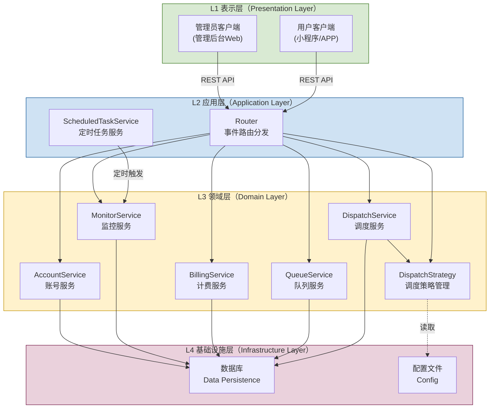
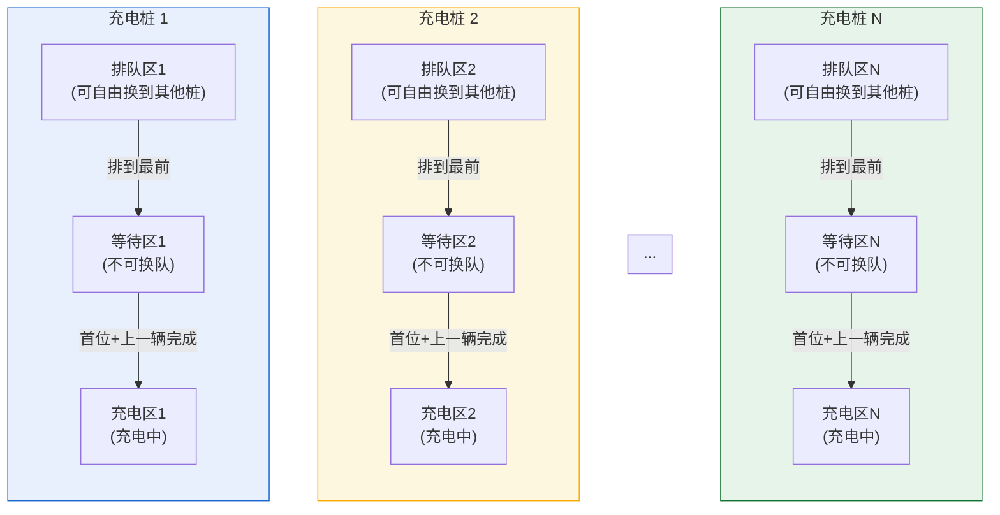

# 系统架构设计文档

> 本文档基于第二次作业成果整理，供后续代码实现时参考。

---

## 一、系统概述

智能充电桩调度计费系统，为电动汽车充电站提供从车辆注册、充电调度、计费结算到管理员监控的全流程服务。系统目标是最小化车辆完成充电的总时间（排队等待 + 实际充电）。

**核心能力**：
- 三区队列管理（排队区、等待区、充电区）
- 可配置调度策略（支持启动参数指定 + 运行中切换）
- 阶梯电价 + 复合服务费计费
- 五种故障处理策略
- 管理员全面监控与配置

---

## 二、架构风格

### 2.1 选定架构：分层架构（Layered Architecture）



**层间规则**：
- 表示层仅能调用应用层接口（REST）
- 应用层调用领域层服务处理业务逻辑
- 领域层通过基础设施层进行数据持久化
- **禁止跨层调用**：表示层不能直接访问领域层或基础设施层
- **禁止反向依赖**：领域层和基础设施层不依赖应用层

### 2.2 通信协议：RESTful API

所有客户端→服务器通信采用 HTTP REST。见 §五 API 定义。

### 2.3 实时状态更新：客户端定时轮询

管理员客户端每隔 N 秒调用 `GET /api/piles/{pile_Id}/state` 拉取最新充电桩状态。

---

## 三、模块职责与接口

### 3.1 领域服务模块

| 模块 | 类名 | 职责 | 关键方法 |
|------|------|------|----------|
| 调度服务 | `DispatchService` | 分配充电桩、执行故障调度策略 | assignChargingPile(), rescheduleByPriority(), rescheduleByTimeOrder(), recoverChargingFault(), rescheduleByShortestTotalTime(), batchAssignByShortestTotalTime() |
| 调度策略 | `DispatchStrategy` | 管理当前激活的调度策略 | init(configFile), switchAlgorithm(), switchFault(), getCurrentAlgorithm(), getCurrentFaultStrategy() |
| 队列服务 | `QueueService` | 车辆入队/出队/换队、状态查询 | enqueue(), dequeue(), changeQueue(), getCarState(), getQueueDetail() |
| 计费服务 | `BillingService` | 费用计算、账单生成、详单拆分 | calculateBill(), queryBillByDate(), getDetailedBill() |
| 监控服务 | `MonitorService` | 充电桩状态采集、统计 | getPileStats(), batchCollectStats() |
| 账号服务 | `AccountService` | 用户注册、认证、密码管理 | createAccount(), authenticate(), setPassword() |

### 3.2 核心领域实体

| 实体 | 关键属性 | 说明 |
|------|----------|------|
| `ChargingStation` | stationId, name, maxQueueCapacity | 充电站聚合根 |
| `User` | userId, userName, licensePlate, password, membershipLevel, accountStatus | 用户账号 |
| `Vehicle` | vehicleId, licensePlate, batteryCapacityKWh, currentBatteryPercentage, chargingProtocol | 车辆信息 |
| `ChargingRequest` | requestId, car_Id, requestTime, chargingMode, Request_Amount, requestStatus, queue_Num | 充电请求（贯穿排队/等待/充电） |
| `ChargingPile` | pileId, type, maxPowerKW, status, supportedProtocols, TotalChargeNum, TotalChargeTime, TotalCapacity | 充电桩 |
| `PileQueue` | queueId, capacity | 充电桩对应的排队队列 |
| `ChargingSession` | sessionId, startTime, endTime, chargedPowerKWh, faultInterrupted, interruptedPowerKWh | 充电会话 |
| `BillingRecord` | billingId, Bill_Id, carId, date, ChargePileNum, ChargeAmount, ChargeDuration, StartTime, EndTime, TotalChargeFee, TotalServiceFee, TotalFee | 账单记录（11字段） |
| `DetailedBill` | Bill_Id, periodChargeFees[], periodServiceFees[], periodSubtotalFees[] | 分段详单 |
| `DispatchStrategy` | algorithm, faultStrategy, availableAlgorithms[], availableFaultStrategies[] | 调度策略配置 |
| `FaultEvent` | eventId, occurrenceTime, pileId, severityLevel, faultType | 故障事件 |

### 3.3 枚举类型

| 枚举 | 值 |
|------|-----|
| `ChargeMode` | FAST_CHARGE, SLOW_CHARGE |
| `PileStatus` | AVAILABLE, QUEUEING, CHARGING, RUNNING, CLOSED, FAULT |
| `RequestStatus` | QUEUED, WAITING, CHARGING, COMPLETED, CANCELLED |
| `ProtocolType` | GB_STANDARD, CCS, CHADEMO |
| `ZoneType` | QUEUE_AREA, WAITING_AREA, CHARGING_AREA |
| `PaymentStatus` | UNPAID, PAID, REFUNDED |

### 3.4 值对象

| 值对象 | 关键属性 | 说明 |
|--------|----------|------|
| `TimeOfUseTariffPolicy` | peakPrice, normalPrice, valleyPrice | 分时电价策略 |
| `ServiceFeePolicy` | baseServiceFee, timeCoefficient, overtimePenalty | 服务费策略 |
| `TariffConfig` | pileId, tariffRule, peakPrice, normalPrice, valleyPrice | 充电桩级计费规则配置 |

---

## 四、核心业务流程

### 4.1 用户充电全流程

```
注册/登录 → 提交充电申请(E_chargingRequest)
  → 系统根据当前分配策略计算最佳充电桩
  → 进入排队区(queue_Num)
  → 排队区可自由更换队列(Modify_Mode/Modify_Amount)
  → 排到最前 → 确认进入等待区
  → 等待区不可换队，可退出(0费用)
  → 等待区排到首位 + 上一位充电完毕
  → 自动进入充电区
  → 核对协议/电量 → Start_Charging(car_id, ChargePileNum)
  → 充电中可修改协议/电量
  → 到达目标电量 → End_Charging(car_id, ChargingPileNum)
  → 生成账单 → Request_Bill → Request_DetailedList
  → 支付完成 → 驶离
```

### 4.2 充电桩故障处理流程

```
detectFault(pile_Id)
  → getActiveFaultStrategy() 获取当前故障策略
  → 按所选策略执行：
     ├─ 优先级调度(SSD-F1): 按区域+会员+等待时间排序分配
     ├─ 时间顺序调度(SSD-F2): 按请求时间先来后到排序分配
     ├─ 充电中故障恢复(SSD-F3): 保存快照+优先恢复充电中车辆
     ├─ 单次最短(SSD-F4): 每台车独立贪心选总时间最短桩
     └─ 批量最短(SSD-F5): 构造成本矩阵+匈牙利算法全局最优
  → 更新故障桩状态为"故障关闭"
  → 发送通知给管理员
```

### 4.3 计费规则

```
总费用 = 电费 + 服务费

电费 = Σ(各时段充电量 × 对应时段电价)
  时段划分：峰时(peakPrice)、平时(normalPrice)、谷时(valleyPrice)
  ✓ 按充电时间跨越的时段分段计算

服务费 = 基础服务费(baseServiceFee) + 时长系数(timeCoefficient × 充电时长)
  ✓ 超时充电额外收取 overtimePenalty
  ✓ 充电区超时未确认：扣除基本服务费（可配置，每充电桩可不同）
```

---

## 五、API 接口定义

### 5.1 用户端 API

| HTTP | 路径 | 系统指令 | 功能 |
|------|------|----------|------|
| POST | /api/accounts | createNewAccount(car_Id, userName, car_Capacity) | 创建新账号 |
| PUT | /api/accounts/{car_Id}/password | set_pwd(******) | 设置密码 |
| POST | /api/auth/login | login(car_Id, password) | 登录认证 |
| POST | /api/charging/requests | E_chargingRequest(car_Id, Request_Amount, Request_Mode) | 提交充电申请 |
| PUT | /api/charging/requests/{car_Id}/amount | Modify_Amount(car_Id, Amount) | 修改充电量 |
| PUT | /api/charging/requests/{car_Id}/mode | Modify_Mode(car_Id, Mode) | 修改充电模式 |
| GET | /api/charging/requests/{car_Id}/state | Query_Car_State(car_id) | 查询排队状态 |
| POST | /api/charging/sessions | Start_Charging(car_id, ChargePileNum) | 开始充电 |
| GET | /api/charging/sessions/{car_Id} | Query_Charging_State(car_id) | 查询充电状态 |
| DELETE | /api/charging/sessions/{car_Id} | End_Charging(car_id, ChargingPileNum) | 结束充电 |
| GET | /api/bills?carId=&date= | Request_Bill(carId, date) | 查看账单 |
| GET | /api/bills/{Bill_Id}/details | Request_DetailedList(Bill_Id) | 查看详单 |

### 5.2 管理员端 API

| HTTP | 路径 | 系统指令 | 功能 |
|------|------|----------|------|
| POST | /api/piles/{pile_Id}/power/on | powerOn(pile_Id) | 启动充电桩 |
| PUT | /api/piles/{pile_Id}/parameters | setParameters(pile_Id, 计费规则, 电价数据) | 设置参数 |
| POST | /api/piles/{pile_Id}/run | Start_ChargingPile(pile_Id) | 运行充电桩 |
| POST | /api/piles/{pile_Id}/power/off | powerOff(pile_Id) | 关闭充电桩 |
| GET | /api/piles/{pile_Id}/state | Query_PileState(pile_Id) | 查看充电桩状态 |
| GET | /api/queues/state | Query_QueueState(queuelist) | 查看队列状态 |
| GET | /api/strategies | getCurrentStrategies() | 获取当前策略 |
| PUT | /api/strategies/dispatch | switchDispatchStrategy(strategyType) | 切换分配策略 |
| PUT | /api/strategies/fault | switchFaultStrategy(faultType) | 切换故障策略 |

### 5.3 API 返回值规范

| 指令 | 返回字段 | 格式 |
|------|----------|------|
| E_chargingRequest | car_position, car_state, queue_Num, request_time | JSON Object |
| Query_Car_State | car_Number_before_position, car_state, queue_Num, request_time | JSON Object |
| Query_Charging_State | 详单信息（当前电量、已充电量、功率、预计剩余、当前电价、已产生费用等） | JSON Object |
| Query_PileState | workingState, TotalChargeNum, TotalChargeTime, TotalCapacity | JSON Object |
| Query_QueueState | [{car_Id, car_Capacity, Request_Amount, waitTime}, ...] | JSON Array |
| Request_Bill | carId, date, Bill_Id, ChargePileNum, ChargeAmount, ChargeDuration, StartTime, EndTime, TotalChargeFee, TotalServiceFee, TotalFee | JSON Array |
| Request_DetailedList | 基础信息 + 各时段 {ChargeFee, ServiceFee, subtotalFee} | JSON Object |

---

## 六、调度策略体系

### 6.1 策略分类与标识

| 策略类型 | 策略名称 | 标识符 | 适用场景 |
|----------|---------|--------|---------|
| 正常分配 | 单次调度最短时长 | `SHORTEST_TOTAL_TIME` | **默认**。每次单台车辆申请时，遍历所有兼容桩选总完成时间最短 |
| 正常分配 | 批量调度最短时长 | `BATCH_SHORTEST_TIME` | 多台车辆同时分配，匈牙利算法求全局最优 |
| 故障处理 | 优先级调度 | `PRIORITY` | 按区域+会员+等待时间排序后分配 |
| 故障处理 | 时间顺序调度 | `TIME_ORDER` | 按请求时间先来后到排序（**默认故障策略**） |
| 故障处理 | 充电中故障恢复 | `FAULT_RECOVERY` | 保存快照，优先恢复充电中车辆 |
| 故障处理 | 单次调度最短时长 | `SHORTEST_TOTAL_TIME` | 故障时用贪心为每台车选最优桩 |
| 故障处理 | 批量调度最短时长 | `BATCH_SHORTEST_TIME` | 故障时用匈牙利算法全局最优分配 |

### 6.2 策略切换机制

```
系统启动时：ConfigFile → initDispatchStrategy(algorithm, faultStrategy)
运行中切换：switchDispatchStrategy(type) / switchFaultStrategy(type)
```

切换后后续所有调度操作立即使用新策略，不影响正在进行的充电会话。

### 6.3 核心调度算法

**单次调度最短时长（贪心）**：
```
Tᵢ = wᵢ(排队等待) + cᵢ(充电时间)
cᵢ = Request_Amount / Pile.maxPowerKW
选 min(Tᵢ) 对应的充电桩
时间复杂度：O(M)，M=兼容桩数量
```

**批量调度最短时长（匈牙利算法）**：
```
构建 N×M 成本矩阵 C[i][j] = wⱼ + (Vᵢ.Request_Amount / Pⱼ.maxPowerKW)
执行匈牙利算法求解最小权完美匹配
时间复杂度：O(N³)
不兼容桩：C[i][j] = ∞
N > M 时：分批处理
```

---

## 七、三区队列模型

每个充电桩独立维护一条三区队列：排队区、等待区、充电区。车辆可在不同充电桩的排队区之间自由切换。



> **关键规则**：
> - 每个充电桩拥有独立的三区队列（排队区→等待区→充电区）
> - 车辆**仅在排队区**可自由更换到其他充电桩的排队队列（排至目标队列队尾）
> - 车辆进入等待区后不可更换队列，仅可退出充电（0费用）
> - 等待区排至首位且上一辆车充电完毕后，自动进入充电区

**队列容量**：每个充电桩的排队区可容纳任意数量车辆，充电区默认4个停车位（可配置），各充电桩独立管理。

---

## 八、计费结算模型

### 8.1 账单层次

```
查看账单 Request_Bill(carId, date)
  └─ 返回概览：carId, date, Bill_Id, ChargePileNum,
     ChargeAmount, ChargeDuration, StartTime, EndTime,
     TotalChargeFee, TotalServiceFee, TotalFee

查看详单 Request_DetailedList(Bill_Id)
  └─ 返回分段明细：基础信息 + 各时段详细费用
     [时段1: ChargeFee, ServiceFee, subtotalFee]
     [时段2: ChargeFee, ServiceFee, subtotalFee]
     [时段3: ChargeFee, ServiceFee, subtotalFee]
```

### 8.2 支付状态流转

```
UNPAID(未支付) → PAID(已支付) → REFUNDED(已退款)
```

---

## 九、关键设计约束

### 9.1 业务约束

1. **三区单向流转**：排队区 → 等待区 → 充电区，不可逆
2. **排队区可换队**：自由更换到其他充电桩队列队尾
3. **等待区不可换队**，仅可退出（0费用）
4. **充电中修改电量**：下限为当前已充电量
5. **充电区超时**：超时未确认取消充电并扣除基本服务费x（可配置）
6. **等待区和排队区退出**：0费用
7. **充电桩故障**：需重新调度桩上所有车辆

### 9.2 类图关系约束

类图中仅允许使用三种关系：
- **定向关联** (`-->`)
- **依赖** (`..>`)
- **继承** (`<|--`)

不允许使用组合关联（`*--`）和其他关系类型。

### 9.3 Mermaid 绘图

所有图使用 Mermaid 语法绘制（类图、序列图、活动图、流程图）。

---

## 十、项目文件结构

```
docs/
├── 背景调研.md                        # 行业背景与需求调研
├── 课程说明.md                        # 课程基本要求
├── 核心业务介绍.md                    # 核心业务与功能需求(20项FR)
├── 用例模型.md                        # 用例图、SSD、操作契约、指令表
├── UML流程图.md                       # 领域模型类图、用例级类图、活动图
├── 第二次作业-系统架构与分工.md        # 架构说明、人员分工
├── 第二次作业要求.md                   # 第二次作业原题
├── 系统架构设计文档.md                 # 本文档——实现参考
└── 云平台文件/
    └── 2026软件工程-春-第1次作业模板-徐鹏.md  # 模板
```

---

## 十一、实现建议

### 11.1 开发顺序建议

| 阶段 | 内容 | 优先级 |
|------|------|--------|
| 1 | **领域模型实体 + 枚举 + 值对象** | 必须先建 |
| 2 | **账号服务 + REST 路由** | 基础能力 |
| 3 | **充电申请 + 三区队列管理** | 核心流程 |
| 4 | **调度策略框架（默认单次最短）** | 调度核心 |
| 5 | **充电会话 + 开始/结束充电** | 充电操作 |
| 6 | **计费服务 + 账单/详单** | 计费核心 |
| 7 | **管理员功能（充电桩管理/参数设置）** | 管理功能 |
| 8 | **五种故障策略** | 容错能力 |
| 9 | **策略切换机制（启动参数 + 运行时）** | 策略管理 |
| 10 | **定时轮询 + 状态监控** | 运维功能 |

### 11.2 关键技术选型参考

| 关注点 | 建议 |
|--------|------|
| 后端语言 | **Python (FastAPI)** | 异步支持好，自动生成 OpenAPI 文档，类型注解与 Pydantic 验证 |
| Web 框架 | **FastAPI** | 高性能异步框架，适合 RESTful API 开发 |
| 数据库 | **SQLite** | 轻量嵌入式数据库，单文件存储，无需独立数据库服务，适合小规模部署 |
| ORM / 数据访问 | **SQLAlchemy** | Python 最成熟的 ORM，支持 SQLite 及后续迁移到 MySQL/PostgreSQL |
| 认证 | **JWT Token（python-jose）** | 无状态认证，适用于 REST API |
| 定时任务 | **APScheduler** | Python 原生定时任务调度库，支持 cron 表达式 |
| 配置管理 | **application.yml（PyYAML）** | YAML 格式配置文件，清晰结构化，可通过环境变量覆盖 |
| 密码处理 | **passlib + bcrypt** | 密码加密存储与验证 |
| 测试 | **pytest + httpx** | 异步测试支持，FastAPI 官方推荐 |

---

> 本文档综合了第二次作业中所有设计成果，为后续编码提供统一参考。如有更新请同步更新本文档。
