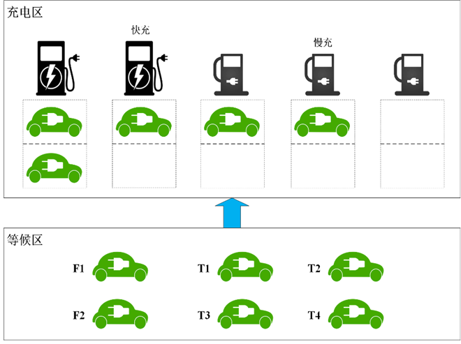

# 软件工程 大作业说明
## 题目
智能充电桩调度计费系统
## 课题基本要求
### 背景
需要设计一套智能充电桩调度计费系统，以便使得电动车完成充电服务的时间（充电时间+排队时间）达到最短的效果。
### 结构
充电站分为“等候区”和“充电区”两个部分。
假定车辆到达充电站后首先进入等候区，此时可以通过客户端软件发起充电请求（暂时不考虑等候区外的请求），等候区的容量待定（暂时考虑能容纳任意数量车辆）。用户在等候区发起充电请求后，将按照充电模式（快/慢）进入不同的等待队列，此后等待系统叫号进入充电区。
充电区安装有2个快充充电桩+3个慢充充电桩（验收时该数值可变更）。充电区面积有限，每个充电桩后仅设置4个停车位（验收时该数值可变更）供车辆等候充电。当充电区有空余车位时，系统将按照进入等候区的先后顺序从对应充电模式的等待队列中调入车辆，并根据调度策略分配充电桩，并加入对应充电桩的排队队列。 

### 调度策略
对应充电模式下被调度车辆完成充电所需时间（等待时长+自己充电时长）最短。
### 计费规则
总费用=充电费+服务费。电价随时间段变化。
### 系统组成
由服务器端、用户客户端、管理员客户端组成。
充电站配置一名管理员，负责管理、查看充电桩运行状态，并完成报表展示。
### 其他需求
用户可能修改充电请求（充电模式/充电电量）甚至取消充电，需要软件设计方设计合理的策略；
充电桩存在出现故障的可能，需要软件设计方设计合理的再调度策略，兼顾公平和效率。
## 作业要求
调研对象，深入了解（构思）其运营机制，并重点关注提供充电计费和调度服务的规则和要求，兼顾顾客的方便使用要求和充电站管理方提供服务的各种可能的要求，给出各小组对于充电站进行计费和调度服务的说明：业务介绍及业务流程，
- 具体任务如下（占本次作业的25%）：
    - 任务1：根据业务背景及业务流程的调研结果（不计分作业的内容）给出当前系统（充电站）的核心业务介绍（参照教材模板要求书写）；5%
    - 任务2：使用UML的类图，对充电站业务背景进行领域模型的分析及构建；10%
    - 任务3：使用UML 活动图，给出当前系统的客户使用充电服务的业务流程：从申请服务开始，到结束一次充电服务，10%；
- 给出充电站计费调度系统的用例模型，具体任务如下（占本次作业的65%）：
    - 任务：完成系统中各个角色对应的：
        - 用例图（15%）
        - 系统顺序图（SSD）（25%）
        - 操作契约(25%)；
- 文档规范性要求，按照模板的要求书写文档，5%；
- 工作量统计，按照文档模板中的表格说明填写，5%；
说明
组长和组员协商分配每个组员（包含组长）的工作，每个同学的工作量尽量均等；
组长负责检查并汇总组员作业内容，并形成一个完整的需求分析模型文档并提交；
本次作业占本学期平时作业的比重：25%
